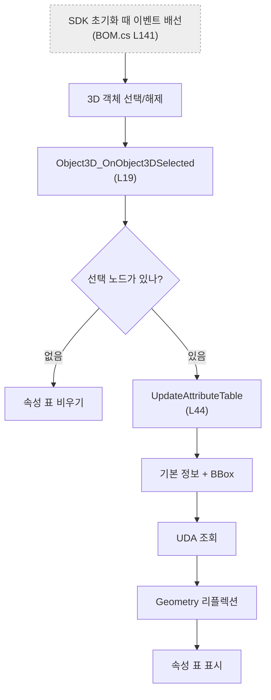
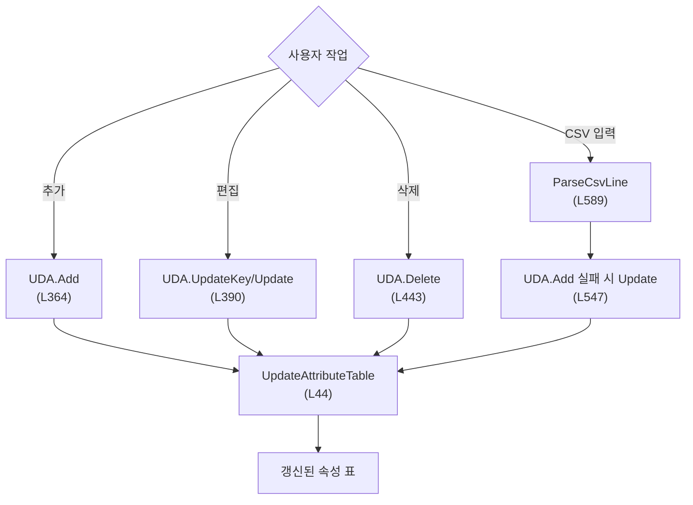

# Form1.Attribute.cs — 선택 노드 속성 조회와 UDA 편집

**한 줄**: 3D에서 고른 노드 하나의 기본 정보·BBox·UDA·지오메트리 속성을 표로 보여주고, UDA를 직접 추가·편집·삭제하거나 CSV로 입출력한다.

---

## 1. 진입점 — 언제 도는가

| 화면 동작 | 핸들러 | 위치 |
|---|---|---:|
| 3D 뷰어에서 객체 선택/해제 | `Object3D_OnObject3DSelected` | L19 |
| **선택 해제** | `btnClearSelection_Click` | L248 |
| **CSV 출력** | `btnExportAttributeCSV_Click` | L257 |
| **UDA 추가** | `btnUdaAdd_Click` | L364 |
| **UDA 편집** | `btnUdaEdit_Click` | L390 |
| **UDA 삭제** | `btnUdaDelete_Click` | L443 |
| **CSV 입력** | `btnUdaImportCSV_Click` | L485 |

여섯 버튼은 Designer에서 배선된다. 객체 선택 이벤트는 SDK 초기화가 끝난 뒤 `Vizcore3d_OnInitializedVIZCore3D`(`Form1.BOM.cs` L141)에서 직접 배선된다.

---

## 2. 실행 흐름 — 무엇이 어떤 순서로





### 2-1. 속성 조회

1. **`Object3D_OnObject3DSelected`** (L19) — SDK가 선택한 최상위 노드 목록에서 첫 노드를 잡는다. 선택이 없으면 표를 비운다.
2. 선택 인덱스와 이름을 보관·표시한 뒤 **`UpdateAttributeTable`** (L44)을 호출한다.
3. **`AddBasicNodeInfo`** (L71) — 인덱스·이름·노드 종류와 이름 문자열에서 추정한 부모 경로를 넣는다.
4. **`AddBoundingBoxInfo`** (L101) — Min/Max XYZ, 축별 크기, 중심점을 소수 둘째 자리까지 넣는다.
5. **`AddUDAInfo`** (L139) — SDK의 전체 UDA 키를 돌며 선택 노드에 값이 있는 항목만 넣는다.
6. **`AddGeometryPropertyInfo`** (L180) — SDK 지오메트리 속성 객체의 공개 프로퍼티를 리플렉션으로 열거해 값이 있는 항목을 넣는다.

**그래서 화면에는** 기본 정보 → BBox → UDA → Geometry 순으로 구분된 속성 표가 나타난다.

### 2-2. UDA 추가·편집·삭제

1. **`ShowUdaInputDialog`** (L305) — Key와 Value를 받는다. Key는 빈 문자열만 금지한다.
2. 추가는 **`btnUdaAdd_Click`** (L364)에서 `UDA.Add(..., true)`를 호출한다.
3. 편집은 **`IsUdaRow`** (L344)로 UDA 구역인지 확인하고, Key가 바뀌면 `UpdateKey`, 값 또는 Key가 바뀌면 `Update`를 이어서 호출한다 (L390~438).
4. 삭제는 같은 구역 판정과 사용자 확인 뒤 `UDA.Delete(..., true)`를 호출한다 (L443~479).
5. 성공 후 매번 **`UpdateAttributeTable`** (L44)로 SDK 값을 다시 읽어 표를 갱신한다.

`true`는 SDK 문서상 **하위 노드까지 재귀 적용**한다. 화면에서 선택한 노드 하나만 바꾸는 것처럼 보이지만, Part나 Assembly를 선택했다면 후손도 함께 바뀐다.

### 2-3. CSV 출력

1. **`btnExportAttributeCSV_Click`** (L257) — 현재 화면 표를 행 순서 그대로 순회한다.
2. `No,Key,Value` 헤더와 세 열을 UTF-8 CSV로 저장한다 (L274~290).
3. Key/Value에 쉼표가 있을 때만 큰따옴표로 감싼다 (L286~290).

**그래서 저장 파일에는** UDA뿐 아니라 기본 정보·BBox·Geometry와 구분선 행까지 현재 표 전체가 들어간다.

### 2-4. CSV 입력

1. **`btnUdaImportCSV_Click`** (L485) — UTF-8 파일 전체를 읽고, 첫 줄에 `key`·`value`·`속성` 중 하나가 있으면 헤더로 건너뛴다.
2. **`ParseCsvLine`** (L589) — 따옴표 안의 쉼표는 데이터로 두고 나머지 쉼표에서 열을 나눈다.
3. 각 줄의 **첫 열을 Key, 둘째 열을 Value**로 쓴다. 셋째 열 이후는 무시한다 (L537~539).
4. `UDA.Add(..., true)`가 예외를 던지면 기존 Key라고 보고 `UDA.Update(..., true)`를 시도한다 (L547~565).
5. 성공/실패 수와 처음 10개 오류를 보여주고 속성 표를 다시 읽는다 (L568~578).

---

## 3. 상태 — 무엇을 읽고 무엇을 쓰나

| 필드 | 읽기/쓰기 | 역할 |
|---|---|---|
| ⚠ `vizcore3d` | 읽기·쓰기 | 선택 노드, BBox, UDA, Geometry 조회와 UDA 변경 |
| ⚠ `selectedAttributeNodeIndex` | 읽기·쓰기 | 현재 표와 UDA 작업이 가리키는 노드. 미선택은 `-1` |

Designer 컨트롤 `dgvAttributes`가 표시 데이터 자체를 보관한다. `lblSelectedNode`는 현재 노드 이름 또는 선택 안내를 표시한다.

이 파일 자체의 지속 필드나 캐시는 없다. 표를 갱신할 때마다 SDK를 다시 조회한다.

단, 다른 파일이 쓰는 ⚠ `_udaValueCache`는 이 파일의 UDA 변경 뒤 비워지지 않는다. 이는 6절의 동작 위험이다.

---

## 4. 의존 — 무엇과 묶여 있나

### VIZCore3D SDK API

`VIZCore3D.NET.xml`에서 아래 멤버와 `recursive` 의미를 확인했다.

| API | 이 파일에서 쓰는 이유 |
|---|---|
| `Object3D.FromFilter(SELECTED_TOP)` | 현재 선택의 최상위 노드 목록 조회 |
| `Object3D.FromIndex(int)` | 선택 노드 이름·종류 조회 |
| `Object3D.GetBoundBox(List<int>, false)` | 숨김 여부와 무관한 선택 노드 AABB 조회 |
| `Object3D.GeometryProperty.FromIndex` | 노드 지오메트리 속성 객체 조회 |
| `Object3D.Select(List<int>, bool, bool)` | 빈 목록과 `selection=false`로 선택 해제 |
| `Object3D.UDA.Keys` | 모델에 정의된 UDA 전체 키 목록 |
| `Object3D.UDA.FromIndex(int, string)` | 선택 노드의 특정 UDA 값 조회 |
| `Object3D.UDA.Add(int, key, value, true)` | 선택 노드와 모든 하위 노드에 UDA 추가 |
| `Object3D.UDA.UpdateKey(int, old, new, true)` | 선택 노드와 모든 하위 노드의 UDA Key 변경 |
| `Object3D.UDA.Update(int, key, value, true)` | 선택 노드와 모든 하위 노드의 UDA 값 변경 |
| `Object3D.UDA.Delete(int, key, true)` | 선택 노드와 모든 하위 노드에서 UDA 삭제 |

### 다른 Form1 파일

| 메서드/배선 | 위치 | 관계 |
|---|---|---|
| `Vizcore3d_OnInitializedVIZCore3D` | `Form1.BOM.cs` L141 | `Object3D.OnObject3DSelected` 이벤트에 이 파일의 선택 핸들러를 등록 |
| `SetupAttributeColumns` | `Form1.BOM.cs` L120 | 앱 시작 때 이 파일이 사용하는 속성 표 열을 구성 |

그 밖의 실행 로직은 이 파일 안에서 끝난다.

---

## 5. 알고리즘 — 자명하지 않은 계산

### 5-1. BBox에서 크기와 중심을 계산한다

SDK AABB는 월드축 기준 좌표다. 코드가 쓰는 계산은 다음과 같고 화면에는 `F2`로 표시한다.

```
SizeX = MaxX - MinX
CenterX = (MinX + MaxX) / 2
```

Y·Z도 같다. 프로젝트 모델 좌표 단위가 mm이므로 크기와 중심도 mm다.

### 5-2. UDA 구역 판정은 표의 구조에 의존한다

`IsUdaRow`는 행에 별도 타입을 붙이지 않는다. 선택 행의 바로 위부터 역방향으로 올라가 처음 만난 `━━` 구분선이 “사용자 정의 속성 (UDA)”인지 확인한다. 즉 데이터 의미가 아니라 **화면 문자열과 행 배치**가 편집 가능 여부를 결정한다.

### 5-3. UDA 쓰기는 모두 재귀적이다

추가·수정·삭제와 CSV 입력 모두 SDK 마지막 인자를 `true`로 넘긴다. XML 정의상 선택 노드뿐 아니라 하위 노드 전부에 재귀 적용한다. Part 하나에 여러 BODY가 있을 때 같은 Key/Value를 모두 심는 정책이다. 의도된 정책인지는 코드 주석에 없다.

### 5-4. CSV 파서는 한 줄 상태 기계다

따옴표를 만날 때마다 `inQuotes`를 뒤집고, 따옴표 밖 쉼표에서만 열을 끊는다. 따라서 `"A,B"`는 한 열로 읽지만, 표준 CSV의 이중 따옴표 escape(`""`)와 줄바꿈이 든 필드는 처리하지 않는다.

가져오기는 Add를 먼저 시도하고 **예외가 나면 Update**하는 upsert 형태다. 별도 존재 확인 API를 호출하지 않아 왕복을 줄였지만, “이미 존재함” 외의 Add 오류도 Update 경로로 들어간다.

### 5-5. Geometry는 SDK 타입을 고정 매핑하지 않는다

지오메트리 속성의 구체 타입과 프로퍼티를 코드에 나열하지 않고 .NET 리플렉션으로 모든 공개 프로퍼티를 읽는다. SDK 버전에 프로퍼티가 추가되면 UI에도 자동으로 나타나는 대신, 표시 순서·형식·비용을 통제하지 못한다.

---

## 6. 책임과 결합 — 다시 짠다면

### ① 이 파일이 지는 책임

- SDK 선택 이벤트를 받아 선택 노드 하나의 기본 정보·BBox·UDA·Geometry 속성을 읽는다.
- 서로 다른 속성을 구분선이 있는 WinForms 표 행으로 변환한다.
- 선택 노드의 UDA를 추가·편집·삭제하며, 모든 후손에 재귀 적용한다.
- 화면 표 전체를 CSV로 내보내고 CSV 행을 UDA 변경 명령으로 가져온다.

조회, 표시 모델, UDA 명령, CSV 직렬화라는 네 책임이 한 이벤트 파일에 섞여 있다.

### ② 떼어낼 수 있는 것

| 무엇을 | 어디로 | 근거 |
|---|---|---|
| 기본 정보·BBox·UDA·Geometry 수집 | `NodeAttributeReader`와 `NodeAttributeSnapshot` | SDK 결과를 DTO로 옮긴 뒤에는 ListView를 몰라도 된다. 조회 실패와 값 없음도 DTO에서 구분할 수 있다. |
| 구분선과 표시 문자열 생성 | `AttributeRowPresenter` | 속성 스냅샷을 행 목록으로 바꾸는 순수 변환이며, `IsUdaRow`를 화면 위치가 아닌 행 종류로 판정할 수 있다. |
| UDA 추가·Key 변경·값 변경·삭제 | `UdaCommandService` | 재귀 범위, 검증, 실패 결과, ⚠ `_udaValueCache` 무효화를 한 경계에서 보장해야 한다. Key 변경 두 단계는 보상 처리 또는 명시적 부분 성공 결과가 필요하다. |
| CSV 읽기·쓰기 | `UdaCsvCodec` | 입력과 출력의 열 계약을 `Key,Value`로 하나로 고정하고 단독 왕복 시험을 할 수 있다. |

### ③ 못 떼는 것과 이유

- 선택·버튼 핸들러, 대화상자, 파일 선택창, `lvAttribute` 갱신은 WinForms에 묶이므로 얇은 UI 어댑터로 남아야 한다.
- UDA의 `recursive=true`가 실제로 어느 노드까지 적용되는지는 SDK 계약이다. 서비스로 옮겨도 SDK 어댑터와 사용자의 적용 범위 확인은 필요하다.
- 선택 노드 인덱스는 ⚠ `selectedAttributeNodeIndex`로 `Form1.cs`에 선언되어 이 파일이 직접 읽고 쓴다. 노드 이름은 공유 필드로 보관하지 않고 `lblSelectedNode`에만 표시한다. 분리하려면 인덱스를 `SelectionContext` 같은 단일 소유 상태로 넘겨야 한다.
- `_udaValueCache`는 가공도 등 다른 파일이 소비하므로 이 파일만 분리해서는 일관된 무효화 시점을 정할 수 없다.

### ④ 지울 것

- 현재의 수동 CSV 출력 escape와 `ParseCsvLine`(L589)은 검증된 CSV 구현으로 대체한 뒤 삭제한다. 지금은 `No,Key,Value` 출력과 2열 입력이 왕복되지 않는다.
- 구분선 위치를 위로 훑는 `IsUdaRow`(L344)는 형식화된 행 모델로 바꾼 뒤 삭제한다. Geometry 구분선을 UDA로 오인할 수 있는 구조가 함께 사라진다.
- `NodeName` 문자열의 마지막 `/`로 만드는 가짜 Parent Path는 SDK 계층 경로로 대체할 수 있을 때 삭제한다 `(미확인)`.
- Add의 모든 예외를 “이미 존재하는 Key”로 간주하는 fallback 분기는 오류 코드 기반 upsert로 바꾼 뒤 제거한다. SDK가 중복 Key 전용 오류를 구분해 주는지는 `(미확인)`이다.

---

## 부록 — 지나가며 눈에 띈 것

| | 내용 |
|---|---|
| ⚠ | CSV 출력은 `No,Key,Value`인데 입력은 첫 두 열을 Key·Value로 읽는다. 자체 출력 파일을 다시 넣으면 열이 어긋난다. |
| ⚠ | UDA 변경 뒤 ⚠ `_udaValueCache`를 비우지 않아 같은 세션의 후속 가공도가 변경 전 값을 읽을 수 있다. |
| ⚠ | 모든 UDA 쓰기가 `recursive=true`라 Assembly·Part 선택 시 후손 전체가 바뀌지만 화면 문구는 그 범위를 드러내지 않는다. |
| · | Key 변경은 `UpdateKey` 뒤 `Update`를 호출하므로 두 번째 실패 시 Key만 바뀐 부분 성공 상태가 남는다. |
| · | 수동 CSV 구현은 필드 안 큰따옴표와 여러 줄 필드를 처리하지 않는다. |
