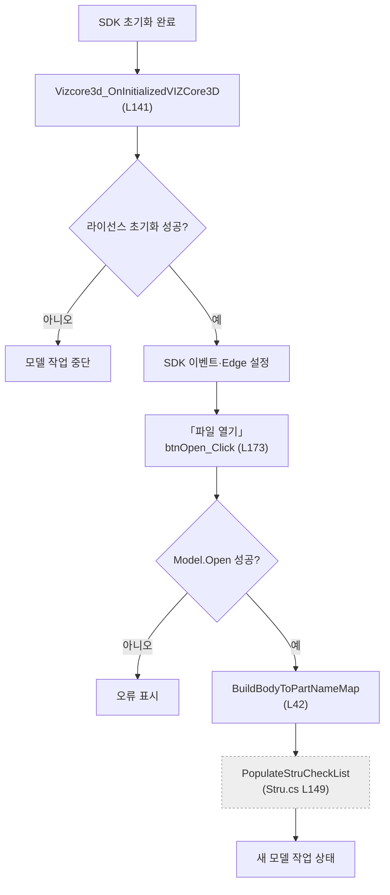
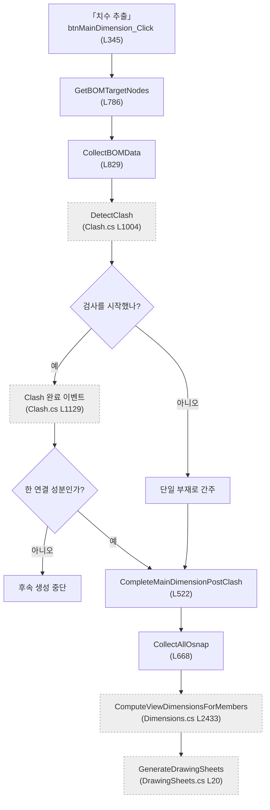

# Form1.BOM.cs — 모델 준비와 치수 추출 파이프라인 조립

**한 줄**: SDK 초기화와 모델 열기·재로드를 맡고, 보이는 BODY의 BBox·Osnap·홀을 BOM으로 수집한 뒤 **간섭 → 연결성 → Osnap → 체인 치수 → 시트 생성** 전 과정을 한 버튼에서 이어 붙인다.

---

## 1. 진입점 — 언제 도는가

### 앱 시작과 SDK 초기화

| 경로 | 메서드 | 위치 |
|---|---|---:|
| 앱 생성자 | `SetupBOMColumns` | L18 |
| 앱 생성자 | `SetupAttributeColumns` | L120 |
| VIZCore3D 초기화 완료 이벤트 | `Vizcore3d_OnInitializedVIZCore3D` | L141 |

초기화 완료 이벤트는 라이선스를 연결하고, 모델트리·축 표시·Edge 데이터를 켜며 Clash 완료와 3D 선택 이벤트를 배선한다.

### 화면에서 직접 시작

| 화면 버튼 | 핸들러 | 위치 | 결과 |
|---|---|---:|---|
| **파일 열기** | `btnOpen_Click` | L173 | 기존 상태를 지우고 `.vizx/.viz` 모델을 열어 STRU 목록까지 준비 |
| **초기화** | `btnResetToInitial_Click` | L255 | 현재 파일을 닫았다 다시 열어 작업 결과 제거 |
| **치수 추출** | `btnMainDimension_Click` | L345 | 자동 파이프라인 전체 실행 |
| **BOM** | `btnCollectBOM_Click` | L1053 | 현재 선택/가시 BODY의 기본 BOM 목록만 수집 |

### 다른 파일에서 시작

`CollectBOMData`(L829)는 치수·도면 일괄 출력 경로에서도 호출되고, `GetPartNameFromBodyIndex`(L110)는 Osnap·2D 표시에서 BODY 이름을 Part 이름으로 바꿀 때 쓰인다. `CompleteMainDimensionPostClash`(L522)는 Clash 완료 이벤트가 호출한다.

---

## 2. 실행 흐름 — 무엇이 어떤 순서로





### 2-1. SDK와 모델 준비

1. **`Vizcore3d_OnInitializedVIZCore3D`** (L141) — `InitializeLicense`를 통과해야 다음 준비를 한다.
2. 2D 툴바·모델트리·Marine Axis를 보이고, Clash 완료 이벤트와 객체 선택 이벤트를 연결한다 (L146~160).
3. `Model.GenerateEdgeData`·`LoadEdgeData`를 모델 열기 전에 true로 설정하고, 현재 객체에도 Edge 생성을 요청한다 (L162~166).
4. **`btnOpen_Click`** (L173) — 새 파일을 고르면 화면 목록·공유 데이터·3D 주석을 먼저 지우고 기존 모델을 닫은 뒤 새 모델을 연다.
5. 성공하면 **`BuildBodyToPartNameMap`** (L42)으로 BODY→Part 이름/인덱스 맵을 만들고 **`PopulateStruCheckList`** (`Form1.Stru.cs` L149)로 STRU 목록을 채운다.

**그래서 화면에는** 새 3D 모델과 STRU 목록이 보이고, BOM·간섭·치수·시트 결과는 빈 상태로 시작한다.

### 2-2. 초기화 버튼

1. **`btnResetToInitial_Click`** (L255) — 현재 모델이 있고 사용자가 확인했을 때만 진행한다.
2. **`ResetToInitialState`** (L277) — 현재 3D/2D 화면 모드를 먼저 기억한다.
3. BOM·Clash·Osnap·치수·시트·풍선 오버라이드와 관련 화면 목록을 비우고 모델을 닫았다 같은 경로로 다시 연다 (L289~318).
4. BODY→Part 맵을 다시 만들고 2D 캔버스를 지운 뒤 원래 화면 모드를 복원한다 (L320~329).

### 2-3. BOM 버튼

1. **`GetBOMTargetNodes`** (L786) — X-Ray 선택이 있으면 그 BODY 또는 선택 Part의 BODY, 없으면 보이는 BODY를 대상으로 고른다.
2. **`CollectBOMData`** (L829) — BODY마다 Part 이름, AABB 좌표·중심, 최대 원 반지름, PURPOSE를 수집한다.
3. `MaxZ` 내림차순으로 정렬한다 (L927~928).
4. **`DetectHoles`** (L982) — 공식 홀 API를 사용하는 외부 공용 메서드로 원형홀·슬롯홀을 채우고 규격별 문자열을 만든다.
5. `lvBOM`에 번호·이름·중심/Min/Max·원형 반지름·용도·홀 크기를 표시한다 (L933~962).

**그래서 화면에는** 현재 작업 범위의 BODY 단위 기본 BOM이 위에서 아래 순으로 나타난다.

### 2-4. 치수 추출 버튼

1. **`btnMainDimension_Click`** (L345) — 중복 자동 작업을 막고, 출력 버튼을 비활성화하며 취소 가능한 진행창을 시작한다.
2. 이전 X-Ray 범위를 지워 **현재 가시성**만 대상이 되게 하고 **`GetBOMTargetNodes`** (L786)로 모수를 센다.
3. 대상이 5,000개 이상이면 오래 걸린다는 확인창을 띄운다 (L383~400).
4. **`CollectBOMData`** (L829)로 BOM을 매번 새로 수집한다.
5. **`DetectClash(includeOutsideNeighbors: true)`** (`Form1.Clash.cs` L1004)로 내부 연결성과 설치도 외부 연결 검사를 시작한다.
6. 검사 시작에 성공하면 SDK 완료 이벤트가 이어서 실행한다. 시작하지 못하면 단일 부재로 간주해 곧바로 **`CompleteMainDimensionPostClash`** (L522)로 간다.
7. **`CompleteMainDimensionPostClash`** (L522) — `CollectAllOsnap` → 공용 체인 치수 계산 → 화면 목록 갱신 → 도면 시트 생성 순으로 실행한다.
8. 시트 생성 뒤 진행창을 먼저 닫고 최종 BOM·Osnap·치수·Clash 수를 보여준다 (L613~639).

### 2-5. Clash 이후 후속 처리

1. **`CollectAllOsnap`** (L668) — LINE 시작/끝과 POINT 중심을 전역 목록과 BODY별 맵에 동시에 넣고 CIRCLE은 치수점에서 제외한다.
2. **`ComputeViewDimensionsForMembers`** (`Form1.Dimensions.cs` L2433) — 보이는 BODY와 0.5mm tolerance, 방금 만든 BODY별 Osnap 맵을 넘겨 X/Y/Z 3뷰의 체인 치수를 계산한다.
3. 계산 결과를 `chainDimensionList`와 `lvDimension`에 넣고, 3D에 남은 치수·보조선은 지운다. 치수 추출 버튼 자체는 3D 치수를 그리지 않는다 (L560~593).
4. **`GenerateDrawingSheets`** (`Form1.DrawingSheets.cs` L20) — 연결 관계와 계산 결과로 제작·조립·설치·가공 시트 목록을 만든다.

---

## 3. 상태 — 무엇을 읽고 무엇을 쓰나

### 이 파일이 선언하는 상태

| 필드/상수 | 값·역할 |
|---|---|
| `LargeBomTargetWarningThreshold` | **5,000 BODY** — 대용량 실행 전 사용자 확인 |
| `CancelableBomLoopInterval` | **1** — BOM·Osnap·홀 루프 매 BODY마다 UI/취소 체크 |
| `CancelableBomScanInterval` | **200** — 전체 모수 스캔 200 BODY마다 UI/취소 체크 |
| `_mainDimensionDrawingControlStates` | 치수 추출 동안 비활성화한 도면 출력 컨트롤의 이전 상태 |

### Form1.cs에서 공유하는 상태

| 필드 | 읽기/쓰기 | 역할 |
|---|---|---|
| ⚠ `vizcore3d` | 읽기·쓰기 | 모델·노드·BBox·Osnap·UDA·주석·2D 캔버스 |
| ⚠ `currentFilePath` | 읽기·쓰기 | 초기화 때 다시 열 현재 모델 경로 |
| ⚠ `bomList` | 쓰기 | BODY별 기본 BOM과 후속 연결성·치수 모수 |
| ⚠ `bodyToPartNameMap` / `bodyToPartIndexMap` | 쓰기 | BODY를 논리 Part 이름·인덱스로 역조회 |
| ⚠ `clashList` | 쓰기 | 모델 교체·초기화 때 이전 간섭 제거 |
| ⚠ `osnapPoints` / `osnapPointsWithNames` | 쓰기 | 전역 치수 기준점과 표시 목록 |
| ⚠ `_lastCollectedNodeOsnapMap` | 쓰기 | BODY별 Osnap 캐시. 치수 계산에 즉시 재사용 |
| ⚠ `chainDimensionList` | 쓰기 | X/Y/Z 체인 치수 결과 |
| ⚠ `drawingSheetList` | 쓰기 | 자동 생성 도면 시트 |
| ⚠ `xraySelectedNodeIndices` | 읽기·쓰기 | BOM 범위 선택. 주 치수 버튼은 시작할 때 비움 |
| ⚠ `balloonOverrides` | 쓰기 | 초기화 버튼에서 수동 풍선 위치 제거 |
| ⚠ `_mfgAxisDetectionCache` | 쓰기 | Osnap 원본을 가공도 주축 판정에도 재사용 |
| ⚠ `_udaValueCache` | 쓰기 | Osnap 재수집·취소 정리 때 UDA 캐시 제거 |
| ⚠ `_mainDimensionInProgress` / `_autoProcessOsnapSuccess` | 쓰기 | 비동기 Clash 전후 파이프라인 상태 |

화면 목록 `lvBOM`·`lvClash`·`lvOsnap`·`lvDimension`·`lvDrawingSheet`와 Attribute 표도 이 파일이 초기화하거나 채운다.

### 캐시를 비우는 시점

- 모델 열기 성공 후 `BuildBodyToPartNameMap`에서 BODY→Part와 외부 근접 검사 캐시 재구성
- `CollectAllOsnap` 시작 때 BODY별 Osnap·가공도 축·UDA 캐시 초기화
- 중간 취소 때 시트·2D/3D·BOM·Osnap·치수·X-Ray와 일부 캐시 전부 제거

---

## 4. 의존 — 무엇과 묶여 있나

### VIZCore3D SDK API

`VIZCore3D.NET.xml`에서 아래 멤버를 확인했다.

| API | 이 파일에서 쓰는 이유 |
|---|---|
| `Model.IsOpen` / `Close` / `Open(string)` | 모델 존재 확인, 교체, 같은 파일 재로드. `Open`은 성공 bool 반환 |
| `Model.GenerateEdgeData` / `LoadEdgeData` | 모델을 열 때 Edge 생성·로드. XML도 **열기 전에 설정**하라고 명시 |
| `Object3D.GenerateEdgeData()` | 현재 모든 객체의 EdgeData 생성 |
| `Object3D.GetPartialNode(false, true, false)` | Part 목록 |
| `Object3D.GetPartialNode(false, false, true)` | BODY 목록 |
| `Object3D.FromIndex` | 부분 노드의 실제 가시성·부모 정보 조회 |
| `Object3D.GetBoundBox(List<int>, false)` | 숨김 여부와 무관한 BODY AABB |
| `Object3D.GetOsnapPoint` | LINE/POINT/CIRCLE 특징점 |
| `Object3D.UDA.Keys` / `UDA.FromIndex` | PURPOSE 조회 |
| `GeometryUtility.GetNodeHoleInfo` | 지정 노드의 공식 홀 정보. 실제 변환은 MfgDrawing 공용 메서드에 위임 |
| `View.FitToView` / `MarineAxis.Visible` | 모델 화면 맞춤과 3D 축 표시 |
| `Review.Measure.Clear` / `Review.Note.Clear` / `ShapeDrawing.Clear` | 모델 교체·초기화·치수 계산 뒤 임시 주석 제거 |

### 다른 Form1 파일

| 메서드 | 위치 | 맡기는 일 |
|---|---|---|
| `InitializeLicense` | `Form1.License.cs` L39 | SDK 초기화 완료 후 라이선스 연결 |
| `ResetFabricationNeighborSearchCache` / `DetectClash` | `Form1.Clash.cs` L666 / L1004 | 모델별 외부 연결 캐시 초기화와 간섭검사 |
| `PopulateStruCheckList` | `Form1.Stru.cs` L149 | 새 모델의 STRU 목록 구성 |
| `CaptureDrawingExportControlStates` / `SetDrawingExportControlsEnabled` / `RestoreDrawingExportControlStates` | `Form1.DrawingSheets.cs` L1529 / L1550 / L1562 | 치수 추출 중 충돌 가능한 출력 UI 잠금·복원 |
| `ComputeViewDimensionsForMembers` | `Form1.Dimensions.cs` L2433 | BODY별 Osnap에서 3뷰 체인 치수 계산 |
| `GenerateDrawingSheets` | `Form1.DrawingSheets.cs` L20 | 제작·조립·설치·가공 시트 분할 |
| `CacheMfgAxisDetection` / `GetMfgHolesFromApi` | `Form1.MfgDrawing.cs` L3664 / L1515 | Osnap 주축 캐시와 공식 홀/슬롯홀 변환 |
| `EstimateOsnapLineAxis` | `Form1.Drawing2D.cs` L804 | LINE 시작→끝의 최대 성분을 X/Y/Z로 분류 |
| `Clear2DView` / `RestoreViewMode` | `Form1.Drawing2D.cs` L1245 / L1233 | 초기화 뒤 2D 잔재 제거와 화면 구성 복원 |
| `ShowBusyOverlay`·취소 체크포인트 | `Form1.cs` | UI 스레드 장시간 작업의 진행 표시와 협력적 취소 |

---

## 5. 알고리즘 — 자명하지 않은 계산

### 5-1. BODY→Part 맵은 노드 인덱스 순서를 이용한다

Part 인덱스를 정렬한 뒤 각 BODY 인덱스 이하에서 가장 큰 Part 인덱스를 이진 탐색한다.

```
parentPart(body) = max(partIndex | partIndex ≤ body.Index)
```

한 번 만든 이름·인덱스 맵은 BOM 이름 표시, 선택 Part의 BODY 확장, Clash PART 결과의 BODY 환산 등 여러 파일이 공유한다. 실제 부모 트리를 매번 걷지 않아 빠르지만, 노드 인덱스가 트리 전위 순서라는 전제가 필요하다.

### 5-2. 대상 범위는 X-Ray 우선, 아니면 가시성이다

- X-Ray 목록이 있으면 인덱스가 직접 포함된 BODY 또는 그 부모 Part가 선택된 BODY
- X-Ray 목록이 없으면 `FromIndex(...).Visible == true`인 BODY
- 보이는 BODY가 하나도 없으면 전체 BODY fallback

주 치수 버튼은 이전 시트의 X-Ray 목록을 시작 전에 비우므로 현재 가시성만 따른다. 반면 단독 BOM 호출은 남아 있는 X-Ray 선택을 그대로 따른다.

### 5-3. 기본 BOM은 BODY 단위다

각 BODY에 대해 AABB Min/Max·중심을 mm 좌표로 저장한다.

```
CenterX = (MinX + MaxX) / 2
```

CIRCLE Osnap은 `|Start - Center|`로 반지름을 계산해 가장 큰 값을 남긴다. `RotationAngle`은 계산하지 않고 0으로 고정한다. 정렬 키는 `BBox.MaxZ` 내림차순이다. 기술 사양에서 일반 철골은 최상단 Osnap.Z와 사실상 같고, 경사·곡면에서만 차이가 날 수 있음을 확인한 뒤 BBox 기준 유지가 결정됐다.

이 목록은 BODY마다 한 행을 만들지만 이름은 부모 Part 이름으로 치환한다. 도면 8열 BOM은 `Form1.Clash.cs`에서 별도로 Part 중복을 합쳐 만든다.

### 5-4. 홀·슬롯홀 표기

원형홀은 직경을 0.1mm로 반올림해 그룹화한다.

```
한 개: Ø20.0
여러 개: Ø20.0x4
```

슬롯홀은 `Radius(0.1mm)_SlotLength(1mm)_Depth(1mm)` 키로 묶고 폭 `2×Radius`를 써 `(W*L*D)*수량` 형태로 표시한다.

### 5-5. Osnap은 전역 풀과 BODY별 맵을 동시에 만든다

- LINE: Start·End 두 점, 시작→끝 최대 성분으로 축 X/Y/Z 부여
- POINT: Center 한 점, 축 빈 문자열
- CIRCLE: 치수 기준에서 제외

한 점은 `osnapPoints`, `(점, Part 이름, 축)`은 `osnapPointsWithNames`, `(점, Part 이름)`은 `_lastCollectedNodeOsnapMap[BODY]`에 동시에 들어간다. 이후 치수 엔진이 BODY별 맵을 받아 같은 `GetOsnapPoint`를 다시 호출하지 않는다.

### 5-6. 치수 추출은 비동기 Clash 앞뒤를 한 흐름으로 묶는다

```
현재 가시 BODY 확정
→ 기본 BOM
→ 간섭검사 시작
→ SDK 완료 이벤트
→ 연결 성분 1개 확인
→ Osnap
→ 0.5mm tolerance 체인 치수
→ 시트 생성
```

검사 호출은 즉시 돌아오고 실제 후반부는 `Clash_OnClashTestFinishedEvent`에서 이어진다. `_mainDimensionInProgress`와 비활성화한 버튼 상태가 두 호출 사이를 연결한다.

치수 계산은 X/Y/Z 뷰 × 화면에 보이는 두 축의 6조합을 처리한다. 결과 목록만 만들고 3D Measure·ShapeDrawing은 지워 깨끗한 뷰로 끝낸다. 사용자가 축 버튼을 눌렀을 때만 실제 치수를 그린다.

### 5-7. 취소는 BODY 사이 체크포인트에서만 동작한다

BOM·Osnap·홀 루프는 매 BODY마다 `ProcessCancelableUiCheckpoint`를 호출하고, 전체 모수 스캔과 목록 구성은 200개마다 확인한다. SDK 간섭검사 한 건은 중간에 끊지 못하며 완료 뒤 다음 체크포인트에서 멈춘다.

취소되면 부분 2D 캔버스·3D 주석·시트·치수·Osnap·BOM·X-Ray와 일부 캐시를 모두 지우고 버튼 상태를 복원한다.

---

## 6. 책임과 결합 — 다시 짠다면

### ① 이 파일이 지는 책임

- VIZCore3D 초기화 완료 뒤 라이선스·이벤트·Edge 옵션을 준비한다.
- 모델 파일 열기와 같은 파일 재로드, 화면·캐시·목록 초기화를 수행한다.
- 현재 X-Ray 또는 가시 BODY를 작업 대상으로 정하고 BODY→Part 관계를 만든다.
- BODY별 BBox·원 반지름·PURPOSE·홀과 LINE/POINT Osnap을 수집한다.
- **치수 추출** 한 번으로 BOM → Clash → Osnap → 체인 치수 → 시트 생성 파이프라인을 조정한다.

모델 세션, 기본 BOM 수집, 특징점 수집, 전체 작업 오케스트레이션이 한 파일에 결합돼 있다.

### ② 떼어낼 수 있는 것

| 무엇을 | 어디로 | 근거 |
|---|---|---|
| 모델 열기·닫기·재로드와 모델별 캐시 버전 | `ModelSessionService` | 성공한 모델 교체 시점에 모든 모델 종속 캐시를 한 번에 무효화할 수 있다. UI 목록을 먼저 지우는 현재 순서도 트랜잭션 경계로 바꿀 수 있다. |
| BODY→Part 해석과 대상 BODY 선택 | `ModelHierarchyIndex`와 `BOMTargetResolver` | UI에서는 선택 인덱스/가시 인덱스만 넘기고, 부모 관계와 fallback 정책을 별도 시험할 수 있다. |
| BBox·PURPOSE·홀 기반 `BOMItem` 생성 | `BasicBomCollector` | SDK 조회를 얇은 어댑터로 감싸면 정렬·표시 데이터 조립은 화면 컨트롤과 무관하다. |
| LINE/POINT Osnap 수집과 BODY별 맵 | `OsnapCollector` | 전역 목록과 BODY별 맵을 한 불변 결과로 반환하면 후속 치수 계산이 공유 필드에 기대지 않는다. |
| 치수 추출의 단계 전환 | `DrawingExtractionCoordinator` | Clash 시작 여부를 bool이 아닌 `NoTestNeeded/Started/Failed` 결과로 받아 잘못된 단일 부재 fallback을 없앨 수 있다. |

### ③ 못 떼는 것과 이유

- SDK 초기화 이벤트, `Model.Open`, Edge 설정, 객체 선택·Clash 이벤트 배선은 상태를 가진 `vizcore3d` 인스턴스와 SDK 수명주기에 묶인다.
- 파일 선택·확인창·진행창·버튼 잠금과 ListView 갱신은 WinForms 어댑터에 남아야 한다.
- ⚠ `bomList`, `osnapList`, `chainDimensionList`, `drawingSheetList`, X-Ray 범위를 다른 partial 파일이 직접 읽으므로, 작업 결과 객체를 도입하기 전에는 오케스트레이터만 떼어낼 수 없다.
- BODY가 0개일 때 전체 모델로 fallback할지 “대상 없음”으로 끝낼지는 제품 정책이다. 현재 동작을 제거하기 전에 확인해야 한다 `(미확인)`.
- BODY 인덱스 순서가 부모 Part 연속성을 보장하는지는 SDK XML에서 확인되지 않는다. `ParentIndex` 기반으로 바꾸는 것이 안전해 보이지만 실기 검증이 필요하다 `(미확인)`.

### ④ 지울 것

- `DetectHoles`의 사용되지 않는 `tolerance=1.0f` 매개변수와 제거된 원기둥 휴리스틱을 설명하는 XML 주석은 삭제한다.
- 항상 `0.0f`인 `RotationAngle`과 **각도** 열은 실제 계산 요구가 없다면 삭제한다 `(미확인)`.
- `DetectClash == false`를 곧바로 `isSingleMember:true`로 해석하는 분기는 형식화된 결과로 교체한 뒤 제거한다.
- 파일 열기·초기화에 흩어진 캐시/목록 clear 중복은 `ModelSessionService.Reset` 하나로 옮긴 뒤 삭제한다. 새 파일에서 남는 `balloonOverrides`, Osnap, 축, UDA 캐시도 이 경계에서 함께 비운다.
- BODY마다 `UDA.Keys` 전체를 다시 찾는 반복은 모델 세션별 PURPOSE Key 캐시로 바꾼 뒤 제거한다.
