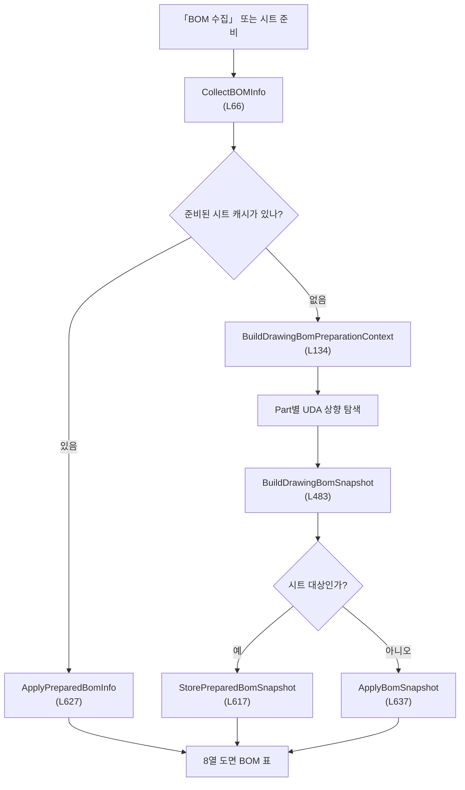
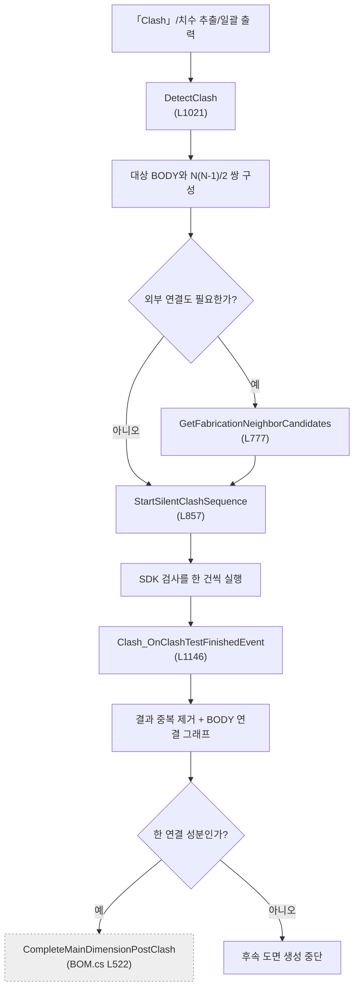

# Form1.Clash.cs — 도면 BOM 조립과 간섭 연결성 판정

**한 줄**: 한쪽에서는 UDA를 조상까지 읽어 도면용 BOM 표를 만들고, 다른 쪽에서는 BODY 쌍 간섭검사를 SDK에 순차 실행시킨 뒤 결과를 **부재 연결 그래프**와 설치도 접합 후보로 바꾼다.

---

## 1. 진입점 — 언제 도는가

### 화면에서 직접 시작

| 화면 동작 | 핸들러 | 위치 | 결과 |
|---|---|---:|---|
| **BOM 수집** | `btnCollectBOMInfo_Click` | L21 | 현재 선택 도면 시트 또는 전체 모델의 8열 도면 BOM 표 구성 |
| **Clash** | `btnClashDetection_Click` | L1113 | 현재 선택/가시 BODY의 간섭검사 시작 |

두 버튼은 Designer에서 배선된다.

### SDK 이벤트와 다른 파일에서 시작

| 경로 | 메서드 | 언제 |
|---|---|---|
| 간섭검사 완료 이벤트 | `Clash_OnClashTestFinishedEvent` (L1146) | SDK 초기화 때 `Form1.BOM.cs` L157에서 배선. 등록한 검사 한 건이 끝날 때마다 호출 |
| **치수 추출** | `DetectClash` (L1021) | `Form1.BOM.cs`가 BOM 수집 뒤 연결성 확인을 시작 |
| **도면 일괄 출력** | `DetectClash` (L1021) | `Form1.Stru.cs`가 STRU마다 검사와 설치도 외부 연결 검사를 시작 |
| 도면 시트 생성·선택·출력 | `CollectBOMInfo` (L66), `PrepareDrawingSheetBomCaches` (L117) | `Form1.DrawingSheets.cs`와 `Form1.MfgDrawing.cs`가 시트별 BOM을 미리 계산하거나 화면에 적용 |
| 모델 열기 | `ResetFabricationNeighborSearchCache` (L654) | `Form1.BOM.cs`의 Body→Part 매핑 재구축 시 근접 검사 캐시 초기화 |

---

## 2. 실행 흐름 — 무엇이 어떤 순서로





### 2-1. 도면 BOM 수집

1. **`CollectBOMInfo`** (L66) — 선택 도면 시트가 있으면 그 시트, 없으면 전체 모델을 대상으로 고른다. 시트에 준비된 캐시가 있으면 계산을 건너뛴다.
2. **`BuildDrawingBomPreparationContext`** (L134) — BODY를 Part로 묶고, 필요한 UDA 실제 Key를 찾은 뒤 Part마다 한 번만 값을 읽는다.
3. **`ReadDrawingBomPartData`** (L262) — Part에서 부모 방향으로 최대 10단계를 올라가 SPREF·MATREF·GWEI·POSSTART·POSEND·STRU·MA·FA를 채운다.
4. **`BuildDrawingBomSnapshot`** (L483) — 요약행 1개와 Part별 데이터행을 만들고 BODY→그룹 번호 맵을 만든다.
5. 시트 대상이면 **`StorePreparedBomSnapshot`** (L617)에 저장하고, 화면 표시 때 **`ApplyPreparedBomInfo`** (L627)로 꺼낸다. 전체 대상이면 바로 **`ApplyBomSnapshot`** (L637)을 실행한다.
6. **`ApplyBomSnapshot`** (L637) — `lvDrawingBOMInfo`를 No/ITEM/MATERIAL/SIZE/Q'TY/T/W/MA/FA 여덟 열로 채운다.

**그래서 화면에는** 첫 줄 요약행 `00`과 BOM 번호순 부재 행이 나타난다. 시트 생성 경로에서는 같은 계산을 시트마다 다시 하지 않도록 스냅샷을 보관한다.

### 2-2. 일반 간섭검사 등록과 실행

1. **`DetectClash`** (L1021) — 이전 일반/근접 결과와 화면 목록을 비운다.
2. 모델의 BODY 노드를 가져오고, X-Ray 목록이 있으면 그 인덱스만, 없으면 현재 보이는 BODY만 검사 대상으로 잡는다 (L1012~1034).
3. 대상 BODY의 모든 조합 `N(N-1)/2`마다 `ClashTest` 하나를 만들고 SDK에 등록한다 (L1040~1064).
4. 설치도 외부 연결까지 필요하면 **`GetFabricationNeighborCandidates`** (L777)로 3mm 안의 외부 BODY만 먼저 거른 뒤, 대상 그룹 대 후보 그룹 검사 하나를 추가한다 (L1066~1096).
5. **`StartSilentClashSequence`** (L857) — 등록된 테스트 ID를 큐에 넣고 첫 검사를 진행창 없이 시작한다.

**그래서 SDK에는** 대상 내부 연결성 검사들과, 필요할 때만 외부 근접 연결 검사 하나가 등록된다.

### 2-3. 여러 검사를 한 건씩 직렬화

1. **`StartNextSilentClashTest`** (L877) — 큐 맨 앞 ID를 `PerformInterferenceCheck(id, false)`로 실행한다.
2. 완료 이벤트가 오면 **`AdvanceSilentClashSequence`** (L973)가 예상 ID인지 확인한다.
3. 다음 ID가 남았으면 이벤트 콜백을 빠져나온 뒤 **`StartNextSilentClashTestAfterEvent`** (L902)를 UI 큐에서 실행한다.
4. SDK `IsBusy`가 풀릴 때까지 50ms 간격, 최대 40회(약 2초) 기다린 뒤 다음 검사를 시작한다 (L910~928).
5. 취소되거나 후속 시작이 실패하면 **`HandleSilentClashStartFailure`** (L938)에서 상태를 초기화하고 치수 추출 또는 일괄 출력 흐름을 정리한다.

### 2-4. 완료 결과를 연결 그래프로 변환

1. **`Clash_OnClashTestFinishedEvent`** (L1146) — 마지막 테스트 완료 때만 등록된 모든 테스트를 순회한다.
2. 각 테스트 결과를 SDK의 `PART` 그룹으로 읽고 `ClashData`에 Part 인덱스·이름·HotPoint XYZ를 보존한다 (L1160~1201).
3. A-B와 B-A를 같은 쌍으로 보고 일반 결과와 외부 연결 결과에서 각각 중복 제거한다 (L1203~1211).
4. 외부 연결 결과의 실제 상대 Part만 `fabricationNeighborPartIndices`에 넣는다. 이는 AABB 광역 후보 목록이 아니라 **SDK 간섭 결과를 통과한 Part 목록**이다 (L1213~1221).
5. 일반 결과와 `[연결]` 결과를 HotPoint Z 내림차순으로 화면에 표시한다 (L1226~1253).
6. **`IsSingleConnectedComponent`** (L1309) — 일반 결과를 BODY 양방향 인접 리스트로 바꾸고 BFS로 모든 BOM 항목이 한 덩어리인지 판정한다.
7. 한 덩어리면 **`CompleteMainDimensionPostClash`** (`Form1.BOM.cs` L522)로 넘어가 Osnap·치수·시트 생성을 계속하고, 아니면 중단한다.

---

## 3. 상태 — 무엇을 읽고 무엇을 쓰나

### 이 파일의 지속 상태

| 필드 | 역할 | 초기화 |
|---|---|---|
| `_silentClashPendingTestIds` | 순차 실행할 SDK 테스트 ID 큐 | 새 검사 시작·취소·완료 실패 때 `ResetSilentClashSequence` |
| `_silentClashSequenceActive` | 현재 직렬 실행 중인지 | 같은 시점 |
| `_silentClashActiveTestId` | 완료 이벤트에서 기다리는 ID | 같은 시점 |
| `_silentClashSequenceTotal` / `_silentClashCompletedCount` | 진행 로그용 전체·완료 수 | 같은 시점 |

도면 BOM 임시 타입 `DrawingBomPartData`·`DrawingBomPreparationContext`·`DrawingBomSnapshot`은 한 번의 준비 계산 동안 Part UDA, Part↔BODY, BOM 번호, 최종 행을 전달한다.

### Form1.cs에서 공유하는 상태

| 필드 | 읽기/쓰기 | 역할 |
|---|---|---|
| ⚠ `vizcore3d` | 읽기·쓰기 | 노드·UDA·BBox 조회, 간섭 테스트 등록·실행·결과 조회 |
| ⚠ `bomList` | 읽기 | 도면 번호 매핑과 연결성 판정의 BODY 모수 |
| ⚠ `bodyToPartIndexMap` | 읽기 | BODY→Part 변환 |
| ⚠ `drawingSheetList` | 읽기 | 모든 시트의 BOM 사전 준비 |
| ⚠ `bomInfoNodeGroupMap` | 쓰기 | BODY→도면 BOM 그룹 번호 적용 |
| ⚠ `clashList` | 쓰기 | 일반 간섭 결과. 연결성·시트 분할에서 사용 |
| ⚠ `fabricationNeighborClashList` | 쓰기 | 설치도·제작도 외부 연결 전용 결과 |
| ⚠ `fabricationNeighborPartIndices` | 쓰기 | 실제 외부 연결 Part 집합 |
| ⚠ `fabricationTargetBodyIndices` / `fabricationTargetPartIndices` | 쓰기 | 외부 검사에서 기준과 상대 구분 |
| ⚠ `fabricationBodyBoundsCache` | 쓰기 | 전체 BODY AABB 캐시 |
| ⚠ `fabricationBodyToPartIndexCache` | 쓰기 | 실제 부모 체인을 따른 BODY→Part 캐시 |
| ⚠ `fabricationNeighborCacheSourceBodyCount` | 쓰기 | 캐시 재사용 판정용 모델 BODY 수 |
| ⚠ `xraySelectedNodeIndices` | 읽기 | 간섭 검사 대상을 선택 범위로 제한 |

`_mainDimensionInProgress`·`_p2aInProgress`·취소 상태도 읽어 어느 상위 자동화가 검사를 시작했는지에 따라 메시지와 정리 흐름을 바꾼다.

`DrawingSheetData.PreparedBomRows`·`PreparedBomNodeGroupMap`·`BomPrepared`는 시트별 BOM 캐시다.

### 설정값과 상수

| 항목 | 값 |
|---|---|
| MA 기본 UDA | `:SHI_MA` (`App.config`의 `Uda.BomMa`로 교체 가능) |
| FA 기본 UDA | `:SHI_FA` (`App.config`의 `Uda.BomFa`로 교체 가능) |
| 일반/외부 간섭 clearance·range | **3.0mm** |
| penetration tolerance | **1.0mm** |
| 외부 후보 AABB clearance | ⚠ `FabricationNeighborClearance` **3.0mm** (`Form1.cs`) |

---

## 4. 의존 — 무엇과 묶여 있나

### VIZCore3D SDK API

`VIZCore3D.NET.xml`에서 아래 멤버와 의미를 확인했다.

| API | 이 파일에서 쓰는 이유 |
|---|---|
| `Object3D.GetPartialNode(assembly, part, body)` | 전체 Part 또는 BODY의 인덱스·이름·종류만 빠르게 조회 |
| `Object3D.FromIndex` | 부모 인덱스·가시성·실제 이름 조회 |
| `Object3D.GetBoundBox(..., false)` | BODY 근접 후보용 AABB |
| `Object3D.UDA.Keys` / `UDA.FromIndex` | 실제 UDA Key 확인과 Part/조상 값 조회 |
| `Clash.Clear()` | 이전 간섭 테스트 항목 전체 삭제 |
| `Clash.Add(ClashTest)` | `GROUP_VS_GROUP` 테스트 등록 |
| `Clash.PerformInterferenceCheck(int, false)` | 특정 테스트를 SDK 진행창 없이 비동기 실행 |
| `Clash.IsBusy` | 완료 이벤트 후 SDK 내부 작업 해제 확인 |
| `Clash.Items` / `ClashTestCount` | 등록된 테스트 전수 조회 |
| `Clash.GetResultItem(test, PART)` | 결과를 Part 단위로 그룹화해 조회 |

XML 정의상 `UseClearanceValue`는 여유허용범위, `UseRangeValue`는 근접허용범위, `UsePenetrationTolerance`는 접촉허용오차를 켠다. `BottomLevel`은 1부터 시작하고 1이 PART인데 코드는 0을 써 상위 동일 부모 제외를 적용하지 않는다.

### 다른 Form1 파일

| 메서드 | 위치 | 맡기는 일 |
|---|---|---|
| `GetAppSetting` | `Form1.DrawingSheets.cs` L3483 | MA·FA UDA Key와 진단 덤프 설정 읽기 |
| `CompleteMainDimensionPostClash` | `Form1.BOM.cs` L522 | 연결성 통과 후 Osnap·치수·시트 생성 계속 |
| `CancelMainDimensionAtCheckpoint` / `FinishMainDimensionOperation` | `Form1.BOM.cs` L456 / L475 | 치수 추출 취소·UI 복원 |
| `GenerateDrawingSheets` | `Form1.DrawingSheets.cs` L20 | 일괄 출력에서 검사 시작 실패 시 최소 시트 생성 시도 |
| `DiagLog`·`IsCancellationRequested`·`HideBusyOverlay` | `Form1.cs` | 진단·협력적 취소·진행창 정리 |

---

## 5. 알고리즘 — 자명하지 않은 계산

### 5-1. 도면 BOM은 Part당 UDA를 한 번만 읽는다

시트의 `MemberIndices`는 BODY이므로 먼저 `bodyToPartIndexMap`으로 Part 집합을 만든다. 전체 모델이면 SDK Part 목록을 직접 쓴다. 이후 UDA 전체 Key에서 필요한 이름만 대소문자 무시로 실제 Key에 매핑한다.

Part마다 최대 10단계 부모 방향으로 올라가며 각 항목의 **첫 비어 있지 않은 값**을 유지한다. SPREF·MATREF·GWEI·POSSTART·POSEND는 모두 채워지고 STRU 노드까지 찾으면 조기 종료한다. MA·FA가 비어 있어도 종료 조건에는 포함하지 않는다.

STRUCTURE 무게는 `STRU` UDA가 붙은 노드를 STRUCTURE로 보지 않는다. 먼저 부재에서 읽은 `STRU` 문자열을 기억한 다음, 조상 중 `NodeName == STRU 값`인 노드의 GWEI를 읽는다. 조상 노드는 여러 Part가 공유하므로 `struGweiByNode`로 한 번만 읽는다.

### 5-2. SPREF·POS·GWEI를 표 값으로 변환한다

- SPREF: 선행 `/` 제거 → 첫 `/` 또는 `:` 앞은 ITEM, 뒤는 SIZE
- POSSTART/POSEND: 문자열에서 처음 세 숫자를 순서대로 X/Y/Z로 보고 유클리드 거리 계산

```
length = √((endX-startX)² + (endY-startY)² + (endZ-startZ)²)
SIZE = 기존 SIZE + "x" + length
```

좌표 토큰의 실제 축 의미는 확인되지 않았고 코드도 등장 순서를 그대로 쓴다. 숫자가 셋보다 적으면 0으로 채운다.

GWEI는 숫자·`.`·`,`·`-`만 남기고 쉼표를 점으로 바꿔 읽은 뒤 소수 둘째 자리 문자열로 만든다. 단위 문자는 제거하지만 kg↔t 같은 단위 변환은 하지 않는다.

### 5-3. 요약행은 STRU 무게 우선, 부재 합계는 fallback이다

첫 비어 있지 않은 STRUCTURE GWEI를 요약행 T/W로 쓴다. 없을 때만 Part 무게를 합산한다. 자체 GWEI가 없는 부재가 조상 무게를 물려받아 합계가 부풀 수 있어, 합계가 STRUCTURE 무게보다 커도 덮어쓰지 않고 로그만 남긴다.

요약행은 `00 / Support&Seat / 빈칸 / 빈칸 / 빈칸 / T/W / F / F`다. 데이터행 Q'TY는 Part 한 행당 항상 `1`; 빈 MATERIAL·SIZE·T/W·MA·FA는 `-`로 보인다. BOM 번호는 메인 `bomList`의 순서를 따라 숫자 오름차순으로 정렬한다.

### 5-4. 외부 연결 검사는 AABB로 모수를 줄인 뒤 SDK에 맡긴다

모델의 모든 BODY AABB와 실제 부모 Part를 최초 한 번 캐시한다. 각 후보는 먼저 대상 BODY 전체의 합성 AABB와 3mm 안에서 겹쳐야 하고, 이어서 **개별 대상 BODY 하나 이상**과도 3mm 안에서 겹쳐야 한다.

축별 겹침식은 다음 세 축을 모두 만족해야 한다.

```
a.MaxX + clearance ≥ b.MinX  &&  b.MaxX + clearance ≥ a.MinX
```

같은 대상 Part의 다른 BODY는 후보에서 제외한다. AABB는 광역 필터일 뿐, 최종 `fabricationNeighborPartIndices`는 SDK `GROUP_VS_GROUP` 결과에서만 채운다.

### 5-5. 일반 간섭은 BODY 쌍별 테스트다

대상이 N개면 테스트 수는 `N(N-1)/2`다. 각 테스트의 GroupA·GroupB에 BODY 하나씩 넣는다. clearance와 range는 둘 다 3mm이고 penetration tolerance는 1mm다. 주석상 2mm 떨어진 부재까지 안전하게 연결로 잡기 위해 1→3mm로 올렸다.

SDK 호출 하나가 끝나기 전에 다음 호출을 시작하지 않도록 ID 큐와 완료 이벤트를 사용한다. 이벤트 콜백 시점에는 `IsBusy`가 아직 true일 수 있어 콜백을 빠져나온 뒤 **최대 40회 × 50ms ≈ 2초** 폴링한다 (`StartNextSilentClashTestAfterEvent`, L902~928). 이 비동기 직렬화가 간섭 코드 중 SDK 호출보다 긴 부분이다.

### 5-6. PART 결과를 BODY 연결 그래프로 다시 펼친다

SDK 결과는 Part 인덱스지만 `bomList`는 BODY 인덱스다. 먼저 Part→BODY 역맵을 만들고, Clash Part A의 모든 BODY와 Part B의 모든 BODY를 완전 이분 연결한다. 그 뒤 BOM BODY마다 BFS를 시작해 연결 성분이 하나인지 본다.

```
Clash Part A ↔ Part B
→ A의 BODY 모두 ↔ B의 BODY 모두
→ BODY 양방향 인접 리스트
→ BFS
```

한 덩어리만 통과해야 치수·시트 자동 생성으로 넘어간다. 떨어진 부재를 연결된 조립체로 오판하지 않게 하는 생산 전 게이트다.

### 5-7. 캐시 수명

- 시트 BOM: `DrawingSheetData.BomPrepared`가 true면 재사용. 시트 객체가 새로 만들어질 때 함께 새로 시작
- 외부 근접 AABB/Body→Part: 모델 로드 때 `BuildBodyToPartNameMap`이 `ResetFabricationNeighborSearchCache` 호출
- STRUCTURE GWEI memo: 한 `BuildDrawingBomPreparationContext` 호출 안에서만 유지

---

## 6. 책임과 결합 — 다시 짠다면

### ① 이 파일이 지는 책임

- Part별 UDA를 조상까지 찾아 도면용 8열 BOM과 시트별 스냅샷을 만든다.
- 내부 BODY 쌍과 설치도 외부 후보를 골라 SDK ClashTest로 등록한다.
- SDK가 동시에 처리하기 어려운 검사를 무창 직렬 큐로 실행하고 완료 이벤트를 이어 붙인다.
- SDK의 Part 결과를 BODY 연결 그래프와 설치도 외부 연결 목록으로 바꾼다.
- 진행창, Clash 목록, 치수 추출·STRU 일괄 출력의 후속 흐름까지 제어한다.

도면 BOM, 간섭 실행기, 연결성 분석, UI 오케스트레이션이 한 파일에 모여 있다.

### ② 떼어낼 수 있는 것

| 무엇을 | 어디로 | 근거 |
|---|---|---|
| SPREF·POS·GWEI 정규화와 요약행/Part 행 조립 | `DrawingBomBuilder` | UDA 조회 결과를 DTO로 받으면 문자열 파싱·정렬·합계는 SDK와 UI 없이 시험할 수 있다. |
| BODY 조합과 3mm 외부 후보 계획 | `ClashTestPlanner` | BBox와 Part/BODY 관계만으로 검사 계획을 만들 수 있고 SDK에는 완성된 계획만 넘기면 된다. |
| 무창 큐와 완료 이벤트 상태 기계 | `VizClashRunner` | SDK Test ID·`IsBusy`·이벤트를 한 어댑터가 소유하면 `Form1`의 bool 필드와 후속 화면 로직을 분리할 수 있다. |
| 중복 제거·인접 리스트·BFS | `ConnectivityAnalyzer` | `ClashData`의 양 끝 인덱스만 쓰는 순수 그래프 계산이다. 실제 성분 수와 Part/BODY 정책을 단위 시험으로 고정할 수 있다. |
| 시트별 BOM 캐시 | 모델 버전과 UDA 버전을 키로 삼는 `DrawingBomCache` | 현재 `BomPrepared` bool보다 무효화 근거를 명시할 수 있다. |

### ③ 못 떼는 것과 이유

- `PerformInterferenceCheck`와 완료 이벤트는 SDK 전역 Clash 상태와 Test ID에 묶이므로 SDK 어댑터 없이 순수 서비스로 옮길 수 없다.
- 대상 범위가 ⚠ `xraySelectedNodeIndices`, `bomList`, 현재 가시성에 의존하고 결과도 ⚠ `clashList`, `drawingSheetList`를 바꾸므로 먼저 작업 단위 `DrawingJobContext`가 필요하다.
- 진행창·취소와 `lvClash`, `lvDrawingBOMInfo` 갱신은 WinForms 어댑터 책임으로 남는다.
- 같은 Part 아래 여러 BODY를 한 연결 단위로 볼지는 코드 문제가 아니라 도면 업무 규칙이다. Part 단위로 합칠지 확인 전에는 그래프 경계를 확정할 수 없다 `(미확인)`.
- SDK 일괄 간섭 오버로드가 무창 실행을 지원하는지는 XML만으로 확인되지 않아 현재 직렬 큐를 바로 없앨 수 없다 `(미확인)`.

### ④ 지울 것

- 코드베이스에 소비자가 없는 `bomInfoNodeGroupMap`과 `PreparedBomNodeGroupMap` 생성·저장·복원은 삭제 대상이다.
- `IsSingleConnectedComponent`가 두 번째 성분에서 즉시 반환해 개수를 항상 2로 만드는 조기 반환은 제거하고 전체 BFS 결과를 반환하게 한다.
- 문자열을 처음 세 숫자로만 해석하는 `ParsePosString`과 단위 없는 GWEI 정규화는 공용 파서로 교체한 뒤 삭제한다. 실제 입력 형식 범위는 `(미확인)`이다.
- `catch { }`로 UDA 없음과 SDK 오류를 합치는 분기는 명시적 조회 결과로 바꾼 뒤 제거한다.
- **Clash** 버튼이 간섭 표시 뒤 치수·시트 생성까지 호출하는 결합은 버튼 의도가 “검사만”으로 확정되면 삭제한다 `(미확인)`.

---

## 부록 — 지나가며 눈에 띈 것

| | 내용 |
|---|---|
| ⚠ | `IsSingleConnectedComponent`는 두 번째 성분에서 반환하므로 실제 그룹이 더 많아도 사용자 메시지의 그룹 수는 항상 2다. |
| ⚠ | 같은 Part 아래 여러 BODY에는 내부 간선을 만들지 않는다. 논리 Part 하나를 BODY 수만큼 분리 성분으로 볼 수 있어 업무 단위 확인이 필요하다 `(미확인)`. |
| ⚠ | 시트 `BomPrepared`는 UDA 변경 뒤 무효화되지 않아 이전 SPREF·GWEI·MA·FA를 다시 표시할 수 있다. |
| · | 외부 근접 캐시는 BODY 총수와 BBox 캐시 존재만 확인해 일부 BBox 조회가 빠진 불완전한 캐시도 재사용할 수 있다. |
| · | 여러 STRUCTURE가 한 스냅샷에 섞이면 첫 번째 STRU 무게를 요약행에 쓰며 대표 선택 정책은 없다. |
