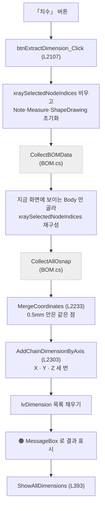
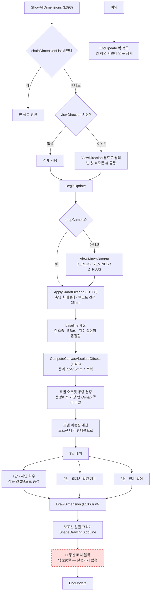

# Form1.Dimensions.cs — 치수를 몇 개, 어디에, 어떤 길이로

**한 줄**: 부재 좌표에서 **체인 치수를 만들고**, 도면에 다 넣으면 겹쳐서 못 읽으니 **골라내고**, 겹치지 않게 **단을 나눠 배치**한다.

> 📊 이 파일에 프로젝트에서 가장 큰 메서드가 있다 — **`ShowAllDimensions` 663줄**. 5개 파일에서 15번 불린다.
> 그리고 그 안에 **약 220줄의 죽은 코드**가 있다 → [6절 ④](#④-지울-것)

---

## 1. 진입점

### 살아 있는 버튼 4개

| 화면 버튼 | 핸들러 | 줄 | 크기 |
|---|---|---|---|
| **치수** (치수 추출) | `btnExtractDimension_Click` | L2107 | 123줄 |
| **풍선 위치 조정** | `btnBalloonAdjust_Click` | L237 | 124줄 |
| **선택 보기** | `btnDimensionShowSelected_Click` | L17 | 112줄 |
| **선택 삭제** | `btnDimensionDelete_Click` | L133 | 68줄 |

### 🔴 죽은 버튼 핸들러 4개

`btnShowAxisX_Click` (L205) · `btnShowAxisY_Click` (L213) · `btnShowAxisZ_Click` (L221) · `btnShowISO_Click` (L229)

**어디에도 배선돼 있지 않다.** 주석에 *"기존 호환용"* 이라 적혀 있고 각각 4줄로 `ApplyGlobalView`만 부른다. 지금 화면의 축·ISO 버튼은 `GlobalViews`로 간다.

### 목록

| | 줄 | 언제 |
|---|---|---|
| `LvClash_SelectedIndexChanged` | L1900 | 간섭 행 선택 → 관련 Osnap·치수 자동 선택 |
| `LvDimension_SelectedIndexChanged` | L1870 | 치수 행 선택 → 그 부재 3D 강조 |

### 다른 파일이 부르는 것 — 이쪽이 본체

| 메서드 | 줄 | 누가 |
|---|---|---|
| **`ShowAllDimensions`** | L393 | BOM · Drawing2D · **DrawingSheets ×8** · GlobalViews |
| `ComputeViewDimensionsForMembers` | L2433 | BOM · **DrawingSheets ×4** |
| `MarkNonRightAngles` | L2782 | DrawingSheets |
| `AddChainDimensionByAxis` · `MergeCoordinates` | L2303 · L2233 | Drawing2D · MfgDrawing |

---

## 2. 실행 흐름

### 2-1. 「치수」 버튼 — 좌표에서 치수까지



### 2-2. `ShowAllDimensions` — 663줄이 하는 일



---

## 3. 상태

### `Form1.cs` 공유 상태

| 필드 | 읽기/쓰기 | 무엇에 |
|---|---|---|
| ⚠ `vizcore3d` | 읽기·쓰기 | 전부 |
| ⚠ `chainDimensionList` | 읽기·**쓰기** | 치수 목록. **이 파일이 정본** |
| ⚠ `xraySelectedNodeIndices` | 읽기·쓰기 | baseline 계산 대상 |
| ⚠ `osnapPointsWithNames` | 읽기 | 체인 치수 재료 |
| ⚠ `bomList` | 읽기 | 부재 중심·경계상자 |
| ⚠ `balloonOverrides` | 읽기·**쓰기** | 풍선 수동 위치 |
| ⚠ `currentBalloonView` · `currentBalloonMemberIndices` | 읽기 | 풍선 조정 대상 |
| ⚠ `bodyToPartIndexMap` | 읽기 | Body → Part |
| ⚠ `_lastModelShiftCanvasX` / `Y` | **쓰기** | 🔑 계산 결과를 `DrawingSheets`가 읽어 모델을 민다 |

### 이 파일의 상수 — 전부 도면 사양

| 상수 | 값 | 단위 | 무엇 |
|---|---|---|---|
| `ExtensionLineGap` L1449 | **10.0** | 모델 mm | 보조선 시작 간격 (제작도 기본) |
| `FabCanvasExtGap` L1455 | **2.0** | **종이 mm** | 가공도 보조선 간격 |
| `Lvl2TextSlideCanvas` L1461 | **2.5** | **종이 mm** | 2단 치수 텍스트 밀기 |
| `MarkAngleTol` L2779 | **1.0** | 도 | 90° 배수 판정 공차 |
| `MarkJunctionTol` L2780 | **3.0** | mm | 부재 접합 판정 거리 |

> 🔑 **단위가 두 가지다.** 모델 mm는 축척에 따라 종이에서 길이가 달라지고, 종이 mm는 항상 같다. 2026-07-03에 **종이 절대 기준으로 옮기는 중**이고 아직 섞여 있다.

---

## 4. 의존

### VIZCore3D SDK

| API | 무엇에 |
|---|---|
| `Review.Measure.AddCustomAxisDistance(Axis, s, e)` | **월드축 치수** — 기본 경로 |
| `Review.Measure.AddCustomDistanceUserAxis(s, e, axis)` | **임의축 치수** — 기울어진 부재용 |
| `Review.Measure.GetStyle` · `SetStyle` | 글꼴·색·소수점·정렬 |
| `Review.Measure.Clear` | 기존 치수 제거 (**참조축도 같이 지워진다**) |
| `Review.Note.AddNoteSurface` · `GetStyle` · `Clear` | 풍선 |
| `ShapeDrawing.AddLine` · `Clear` | **보조선** |
| `Drawing2D.Measure.SetMeasureItemDistanceTextPos` | 치수 텍스트 위치 |
| `Object3D.GetOsnapPoint` | 각도 표시용 점 수집 |
| `Object3D.GetBoundBox` | baseline |
| `View.MoveCamera` · `SetPivotPosition` · `FlyToObject3d` | 카메라 |
| `Review.Measure.AddCustom3PointAngle` | **직각 아닌 각도 표시** |
| `BeginUpdate` · `EndUpdate` | 화면 갱신 묶기 |

### 다른 `Form1.*.cs`

| 메서드 | 어디 | 맡기는 일 |
|---|---|---|
| `CollectBOMData` · `CollectAllOsnap` | `Form1.BOM.cs` | 부재·좌표 수집 |
| `CreateIsoBalloonNotes` | `Form1.DrawingSheets.cs` L960 | ISO 풍선 |
| `ApplyGlobalView` | `Form1.GlobalViews.cs` L49 | 뷰 전환 (죽은 핸들러 4개가 부름) |
| `IsPadOrPlateFromSpref` | `Form1.MfgDrawing.cs` | 판형 부재 판정 |
| `DiagLog` | `Form1.cs` L266 | 로그 |

---

## 5. 알고리즘

### ① 체인 치수 만들기 — "제일 아래 왼쪽" 하나만 남긴다 (L2303)

같은 축 위에 점이 여러 개면 치수가 겹친다. 그래서 **축 값이 같은 점들 중 하나만 고른다.**

```
1. 필터축을 정한다
     뷰 있음:  보이는 두 축 중 치수축이 아닌 쪽
     뷰 없음:  X→Z,  Y→X,  Z→Y
2. 치수축 값이 같은 점끼리 묶고, 그 중 필터축 값이 가장 작은 점만 남긴다
3. 치수축 값 오름차순 정렬
4. 이웃끼리 순차 치수  (0.5mm 이하는 버림)
5. 점이 3개 이상이면 처음~끝 전체 치수 하나 더  (IsTotal)
```

**"필터축 최소"가 곧 "아래쪽·왼쪽 우선"** 이다. 도면 관례상 치수를 아래·왼쪽에 모으기 때문.

### ② 좌표 병합 — 0.5mm 격자로 반올림 (L2233)

```
x' = round(x / 0.5) × 0.5      // y, z 도 같이
```

반올림한 뒤 **다시 0.5mm 안에 있는 것을 중복 제거**한다. 반올림만으로는 경계에 걸친 점이 갈리기 때문.

> ⚠ `Any()` 선형 탐색이라 점 개수의 제곱에 비례한다. 좌표가 수천 개면 느려진다.

### ③ 스마트 필터링 — 4단계 (L1568)

도면 한 장에 치수를 다 넣으면 못 읽는다. **축당 최대 8개**만 남긴다.

**1단계 · 우선순위 매기기** (`AssignDimensionPriorities` L1495)

축별로 거리 분포를 정규화한다 — `(거리 − 최소) / (최대 − 최소)`.

| 정규화 값 | 우선순위 | |
|---|---|---|
| — | **10** | `IsTotal` 전체 길이 · `IsRequired` 설치 접합 |
| ≥ 0.70 | **8** | 상위 30% |
| ≥ 0.40 | **5** | 중간 |
| ≥ 0.15 | **3** | 작은 구간 |
| < 0.15 | **1** | 매우 작은 구간 |

**2단계 · 무조건 넣는 것** — `IsTotal`과 `IsRequired`는 개수·겹침 검사 **이전에** 통과시킨다.

**3단계 · 짧은 것 병합** (`MergeShortDimensions`) — 연속된 짧은 치수를 하나로 합친다.

**4단계 · Greedy 배치** — 우선순위 높은 순으로 넣되 **텍스트가 겹치면 밀어낸다.**

```
텍스트 폭 ≈ max(25, 자릿수 × 5 + 10)        // "1250" 이면 4자리 → 30mm

두 치수 중심 거리 < (폭1 + 폭2) / 2  이면 겹침
   → 우선순위 5 이상이면 2단으로 (거기서도 겹치면 숨김)
   → 5 미만이면 숨김
```

**"큰 치수부터 자리를 잡고, 남은 자리에 작은 것"** 이 전부다.

### ④ 보조선 길이 — 종이 절대 mm를 모델좌표로 역산 (L378)

```
1단 = 7.5mm ÷ 축척        2단 간격 = 7.5mm ÷ 축척
```

축척이 1:50이든 1:200이든 **출력물에서 보조선 길이가 항상 같다.** 모델좌표 고정값이면 축척마다 달라진다.

| 용도 | 1단 / 간격 |
|---|---|
| 제작도 | **7.5 / 7.5** — 2026-07-06에 5/5에서 1.5배 확대 (세로 치수 텍스트가 모델에 붙어서) |
| 가공도 | **9 / 9** (`MfgCanvasBaseOff` · `MfgCanvasLvlSp`) |
| 3D 미리보기 (축척 없음) | 모델좌표 **100 / 80** 고정 |

**식은 한 곳(`ComputeCanvasAbsoluteOffsets`), 값만 분기**한다.

### ⑤ 3단 배치와 "작은 치수 승격"

| 단 | 오프셋 | 무엇 |
|---|---|---|
| 1단 | `base` | 체인 치수 |
| 2단 | `base + spacing` | 겹쳐서 밀린 것 **+ 작은 치수** |
| 3단 | `base + spacing × 2` | 전체 길이 |

**작은 치수 승격** (2026-07-03) — 텍스트가 치수선 안에 안 들어가는 치수는 **제자리에서 글자를 옮기지 않고 치수선째 2단으로 올린다.**

```
임계 = 뷰 최대 치수 / 26        (뷰 최대가 100mm 이하면 승격 없음)
승격이 하나라도 있으면 전체 길이는 3단으로 밀린다
```

> 옛 방식(`ApplyParallelTextShift` — 텍스트만 옆으로 밀기)은 이걸로 **대체·폐기**됐다. 이웃과 겹치는 문제가 원천적으로 사라져서다.

**2단 텍스트 슬라이드** — 2단에 그려지는 치수는 텍스트를 **종이 절대 2.5mm** 옮긴다. 가로 치수는 화면 오른쪽, 세로 치수는 화면 위로.

> `SetMeasureItemDistanceTextPos`는 **치수선 방향 성분만 반영**하고 수직 성분은 버린다 (실기 확정). 그래서 두 방향밖에 못 민다.

### ⑥ 치수를 어느 쪽에 뺄지 — 중앙에서 가장 먼 Osnap 쪽

```
축 그룹마다:
  오프셋축 = 뷰에서 보이는 축 중 치수축이 아닌 쪽
  그 축의 Osnap 값들과 모델 중심을 비교
  → 중심에서 가장 먼 점이 있는 쪽이 바깥 (ComputePositiveOffsetByOsnapExtreme)
```

**부재가 한쪽으로 치우쳐 있으면 치수도 그쪽 바깥으로 나간다.** 모델 위에 겹치지 않게 하려는 것.

### ⑦ 모델을 반대로 민다 (2026-05-12 사용자 사양)

> *"보조선이 나간 방향 반대쪽으로 그리드 안의 모델을 보조선 길이만큼 이동"*

치수가 도면 한쪽으로 몰리면 반대쪽이 빈다. 그래서 **모델을 반대로 밀어** 균형을 맞춘다.

| 방향 | 배율 |
|---|---|
| 가로 | **0.25** (항상) |
| 세로 · 바깥이 위 | **0.25** |
| 세로 · 바깥이 아래 · **Z뷰(평면도)** | **0.5** |
| 세로 · 바깥이 아래 · **X·Y뷰** | **0.75** — 라벨 가림 추가 보강 |

계산 결과를 `_lastModelShiftCanvasX/Y`에 넣으면 **`DrawingSheets`가 `MoveObject`로 실제로 민다.** 파일 두 개가 필드 하나로 이어져 있다.

### ⑧ 월드축 치수 vs 임의축 치수 (L1060)

부재가 축에 나란하면 `AddCustomAxisDistance`로 충분하다. **기울어져 있으면** 부재의 로컬축을 만들어 `AddCustomDistanceUserAxis`를 쓴다.

```
로컬 좌표로 계산  →  오프셋축 값만 바꿈  →  월드로 복원  →  UserAxis 치수
        ↓ 실패하면
   참조축 경로면 → 그 치수를 생략한다 (비스듬한 월드축 치수 오표시 방지)
   아니면        → 월드축으로 폴백
```

**실패했을 때 "대충 그리기"보다 "안 그리기"를 골랐다.** 틀린 치수가 도면에 남는 게 더 나쁘기 때문.

### ⑨ 보조선 간격은 길이의 절반을 넘지 않는다

```
gap = min(기본 gap, 보조선 길이 × 0.5)
```

오프셋이 짧으면 고정 gap이 보조선을 통째로 먹어 **길이 0으로 접힌다.** 2026-06-23에 "아래쪽 보조선 누락"으로 나타났던 문제.

가공도 전용(`alignExtToBaseline`)은 다르다 — 보조선을 Osnap 점이 아니라 **모델 가장자리에서 시작**해 모든 보조선 길이를 오프셋 거리로 통일하고, gap은 길이의 **25%** 를 쓴다.

### ⑩ 직각이 아닌 접합에 각도 표시 (L2782)

```
부재마다:  판형(PAD/PLATE) 제외 → Osnap LINE 점 수집 → 길이축 방향 계산
방향벡터를 뷰 평면에 투영 (깊이축 버림)
부재 쌍의 각도가 90° 배수에서 1.0° 넘게 벗어나면 → AddCustom3PointAngle
접합 판정: Osnap 끝점 간 거리 ≤ 3.0mm
```

**판형 부재는 길이 방향이 모호해서 아예 제외**한다. 제외 사유를 전부 로그로 남긴다 — *"기울어 붙었는데 각도가 안 나온다"* 를 진단하려고.

---

## 6. 책임과 결합 — 다시 짠다면

### ① 이 파일이 지는 책임

**네 개다.**

| | 책임 | 대략 |
|---|---|---|
| 1 | **치수 만들기** — Osnap → 체인 치수 | 약 400줄 |
| 2 | **골라내기** — 우선순위·겹침·병합 | 약 300줄 |
| 3 | **배치하기** — 단·오프셋·보조선·텍스트 | 약 1,100줄 |
| 4 | **곁다리** — 풍선 조정 다이얼로그, 각도 표시, 목록 연동 | 약 600줄 |

`ShowAllDimensions` 663줄 하나가 **2·3번을 통째로** 안고 있다.

### ② 떼어낼 수 있는 것

| 무엇을 | 어디로 | 근거 |
|---|---|---|
| 🔑 **필터링 3종** — `AssignDimensionPriorities` · `ApplySmartFiltering` · `MergeShortDimensions` | `DimensionFilter` | **`vizcore3d`를 한 번도 안 부른다.** `ChainDimensionData` 목록을 받아 목록을 돌려주는 순수 계산 |
| 🔑 **체인 치수 생성** — `AddChainDimensionByAxis` · `MergeCoordinates` · `RoundToTolerance` · `GetRemainingAxis` · `GetViewNameByAxis` | `ChainDimensionBuilder` | 좌표 목록만 받는다. SDK도 UI도 안 씀 |
| **좌표 계산 헬퍼** — `TryNormalizeDimensionAxis` · `MovePointToAxisProjection` · `GetBoundingBoxProjectionRange` · `GetAxisValue` · `OffsetTowardLineEnd` · `DrawingReferenceLocalToWorld` | 기하 유틸 | 전부 순수 함수 |
| **`ComputeCanvasAbsoluteOffsets`** (L378) | 도면 사양 상수 클래스 | 나눗셈 두 줄. 상수 5개와 함께 |
| **풍선 조정 다이얼로그** (L237~360) | 별도 Form | 대화상자를 코드로 만드는 124줄. `balloonOverrides`만 건드린다 |

**①②만 빼도 700줄쯤이 순수 계산으로 분리된다.** 그러면 **테스트를 쓸 수 있게 된다** — 지금은 SDK 없이 치수 하나도 못 만들어 본다.

### ③ 못 떼는 것과 이유

| 무엇 | 무엇에 묶였나 |
|---|---|
| `ShowAllDimensions` 배치부 | 🔴 **SDK 호출과 계산이 한 줄 걸러 섞여 있다.** baseline 계산 → 스타일 설정 → 오프셋 계산 → 그리기 → 풍선이 순서대로 얽혀 있어 "계산"과 "그리기"의 경계가 없다 |
| `DrawDimension` | 같은 이유. 좌표 변환·SDK 호출·로그가 섞임 |
| `_lastModelShiftCanvasX/Y` | **`DrawingSheets`와 필드로 이어져 있다.** 반환값으로 바꾸려면 양쪽을 같이 고쳐야 함 |
| 버튼 핸들러·목록 연동 | UI 컨트롤 |

**여기가 이 파일 리팩토링의 핵심 난점**이다. 계산을 빼내려면 `ShowAllDimensions`를 **"무엇을 어디에 그릴지 정하는 부분"과 "실제로 그리는 부분"으로 갈라야** 한다.

```
지금   ShowAllDimensions  →  계산과 그리기가 663줄에 뒤섞임

제안   DimensionLayout.Plan(치수목록, 뷰, 축척)  →  DrawItem 목록   ← 순수 계산
       DimensionRenderer.Draw(DrawItem 목록)                       ← SDK 호출만
```

이렇게 되면 **"치수가 왜 저기 그려졌나"를 SDK 없이 재현**할 수 있다.

### ④ 지울 것

#### 🔴 죽은 풍선 배치 코드 — 약 220줄 (L800~1020)

```csharp
balloonEntries.Clear();            // L893
foreach (var entry in balloonEntries)   // L895 — 항상 0회
```

`balloonEntries`는 **L768에서 선언되고 한 번도 채워지지 않는다.** 채우던 블록은 2026-07-22에 지워졌다 (`Object3D.UDA.Keys`가 `BeginUpdate` 안에서 안 돌아와 앱이 멈추던 문제). **그런데 소비하는 쪽이 그대로 남았다.**

같이 죽은 것들 — 전부 저 루프에서만 쓰인다.

| | 무엇 |
|---|---|
| L800~875 | 치수선 실제 끝단 좌표 추적 (`dimExtMinH/MaxH/MinV/MaxV`) — 모든 치수를 다시 순회 |
| L866~886 | 가상 사각형 경계 (`rectLeft`·`rectRight`), 풍선 간격, 텍스트 크기 추정 |
| L895~928 | 4분면 분류 |
| L931~941 | 정렬 (빈 목록 대상) |
| L943~1020 | 배치 루프 |

> 📌 **`ShowAllDimensions` 663줄 중 약 220줄이 실행되지 않는다.**
> 지우면 **663 → 440줄.** 동작은 한 톨도 안 바뀐다.
> 8/27의 *"왜 3000줄이 넘어야 하는가"* 에 그대로 쓸 수 있는 항목이다.

#### 🔴 죽은 버튼 핸들러 4개

`btnShowAxisX/Y/Z_Click` · `btnShowISO_Click` (L205~236, 32줄). 배선 없음.

#### 🟠 중복

| | |
|---|---|
| **치수 목록 채우기** | `btnExtractDimension_Click`(L2190~2205)과 `Drawing2D`의 `ExtractDimensionForSelectedNodes`가 **거의 같다** — 병합·3축 체인·목록 채우기·`ShowAllDimensions` 호출 순서까지 |
| **스타일 설정 블록** | `btnDimensionShowSelected_Click`(L32~51)과 `ShowAllDimensions`(L465~486)가 같은 `MeasureStyle`을 각각 세운다. 값만 조금 다르다 (SIZE14/파랑 vs SIZE8/파랑) |
| **삭제 후 재구축** | `btnDimensionDelete_Click`이 남은 치수를 **전부 지우고 다시 그린다.** 축별 `switch`가 세 번째로 나온다 |

#### 🟡 주석 처리된 코드

L115~118 (`MouseControl` 실험 흔적)

### 🔑 정리하면

```
지금  Form1.Dimensions.cs 2,985줄
        ShowAllDimensions 663   ← 이 중 220줄이 죽어 있음
        DrawDimension     284
        나머지            2,038

바로 줄일 수 있는 것
        죽은 풍선 배치     -220
        죽은 핸들러 4개     -32
        중복 3건           -100 안팎
                          ─────
                          약 -350줄  (동작 불변)

그 다음
        DimensionFilter          약 300줄  순수 계산, 테스트 가능
        ChainDimensionBuilder    약 250줄  순수 계산, 테스트 가능
        기하 유틸                약 150줄
```

**동작을 안 건드리고 350줄, 계산부 분리로 700줄이 더 나간다.** 남는 건 배치·그리기와 UI다.

---

## 부록 — 지나가며 눈에 띈 것

| | 내용 |
|---|---|
| ⚠ | **`MergeCoordinates`가 O(n²)** — `Any()` 선형 탐색. 좌표가 수천 개면 느려진다 |
| ⚠ | `btnDimensionDelete_Click`이 `lvDimension` 행 순서 = `chainDimensionList` 인덱스라고 전제한다. 목록 정렬이 붙으면 **엉뚱한 치수가 지워진다** |
| ⚠ | **`Review.Measure.Clear()`가 참조축까지 지운다.** 그래서 참조축 경로는 `drawingReferenceFrame != null`일 때 `Clear`를 건너뛴다 (L435). 조건을 놓치면 기울어진 부재 치수가 통째로 사라진다 |
| · | `ShowAllDimensions`의 예외 처리는 **`EndUpdate` 짝 복구가 목적**이다. 2026-07-22 이전엔 예외 시 `BeginUpdate`가 열린 채 남아 **화면 갱신이 영구 정지**했다 (앱이 멈춘 것처럼 보임) |
| · | `btnExtractDimension_Click`·`btnDimensionShowSelected_Click`·`btnDimensionDelete_Click` 셋 다 결과를 `MessageBox`로 띄운다. 일괄 출력 중에는 팝업이 흐름을 막는다 |
| · | 우선순위 경계값(0.7 / 0.4 / 0.15)과 축당 최대 개수(8), 텍스트 간격(25mm)이 **코드에 박혀 있다.** 도면 밀도를 조정하려면 재빌드해야 한다 |
| · | 승격 임계 `maxDist / 26` 의 26에 근거가 없다 **(미확인)** |

---

## 관련 문서

- [`Form1.md`](./Form1.md) — 공유 상태
- [`Models.md`](./Models.md) — `ChainDimensionData` 속성별 의미
- [`Form1.Drawing2D.md`](./Form1.Drawing2D.md) — Osnap 수집 (치수의 재료)
- `docs/기술 노트/치수 보조선 사양.md` · `치수 텍스트 위치.md` — 사양 정본
