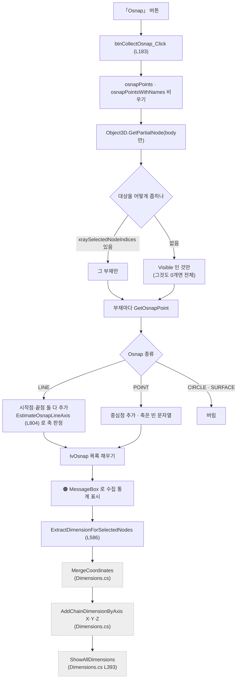
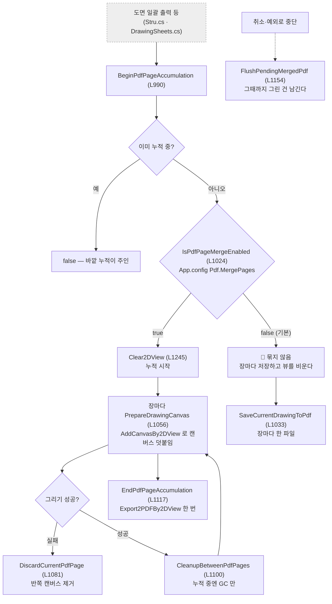

# Form1.Drawing2D.cs — Osnap 수집과 PDF 페이지 관리

**한 줄**: 이름은 "2D 도면"인데 실제로는 **성격이 다른 세 덩어리**가 한 파일에 있다 — 부재의 특징점(Osnap) 수집·편집, 간섭 결과 3D 표시, 그리고 **PDF 여러 장 묶기**.

> 📊 버튼이 **9개로 가장 많은데 코드는 1,270줄로 얇다.** 실제 도면 그리기는 `DrawingSheets`가 하고, 여기는 **그 앞단의 재료 만들기**와 **뒷단의 PDF 저장**을 맡는다.

---

## 1. 진입점 — 언제 도는가

### 버튼 9개

| 화면 버튼 | 핸들러 | 줄 | 크기 |
|---|---|---|---|
| **Osnap** | `btnCollectOsnap_Click` | L183 | 167줄 |
| **선택 항목만 보기** | `btnClashShowSelected_Click` | L354 | 114줄 |
| **선택 좌표 보기** | `btnOsnapShowSelected_Click` | L852 | 102줄 |
| **선택 삭제** | `btnOsnapDelete_Click` | L754 | 45줄 |
| **PDF 내보내기** | `btnExportPDF_Click` | L82 | 41줄 |
| **2D 생성** | `btnGenerate2D_Click` | L37 | 40줄 |
| **전체 보기** | `btnClashShowAll_Click` | L649 | 39줄 |
| **좌표 추가** | `btnOsnapAdd_Click` | L692 | 18줄 |
| **풍선 지우기** | `btnOsnapClearBalloon_Click` | L958 | 9줄 |

### 목록·이벤트

| | 줄 | 언제 |
|---|---|---|
| `LvBOM_DoubleClick` | L127 | BOM 목록 더블클릭 → 그 부재로 카메라 이동 |
| `LvClash_DoubleClick` | L155 | 간섭 목록 더블클릭 → 두 부재 선택 + 이동 |
| `LvOsnap_SelectedIndexChanged` | L820 | 좌표 행 선택 → 그 부재 강조 |
| `GeometryUtility_OnOsnapPickingItem` | L714 | **뷰어에서 마우스 클릭** → 좌표 수동 추가 |

### 다른 파일이 부르는 것 — 이쪽이 더 중요하다

PDF 페이지 관리 함수 8개는 **버튼이 없고 `DrawingSheets`·`MfgDrawing`·`Stru`가 부른다.**

`BeginPdfPageAccumulation` · `PrepareDrawingCanvas` · `EndPdfPageAccumulation` · `FlushPendingMergedPdf` · `DiscardCurrentPdfPage` · `CleanupBetweenPdfPages` · `SaveCurrentDrawingToPdf` · `BuildMergedDrawingPdfPath`

---

## 2. 실행 흐름

### 2-1. Osnap 수집 → 치수까지 자동으로 이어진다



**버튼 하나가 좌표 수집에서 치수 표시까지 끌고 간다.** 사용자는 「Osnap」만 눌렀는데 치수가 화면에 뜬다.

### 2-2. PDF 여러 장 묶기 — 지금은 꺼져 있다



---

## 3. 상태

### `Form1.cs` 공유 상태

| 필드 | 읽기/쓰기 | 무엇에 |
|---|---|---|
| ⚠ `vizcore3d` | 읽기·쓰기 | 전부 |
| ⚠ `osnapPoints` | **쓰기** | 수집한 좌표 |
| ⚠ `osnapPointsWithNames` | **쓰기** | 좌표 + 부재명 + 축 |
| ⚠ `xraySelectedNodeIndices` | 읽기·쓰기 | 수집 대상 좁히기 / 간섭 선택 결과 저장 |
| ⚠ `bomList` | 읽기 | 부재 경계상자, 이름↔인덱스 역조회 |
| ⚠ `chainDimensionList` | **쓰기** | 추출한 치수 |
| ⚠ `currentFilePath` | 읽기 | 시트 이름·PDF 이름 대체값 |
| ⚠ `selectedAttributeNodeIndex` | 읽기 | 「2D 생성」의 시트 이름 |

### 이 파일이 선언한 상태 — 전부 PDF 누적용

| 필드 | 줄 | 무엇 |
|---|---|---|
| `_pdfPageAccumulating` | L973 | 지금 여러 장을 쌓는 중인가 |
| `_pdfPageCount` | L974 | 쌓인 장 수 |
| `_activeDrawingCanvasIdx` | L977 | 지금 그리는 캔버스 번호. 누적이 아니면 항상 1 |
| `_pendingMergedPdfPath` | L983 | 나중에 저장할 묶음 PDF 경로 |
| `_suppressOsnapSelChanged` | L819 | 프로그래밍 선택 시 이벤트 재진입 방지 |

---

## 4. 의존

### VIZCore3D SDK

| API | 무엇에 |
|---|---|
| `Object3D.GetOsnapPoint` | **이 파일의 핵심.** 부재의 특징점 목록 |
| `Object3D.GetPartialNode(false, false, true)` | Body 노드만 추리기 |
| `Object3D.FromIndex` · `FromFilter` | 노드 조회 |
| `Object3D.Select` · `Color.RestoreColorAll` | 선택 표시 |
| `View.XRay.Enable/Clear/Select` · `SilhouetteEdge` | 선택 부재 강조 |
| `View.FlyToObject3d` · `FitToView` · `SetPivotPosition` | 카메라 |
| `GeometryUtility.ShowOsnap` · `OnOsnapPickingItem` | 마우스로 좌표 찍기 |
| `Clash.ShowResultSymbol` · `ClearResultSymbol` | 간섭 지점 삼각형 심볼 |
| `ShapeDrawing.AddSphere` · `Clear` | 좌표 위치 빨간 구 |
| `Review.Note.AddNoteSurface` · `GetStyle` · `Clear` | 좌표 풍선 |
| `Drawing2D.View.AddCanvasBy2DView` · `RemoveCanvasBy2DView` · `SetCanvasSize` · `SetSelectCanvas` · `GetCanvasCountBy2DView` | **PDF 페이지 = 캔버스** |
| `Drawing2D.Object2D.Export2PDFBy2DView` | PDF 저장 |
| `Drawing2D.Object2D.DeleteAllObjectBy2DView` · `DeleteAllNonObjectBy2DView` | 2D 초기화 |
| `Drawing2D.Object2D.UnselectAllObjectBy2DView` · `UnselectCurrentWorkObjectBy2DView` | **노란 선택 테두리 제거** — 안 하면 PDF에 찍힌다 |
| `Drawing2D.Render` | 그리기 반영 |

### 다른 `Form1.*.cs`

| 메서드 | 어디 | 맡기는 일 |
|---|---|---|
| `GenerateSheetDrawing2D` | `Form1.DrawingSheets.cs` L1707 | **실제 도면 그리기 전부** |
| `ShowAllDimensions` | `Form1.Dimensions.cs` L393 | 치수 표시 |
| `MergeCoordinates` · `AddChainDimensionByAxis` | `Form1.Dimensions.cs` | 좌표 병합·체인 치수 |
| `RestoreAllPartsVisibility` | `Form1.MfgDrawing.cs` L23 | 가공도가 숨긴 부재 복원 |
| `GetPartNameFromBodyIndex` | `Form1.BOM.cs` | Body → 부모 Part 이름 |
| `CleanupDrawingSheetExportCanvas` | `Form1.DrawingSheets.cs` | 캔버스 정리 |
| `GetAppSetting` · `SanitizeFileName` · `SanitizeStruForFileName` | 각 파일 | 설정·파일명 |
| `DiagLog` | `Form1.cs` L266 | 로그 |

---

## 5. 알고리즘

### ① Osnap 종류 넷 중 둘만 쓴다

| 종류 | 처리 |
|---|---|
| **LINE** | **시작점과 끝점을 둘 다** 좌표로 넣는다. 축은 `EstimateOsnapLineAxis`로 판정 |
| **POINT** | 중심점 하나. 축은 빈 문자열 = "방향 없음" |
| CIRCLE | 버린다 — 곡면·원형은 체인 치수에 안 쓴다 |
| SURFACE | 버린다 — 곡면 데이터가 너무 많다 |

**축 판정 (L804)** — `start→end` 벡터의 **최대 성분**이 그 선의 축이다.

```
dx = |end.X - start.X|,  dy, dz 도 같이
dx 가 제일 크면 "X",  아니면 dy ≥ dz 면 "Y",  아니면 "Z"
```

경사진 선도 **가장 가까운 축으로 강제 배정**된다. 45도로 기울면 `dx == dy`가 되어 `X`가 된다 — 판정 기준이 `>=`라 X가 우선한다.

> `dynamic` 매개변수를 쓴다. 주석에 이유가 있다 — **`OsnapVertex3D`의 `Start`/`End` 타입이 SDK XML에 명시되지 않아** 정적 타입을 못 적는다.

### ② 수집 대상을 좁히는 3단계 우선순위 (L206~222)

```
1. xraySelectedNodeIndices 가 있으면   →  그 부재만        (선택 모드)
2. 없으면 Visible 인 것만              →  화면에 보이는 것
3. 그것도 0개면                        →  전체
```

**같은 「Osnap」 버튼이 상태에 따라 다르게 동작한다.** 간섭 항목을 골라 「선택 항목만 보기」를 누른 뒤라면 그 부재들만, 아니면 화면에 보이는 것만 수집한다.

### ③ 간섭 심볼 위치 = 두 경계상자가 겹치는 구간의 가운데 (L~430)

```
clashX = ( max(bom1.MinX, bom2.MinX) + min(bom1.MaxX, bom2.MaxX) ) / 2
```

Y·Z도 같다. **실제 접촉면이 아니라 겹침 구간의 중점**이다. `Clash`가 제공하는 HotPoint를 쓰지 않고 경계상자로 근사한다.

### ④ 좌표 병합 허용오차 **0.5mm** (L601)

`MergeCoordinates`에 넘기는 `tolerance`. 이 안에 있는 좌표는 같은 점으로 묶는다. 그 뒤 X·Y·Z 축마다 체인 치수를 만든다.

### ⑤ 삭제는 역순으로 (L765~776)

여러 좌표를 한 번에 지울 때 **인덱스를 정렬해 뒤에서부터** 지운다. 앞에서 지우면 뒤 인덱스가 밀린다. 지운 뒤 목록 번호를 1부터 다시 매긴다.

> ⚠ `lvOsnap`의 행 순서가 `osnapPoints`의 인덱스와 **같다고 전제**한다. 정렬 기능이 붙으면 깨진다.

### ⑥ 🔑 PDF 여러 장 묶기 — SDK 한계에 막힌 기능

**기본값이 `false`다** (`App.config` L62). "안 쓰이는 코드"가 아니라 **기본 비활성인 운영 경로**다 (교차검증 #5) — 제작/조립/설치·STRU 일괄·가공도 경로가 전부 `BeginPdfPageAccumulation`을 호출하고 설정 하나로 켜진다. 꺼둔 이유가 코드 주석에 그대로 있다 (L1005~1023).

| | |
|---|---|
| **묶으려면** | 저장할 때까지 **모든 장의 2D 객체가 뷰에 함께 살아 있어야** 한다 |
| **그러면** | 조립도처럼 장수가 많을 때 SDK 네이티브에서 **"보호된 메모리" 오류로 프로세스가 즉사** (2026-08-04 실기) |
| **왜 못 피하나** | `Export2PDFBy2DView`는 뷰에 올라온 캔버스를 한 번에 내보낼 뿐 **기존 PDF에 이어붙이지 못한다** |

> 📌 **"장마다 비우기"와 "PDF 한 개"가 지금 양립하지 않는다.**
> 이건 우리 코드의 문제가 아니라 **SDK가 이어붙이기를 제공하지 않아서** 생긴 한계다.
> 8/27 발표의 *"왜 이만큼의 코드가 필요한가"* 에 쓸 재료이자, **소프트힐스 요청 항목** 후보다.

누적 방식의 세부 규칙도 남아 있다.

- **중첩 금지** — 이미 누적 중이면 `false`를 돌려주고 **바깥 누적이 끝까지 주인**이다 (일괄 출력이 가공도 묶음을 품는 구조)
- **실패한 장은 버린다** — `DiscardCurrentPdfPage`가 반쪽 캔버스를 제거해 PDF 페이지로 안 남게 한다
- **중단돼도 그때까지는 남긴다** — `FlushPendingMergedPdf`가 취소·예외 이후에도 저장을 마무리한다
- **누적 중엔 캔버스를 못 지운다** — `CleanupBetweenPdfPages`가 GC만 돌린다

### ⑦ PDF 파일명 규칙 (L1190)

```
{저장폴더}\{STRU 이름}_{종류}.pdf
```

- STRU 이름을 못 구하면 **모델 파일명**으로 대체 (이름 없는 파일보다 낫다)
- STRU는 60자, 종류는 40자로 자른다
- 같은 이름이 있으면 `_1`, `_2` … 최대 999까지. ⚠ **마지막 재검사가 없다** — base와 `_1`~`_999`가 전부 존재하면 존재하는 `_999` 경로를 그대로 돌려줘 **덮어쓸 수 있다** (L1210~1216, 교차검증 #6). 1,000개 충돌은 비현실적이나 규칙으로는 구멍이다
- 경로가 **240자를 넘으면 경고 로그** (Windows `MAX_PATH` 260 임박)

---

## 6. 책임과 결합 — 다시 짠다면

### ① 이 파일이 지는 책임

**세 개다. 서로 관계가 없다.**

| | 책임 | 줄 | 대략 |
|---|---|---|---|
| 1 | **Osnap 수집·편집** | L183~360, L472~648, L692~970 | 약 640줄 |
| 2 | **간섭 결과 3D 표시** | L127~181, L354~470, L649~691 | 약 220줄 |
| 3 | **PDF 페이지 관리** | L970~1270 | **약 300줄** |

파일 이름 `Drawing2D`가 맞는 건 3번뿐이고, 정작 **도면을 그리는 코드는 여기 없다** (`DrawingSheets`에 있다).

### ② 떼어낼 수 있는 것

| 무엇을 | 어디로 | 근거 |
|---|---|---|
| 🔑 **PDF 페이지 관리 8함수 + 필드 4개** | `PdfPageAccumulator` | 자기 필드 4개와 `vizcore3d.Drawing2D` 중심. 버튼 없음. 단 **DrawingSheets 헬퍼 3종에 걸려 있다** (교차검증 #7) — `GetAppSetting`(호출 L1026) · `CleanupDrawingSheetExportCanvas`(호출 L1104) · `SanitizeFileName` 계열(호출 L1192~). 설정·정리·파일명을 주입하거나 유틸로 **함께 이동**해야 분리된다 |
| `EstimateOsnapLineAxis` (L804) | 기하 유틸 | `static` 순수 함수. 상태 없음 |
| `GetSolutionPath` (L16) | 경로 유틸 | `.sln`을 위로 찾아 올라가는 함수. **Drawing2D와 무관** |
| `BuildMergedDrawingPdfPath` (L1190) | 파일명 유틸 | `currentFilePath`만 참조 |

**PDF 페이지 관리가 최우선 분리 대상**이다. 300줄이 통째로 나가고, 남는 970줄은 성격이 하나로 정리된다.

### ③ 못 떼는 것과 이유

| 무엇 | 무엇에 묶였나 |
|---|---|
| Osnap 수집 결과 | 🔴 **공유 상태.** `osnapPoints`·`osnapPointsWithNames`에 직접 쓴다. `Dimensions`·`DrawingSheets`가 그걸 읽는다 |
| 버튼 핸들러 9개 | **UI 컨트롤.** `lvOsnap`·`lvClash`·`lvBOM`을 직접 만진다 |
| `ExtractDimensionForSelectedNodes` | `Dimensions`의 3함수를 부르고 `chainDimensionList`에 쓴다. **치수 쪽과 한 몸** |

수집 로직 자체(SDK에서 Osnap 받아 종류별로 거르기)는 순수 함수로 뽑을 수 있다. **결과를 어디에 담느냐만 바꾸면 된다** — `List<(점, 이름, 축)>`을 반환하게 하고, 공유 목록에 넣는 건 호출자가 한다.

### ④ 지울 것

| | 내용 |
|---|---|
| 🔴 **Osnap 수집 코드가 두 벌** | `btnCollectOsnap_Click` (L211~300) 과 `CollectOsnapForSelectedNodes` (L490~570) 의 종류별 `switch`가 **거의 같다.** LINE/POINT/CIRCLE/SURFACE 처리, `lvOsnap` 채우기까지 중복. 차이는 부재명을 어디서 얻느냐(`node.NodeName` vs `GetPartNameFromBodyIndex`)와 디버그 출력 방식뿐 |
| 🟠 **주석 처리된 디버그 블록** | L224~230 (`MessageBox.Show`로 노드 정보 확인하던 것) |
| 🟠 **`btnCollectOsnap_Click`의 `MessageBox` 통계** | 수집 결과를 **팝업으로 띄운다** (L318). 운영 기능에 디버그 UI가 남아 있다. `CollectOsnapForSelectedNodes`는 같은 정보를 `Debug.WriteLine`으로만 낸다 |

### 🔑 정리하면

```
지금  Form1.Drawing2D.cs 1,270줄
        Osnap 수집·편집   640   ← 수집 로직이 두 벌
        간섭 3D 표시      220
        PDF 페이지 관리   300   ← 완전히 독립

제안  PdfPageAccumulator      300줄   독립 클래스, 위험 낮음
      OsnapCollector          150줄   순수 함수로 뽑고 중복 제거
      Form1.Osnap.cs          400줄   버튼 핸들러 (UI 에 묶여 남음)
      Form1.ClashView.cs      220줄   간섭 표시
```

**PDF 300줄 분리 + Osnap 중복 제거만으로 400줄 이상 줄어든다.** 도면 로직은 한 줄도 안 건드린다.

---

## 부록 — 지나가며 눈에 띈 것

| | 내용 |
|---|---|
| ⚠ | **여러 장 묶기가 꺼져 있다** (`Pdf.MergePages=false`). 켜면 조립도에서 프로세스가 죽는다. **사용자가 "PDF 한 파일로" 를 요구하면 지금 구조로는 못 준다** |
| ⚠ | `lvOsnap` 행 순서 = `osnapPoints` 인덱스라고 전제한다. 목록 정렬 기능이 붙으면 **엉뚱한 좌표가 지워진다** |
| ⚠ | `btnOsnapShowSelected_Click` (L852) 이 풍선 텍스트를 만들 때 `SubItems[1]`(축)을 부재명으로, `SubItems[5]`(Z좌표)를 홀사이즈로 읽는다. **컬럼 순서가 `No/축/부재명/X/Y/Z` 라 어긋난다 (미확인 — 실기 확인 필요)** |
| · | `btnGenerate2D_Click`이 만드는 임시 시트의 `BaseMemberIndex = -1`. 제작도 센티넬과 같은 값이다 → [`Models.md`](./Models.md) |
| · | `Clear2DView` (L1245) 는 예외를 다섯 겹으로 삼킨다. 2026-07-22에 깜빡임 제거하며 ViewMode 토글·sleep을 걷어낸 자리다. 잔상 재발 시 롤백하라는 주석이 있다 |
| · | `CleanupBetweenPdfPages` 에서 `GC.WaitForPendingFinalizers()` 를 뺐다 — **UI 스레드 데드락 원인** (이슈 #116, 2026-08-04) |

---

## 관련 문서

- [`Form1.md`](./Form1.md) — 공유 상태 · 진단 로그
- [`Models.md`](./Models.md) — `BOMData` · `ChainDimensionData`
- `docs/기술 노트/Osnap 기준.md` — Osnap 추출 임계값 사양
