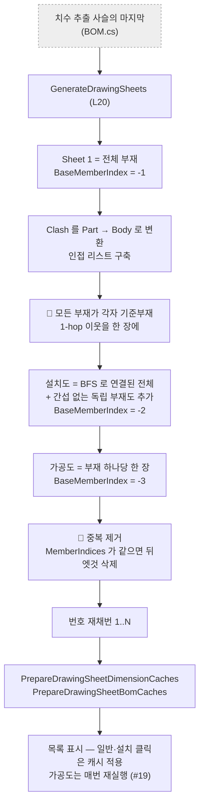
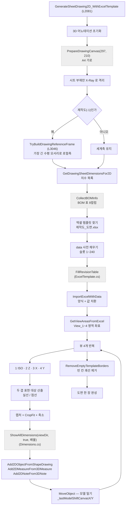

# Form1.DrawingSheets.cs — 도면 몇 장으로 나누고, 한 장을 어떻게 채우나

**한 줄**: 간섭 결과를 그래프로 보고 **도면을 몇 장으로 나눌지 정한 뒤**, 한 장마다 엑셀 양식을 깔고 **4면도를 찍어 넣는다.**

> 📊 **프로젝트에서 가장 큰 파일이자 가장 큰 메서드**가 있다 — `GenerateSheetDrawing2D_WithExcelTemplate` **965줄**.
> 남을 181회 부르는 최상위 조립자다.

---

## 1. 진입점

### 살아 있는 버튼 5개

| 화면 버튼 | 핸들러 | 줄 | 크기 |
|---|---|---|---|
| **2D 출력** | `btnGenerateSheet2D_Click` | L1157 | 55줄 |
| **PDF 출력** | `btnExportSheet2DPDF_Click` | L1217 | 45줄 |
| **제작도** | `btnExportFabricationSheets_Click` | L1262 | 4줄 |
| **조립도** | `btnExportAssemblySheets_Click` | L1267 | 4줄 |
| **설치도** | `btnExportInstallationSheets_Click` | L1272 | 4줄 |

**뒤의 셋은 4줄짜리로 전부 `ExportSheetsByKind`(L1281)에 종류만 바꿔 넘긴다.**

### 🔴 죽은 버튼 핸들러 4개

`btnDrawingISO_Click` (L1134) · `btnDrawingAxisX_Click` (L1139) · `btnDrawingAxisY_Click` (L1144) · `btnDrawingAxisZ_Click` (L1149)

배선 없음. `Dimensions`의 죽은 4개와 같은 패턴이다.

### 목록

| | 줄 | 언제 |
|---|---|---|
| `LvDrawingSheet_SelectedIndexChanged` | L612 | 도면 행 선택 → `ApplySheetSelection` |
| `LvDrawingBOMInfo_SelectedIndexChanged` | L794 | BOM 표 행 선택 → 부재 강조 |

### 다른 파일이 부르는 것

| 메서드 | 줄 | 누가 |
|---|---|---|
| `GenerateDrawingSheets` | L20 | BOM (치수 추출 사슬의 마지막) |
| `GenerateSheetDrawing2D` | L1707 | Drawing2D · Stru |
| `ApplySheetSelection` | L636 | Stru (자동 출력) |
| `ApplyDrawingSheetView` | L838 | GlobalViews |
| `CreateIsoBalloonNotes` | L960 | Dimensions · GlobalViews |
| `FindParentStru` · `FindNearestParentAssembly` | L3394 · L3367 | GlobalViews |
| `FilterOsnapForDimAxis` | — | MfgDrawing |

---

## 2. 실행 흐름

### 2-1. 도면을 몇 장으로 나눌 것인가 (`GenerateDrawingSheets` L20, 444줄)



### 2-2. 한 장을 채우는 965줄



---

## 3. 상태

### `Form1.cs` 공유 상태 — **이 파일이 가장 많이 쓴다**

| 필드 | 읽기/쓰기 | 무엇에 |
|---|---|---|
| ⚠ `vizcore3d` | 읽기·쓰기 | 전부 |
| ⚠ `drawingSheetList` | **쓰기** | 도면 목록. **이 파일이 정본** |
| ⚠ `bomList` · `clashList` | 읽기 | 시트 분할의 재료 |
| ⚠ `chainDimensionList` | 읽기·**쓰기** | 시트별 치수 |
| ⚠ `xraySelectedNodeIndices` | **쓰기** | 배율·baseline 기준 |
| ⚠ `_lastModelShiftCanvasX` / `Y` | **읽기** | 🔑 `Dimensions`가 계산한 값을 여기서 실제로 민다 |
| ⚠ `fabricationNeighborClashList` 계열 6개 | 읽기·쓰기 | 제작도 점선 이웃 |
| ⚠ `_drawingActiveReferenceAxisId` | 읽기·쓰기 | 참조축 리뷰 ID |
| ⚠ `bodyToPartIndexMap` | 읽기 | Body → Part 매핑 (쓰기는 BOM.cs — 3차 S10 정정. `bomInfoNodeGroupMap`은 이 파일 참조 0건이라 행 삭제) |

### 시트 종류를 음수로 구분한다

| `BaseMemberIndex` | 시트 |
|---|---|
| **−1** | 제작도 (Sheet 1, 전체 부재) |
| **≥ 0** | 조립도 (그 부재가 기준) |
| **−2** | 설치도 |
| **−3** | 가공도 |

> ⚠ 이 규약이 `Models.cs`의 타입 정의에는 안 적혀 있다 → [`Models.md`](./Models.md) 6절 ⑤

### 배치 상수 (L2316~2319)

| | 값 | 무엇 |
|---|---|---|
| `margin` | **5.0** | 뷰 영역 여백 |
| `isoModelXOffset` | **10.0** | ISO 모델 가로 오프셋 |
| `templateYOffset` | **15.0** | 템플릿 세로 오프셋 |
| `isoShrinkFactor` | **0.70** | ISO 축소 |
| Z뷰 축소 | **0.65** | 평면도만 더 줄인다 (L2586) |

---

## 4. 의존

### VIZCore3D SDK

| API | 무엇에 |
|---|---|
| `Drawing2D.Template.ImportExcelWithData` | 🔑 **엑셀 양식 + 값 치환** |
| `Drawing2D.Template.GetViewAreasFromExcel` | 🔑 **뷰 영역 좌표** |
| `Drawing2D.Object2D.Create2DViewObjectWithModelHiddenLine…` | 2D 캡처 |
| `Drawing2D.Object2D.RescaleObject` · `MoveObject` · `MoveObjectTo` | 배치·밀기 |
| `Drawing2D.Object2D.Add2DMeasureFrom3DMeasure` · `Add2DNoteFrom3DNote` · `Add2DObjectFromShapeDrawing` | 3D → 2D 이관 |
| `Drawing2D.Object2D.RemoveEmptyTemplateBorders` | 빈 칸 괘선 제거 |
| `Drawing2D.Object2D.Export2PDFBy2DView` | PDF |
| `Object3D.Show` · `View.XRay.*` | 두 겹 표현 |
| `View.MoveCamera` · `SetRenderMode(DASH_LINE)` | 4면도 |
| `Object3D.UDA.Keys` | PAINT CODE · DP No. · TAG No. |
| Win32 `SendMessage(WM_MOUSEWHEEL)` | 🔴 **가짜 휠 줌** (L2020~2044) |

### 다른 `Form1.*.cs`

| 메서드 | 어디 | 맡기는 일 |
|---|---|---|
| `ShowAllDimensions` · `MarkNonRightAngles` · `ComputeViewDimensionsForMembers` | `Dimensions.cs` | 치수 |
| `PrepareDrawingCanvas` · `SaveCurrentDrawingToPdf` · `BeginPdfPageAccumulation` | `Drawing2D.cs` | PDF 페이지 |
| `FillRevisionTable` · `KeepBorder` · `SafeSubItem` | `ExcelTemplate.cs` | 표제부 |
| `PrepareInstallationConnectionData` | `GlobalViews.cs` | 설치도 접합 |
| `CollectBOMInfo` | `Clash.cs` | BOM 표 |
| `ApplyOrientationRotation` · `ResetMfgPreviewViewState` · `GetSprefValue` | `MfgDrawing.cs` | UDA·회전 |
| `ShowBusyOverlay` · `ProcessCancelableUiCheckpoint` · `DiagLog` | `Form1.cs` | 진행·취소·로그 |

**7개 파일을 부른다.** 프로젝트에서 가장 넓게 얽혀 있다.

---

## 5. 알고리즘

### ① 도면을 몇 장으로 — 간섭을 그래프로 본다 (L20~180)

```
1. Clash 결과는 Part 쌍이다  →  Part 아래 Body 전부로 펼쳐 인접 리스트를 만든다
2. 부재마다 한 장:  자기 + 1-hop 이웃    (조립도)
3. 설치도 한 장:    BFS 로 연결된 전체 + 간섭 없는 독립 부재
4. 가공도:          부재당 한 장
5. 중복 제거:       MemberIndices 가 같으면 뒤엣것 삭제
```

**"모든 부재가 자기 기준 시트를 가져야 한다"** 가 사용자 의도다 (T-015, 2026-04-21). 그래서 1-2-3-4가 연쇄로 붙어 있으면 **시트가 4장 나온다** — 기준이 1, 2, 3, 4로 각각.

과잉은 5단계가 정리한다. **"포함부재가 같으면 기준부재가 달라도 같은 형상"** 이라는 판단이다. 센티넬 시트(−1·−2·−3)는 의미가 달라서 검사에서 뺀다.

### ② 🔑 두 겹 표현 — 실선과 점선

한 장에 **주인공은 실선, 맥락은 점선**으로 그린다. 무엇이 주인공인지가 시트 종류마다 다르다.

| 시트 | 실선 | 점선 |
|---|---|---|
| **제작도** (−1) | 시트 부재 | 간섭으로 붙은 **시트 밖** 부재 |
| **조립도** (≥0) | 시트 부재 | **전체 − 시트 부재** |
| **설치도** (−2) | 시트 부재 | 연결된 **서포트 STRU 전체** |

점선 대상이 없으면(이웃 0개) 단일 캡처로 폴백한다.

### ③ 🔑 배율 요동 사건 — 2026-08-04 #202

**조립도만 "전체 기준 fit"을 쓰다가 배율이 요동쳤다.**

문제는 전체 기준 fit이 배율을 **점선 배경의 bbox**로 정한다는 것이다. 점선은 `전역 BOM − 시트 부재`라 **그 공간 크기가 시트마다 제멋대로다.**

같은 STRU 한 번의 출력에서 실측된 배율이다.

```
0.127  /  0.286  /  0.286  /  0.135  /  0.182
```

| 결과 | |
|---|---|
| 배율이 튄 장 | 실선 장부재가 **뷰·템플릿을 뚫었다** |
| 배율이 줄어든 장 | BOM 부재가 작아져 **강조가 사라졌다** |
| 정상으로 보인 장 | 점선 범위가 **우연히** 전체와 비슷했을 뿐 |

→ **설치도·제작도와 같은 "시트 부재 기준 CropFit"으로 통일**했다.

```
① 점선 배경에 시트 부재를 포함해 캡처
② 시트 부재 기준으로 CropFit → "시트 부재 ± 여백" 만 남김
③ 그 결과로 fit
```

**bbox가 항상 시트 부재에 묶이므로 배율이 안정되고, 주변 맥락은 여백만큼만 보인다.**

> 📌 **"배경이 배율을 정하면 안 된다"** 는 교훈이다. 리팩토링 때 되돌리기 쉬운 종류의 결정이라 근거를 남겨둘 가치가 있다.

### ④ 4면도 카메라 규약 (L2306~2313)

| View 번호 | 카메라 | 뷰 |
|---|---|---|
| 1 | `ISO_PLUS` | 등각 |
| 2 | `Z_PLUS` | 평면도 |
| 3 | `X_PLUS` | 측면도 |
| 4 | `Y_MINUS` | 정면도 |

**Y만 `MINUS`다.** 이 부호 규약은 실기로 확정한 사양(`docs/기술 노트/데이터 매핑 기준.md`)을 따른다.

영역 좌표는 계산하지 않고 **엑셀 템플릿에서 읽는다** (`GetViewAreasFromExcel`). 양식을 고치면 코드를 안 고쳐도 배치가 따라온다.

### ⑤ 뷰마다 추가로 줄인다

```
Z뷰(평면도)  →  0.65
그 외         →  0.70
```

fit만으로는 치수·보조선·풍선이 영역을 넘는다. **평면도를 더 줄이는 건** 가로세로가 둘 다 길어 라벨 공간이 더 필요해서다.

### ⑥ 제작도만 로컬 참조축을 쓴다 (L2135~2140)

```
제작도(Sheet 1)  →  TryBuildDrawingReferenceFrame
                     선택 영역의 가장 긴 수평 모서리로 로컬축을 만든다
조립도·설치도    →  세계축 유지 (실기 결과 보존)
```

참조축 활성화가 **실패하면 치수까지 세계축으로 되돌린다.**

```csharp
drawingReferenceFrame = null;
chainDimensionList.Clear();
chainDimensionList.AddRange(GetDrawingSheetDimensionsFor2D(sheet, null));
```

**카메라와 치수가 서로 다른 축을 쓰면 도면이 어긋나므로, 하나가 실패하면 둘 다 되돌린다.**

### ⑦ 시트 클릭이 빠른 이유 — 미리 계산해 둔다

목록을 보여주기 **전에** 일반·설치 시트의 치수와 BOM을 계산해 `DrawingSheetData`에 넣어둔다 (`PrepareDrawingSheetDimensionCaches` L496 · `PrepareDrawingSheetBomCaches`).

**이후 일반·설치 시트 클릭은 SDK 재조회·치수 재계산 없이 캐시를 UI에 붙이기만 한다.**

⚠ **가공도(−3)는 예외다** (교차검증 #19) — 사전 준비 루프가 명시적으로 건너뛰고(L501~505), 가공도 행을 클릭하면 **매번 `ExecuteMfgDrawing`을 다시 실행**한다 (L719~727). 그래서 가공도 클릭만 느리다 (Osnap 캐시가 그 체감을 줄인 것 — [`Form1.MfgDrawing.md`](./Form1.MfgDrawing.md) 5절 ⑨).

### ⑧ 가짜 마우스 휠로 줌인 (L2020~2044)

```
SetFocus(뷰어)  →  SendMessage(WM_MOUSEWHEEL) × 약 7회  →  약 3배 확대
```

주석: `오토핏 후 3배 줌인 (모델 선택 → WM_MOUSEWHEEL → 선택 해제)`

**배율 지정 줌 API가 없어서 사람이 휠 굴리는 걸 흉내 낸 것**으로 보인다 **(추정 — SDK에 대체 API가 있는지 미확인)**. 선언은 `Form1.cs`에 있고 사용은 여기 한 곳뿐이다.

---

## 6. 책임과 결합 — 다시 짠다면

### ① 이 파일이 지는 책임

**다섯 개다.**

| | 책임 | 대략 |
|---|---|---|
| 1 | **시트 분할** — 그래프 분석·중복 제거·재채번 | `GenerateDrawingSheets` 444 |
| 2 | **시트 선택 반영** — 3D 뷰·치수·BOM 적용 | 약 400 |
| 3 | **한 장 그리기** — 템플릿·4면도·두 겹·배율 | `…WithExcelTemplate` 965 + `…Core` 361 |
| 4 | **종류별 일괄 출력** — 제작/조립/설치 | `ExportSheetsByKind` 182 |
| 5 | **UDA·이름 조회** — PAINT CODE·DP No.·TAG No.·STRU | 약 350 |

### ② 떼어낼 수 있는 것

| 무엇을 | 어디로 | 근거 |
|---|---|---|
| 🔑 **시트 분할의 그래프 코어** (L39~220: 인접 리스트·1-hop·BFS·중복 제거) | `SheetSplitter` | **이 구간은** `bomList`·`clashList`·`bodyToPartIndexMap`만 쓰는 그래프 계산이다. 단 `GenerateDrawingSheets` 444줄 **전체는 아니다** (교차검증 #20) — 반환형 `void`로 `drawingSheetList`·`lvDrawingSheet`를 직접 채우고, `CreateFullDrawingSheetData`(호출 L33, 선언 L464)는 선택 노드를 SDK로 조회하며 설치 연결 준비(L167)도 SDK를 부른다. **코어만 추출**하는 제안이다 |
| **UDA·이름 조회 5종** — `GetStruPntUdaValues` · `GetNamedUdaValue` · `GetOrCacheDrawingPaintCode` · `GetTagNoValue` · `GetDpNoValue` (L3557~3760) | `UdaReader` | `MfgDrawing`의 UDA 조회와 **같은 곳으로 가야 한다** |
| **부모 탐색** — `FindParentStru` · `FindNearestParentAssembly` · `ResolveDrawingStruName` | 노드 트리 유틸 | GlobalViews도 쓴다 |
| **배율 추정** — `EstimateFitScaleForCell` · `EstimateFitScaleForViewArea` | 배치 계산 | ⚠ 지금은 SDK를 직접 읽는다 (교차검증 #21) — 전자는 `Drawing2D.GridStructure`에서 셀·여백을, 후자는 참조 프레임 없으면 `GetBoundBox`를 호출. **영역·bbox를 값으로 받는 앞단을 만든 뒤에야** 순수 계산으로 뺄 수 있다 |
| **파일명·이미지** — `PlaceImageInTemplateArea` · `SanitizeStruForFileName` | 유틸 | |

**①의 그래프 코어(약 180줄)가 SDK 무관 계산으로 빠진다** (444줄 전체가 아니다 — #20). 그러면 시트 분할 규칙이 **테스트를 쓸 수 있는 형태**가 되고, "왜 이 부재가 이 도면에 들어갔나"를 SDK 없이 재현할 수 있게 된다.

### ③ 못 떼는 것과 이유

| 무엇 | 무엇에 묶였나 |
|---|---|
| 🔴 `GenerateSheetDrawing2D_WithExcelTemplate` **965줄** | **한 메서드에 11단계가 들어 있다.** 초기화 → 캔버스 → 격리 → 참조축 → 치수 → BOM → 템플릿 → 슬롯 → 뷰 루프 → 두 겹 캡처 → 후처리. 각 단계가 앞 단계의 SDK 상태에 의존한다 |
| 두 겹 표현·CropFit | 캡처 결과 크기를 봐야 다음이 정해진다 |
| `_lastModelShiftCanvasX/Y` | `Dimensions`와 필드로 이어져 있다 |
| 버튼·목록 | UI |

**965줄이 이 프로젝트의 최대 난점이다.** 하지만 **단계 경계는 주석으로 이미 그어져 있다** — `── 0.` `── 1.` `── 1.5.` `── 6.` `── 7.` 식으로.

```
지금   GenerateSheetDrawing2D_WithExcelTemplate 965줄
         주석으로 11단계가 표시돼 있으나 한 메서드

제안   SheetRenderer 클래스로 옮기고 단계마다 메서드
         PrepareCanvas()      IsolateMembers()    BuildReferenceFrame()
         CollectDimensions()  FillTemplate()      RenderViews()
         Finalize()
       상태는 필드가 아니라 컨텍스트 객체로 넘긴다
```

**주석을 메서드 이름으로 바꾸는 것만으로도** 965줄이 7개 메서드가 된다. 동작은 안 바뀌고, 어느 단계가 실패했는지 로그로 바로 보인다.

### ④ 지울 것

| | 내용 |
|---|---|
| 🔴 **죽은 버튼 핸들러 4개** (L1134~1153) | `btnDrawingISO/AxisX/AxisY/AxisZ_Click`. 배선 없음 |
| 🟠 **`GenerateSheetDrawing2DCore` 361줄** | `_WithExcelTemplate`(965줄)와 **같은 일을 템플릿 없이** 한다. 분기 스위치는 App.config가 아니라 **하드코딩 필드 `UseExcelTemplate = true`**(L1681)이고 false로 바꾸는 코드가 없어 **사실상 도달 불가** (자기 정정 2026-08-23, [`죽은 코드.md`](../판정/죽은%20코드.md) #7). "템플릿 없이 뽑는" 비상 경로로 남길지는 사용자 결정 |
| 🟠 **`ApplyDrawingSheetView`(L838, 122줄)와 `ApplySheetSelection`(L636, 158줄)** | 겹치는 부분이 있다. 둘 다 시트를 3D에 적용한다 **(미확인 — 차이 확인 필요)** |

### 🔑 정리하면

```
지금  Form1.DrawingSheets.cs 4,313줄

바로 줄일 수 있는 것
        죽은 핸들러 4개        -20

순수 계산 분리
        SheetSplitter (코어)  약 -180  ← 그래프 규칙만, 테스트 가능해진다 (#20)
        UdaReader 로 이관      -350   ← MfgDrawing 것과 합친다
        부모 탐색·배율·유틸    -300
                              ─────
                              약 -1,100줄

구조 정리
        965줄 → 7개 메서드      (줄 수는 그대로, 읽기가 달라진다)
```

---

## 부록 — 지나가며 눈에 띈 것

| | 내용 |
|---|---|
| ⚠ | **프로젝트명·선박번호가 코드에 박혀 있다** — `data[1] = "CEDAR FLNG"` · `data[2] = "SN2688"` (L2196~2197). 주석에 *"TODO: tableInfo 또는 sheet 메타에서. 지금은 PoC 하드코딩 유지"* |
| ⚠ | **Note(도면 비고) 입력 수단이 없다.** 슬롯 164·200이 준비돼 있고 채우는 코드도 주석으로 적혀 있으나 **입력 소스가 미구현**이다 (L2189~2193) |
| ⚠ | **`btnMfgDrawing_Click`이 없다.** `docs/_pipeline.md`의 흐름도가 이 버튼을 가리키는데 Designer에도 핸들러에도 없다 — 문서가 낡은 것 |
| · | **빈 슬롯 선초기화를 2026-07-27에 걷어냈다.** 벤더 안내로, 선초기화가 `{Input}`을 다 없애 괘선 제거가 무동작이었다. 그 부작용으로 08-09에 DP No.·PAINT CODE 테두리가 사라져 `KeepBorder`로 대응 → [`Form1.ExcelTemplate.md`](./Form1.ExcelTemplate.md) |
| · | **슬롯 번호 컨벤션이 주석에만 있다** (L2165~2183). 코드에는 `data[165]`, `data[246]` 같은 생짜 숫자가 박혀 있다 |
| · | `TAG No.` walk-up이 음수 센티넬에서 즉시 멈춰 **조립도만 값이 채워지던 버그**가 있었다 (#120). 지금은 음수면 시트의 실제 부재 노드로 대체한다 |
| · | **PAINT CODE는 STRU에서 한 번만 조회**해 같은 목록의 모든 도면이 공유한다 (#68). `UDA.Keys`가 무거워 `BeginUpdate` 밖에서만 부른다 |

---

## 관련 문서

- [`Form1.md`](./Form1.md) — 공유 상태 · 진행/취소
- [`Form1.Dimensions.md`](./Form1.Dimensions.md) — 치수 (여기서 그대로 쓴다)
- [`Form1.MfgDrawing.md`](./Form1.MfgDrawing.md) — 가공도 (같은 "찍고 나서 그린다" 구조)
- [`Form1.ExcelTemplate.md`](./Form1.ExcelTemplate.md) — 슬롯·괘선 규칙
- [`Models.md`](./Models.md) — `DrawingSheetData` · 센티넬 규약
- `docs/기술 노트/Sheet1 명명 기준.md` · `데이터 매핑 기준.md`
