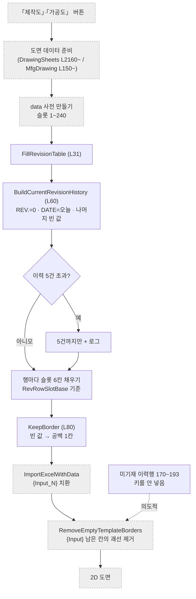

# Form1.ExcelTemplate.cs — 도면 표제부 채우기

**한 줄**: 도면 양식(엑셀)의 **표제부 REV 이력 표**를 채우고, **빈 칸의 괘선이 지워지지 않게** 지키는 헬퍼 모음.

> 📊 프로젝트에서 **가장 깨끗한 파일**이다. 남이 26회 부르고 자기는 1회만 부른다 — 상태를 갖지 않는 순수 헬퍼라서다. `partial class Form1`에서 떼어내 별도 클래스로 옮길 수 있는 유일한 후보다.

---

## 0. 먼저 — 도면이 만들어지는 방식

이 파일을 이해하려면 **도면 양식이 엑셀이라는 것**부터 알아야 한다.

```
제작도_도면.xlsx  (표제부·괘선·라벨이 다 그려진 양식)
   ↓  값 넣을 칸마다 {Input_1} {Input_2} … 라는 글자가 박혀 있음
   ↓
data[슬롯번호] = "값"   ← 코드가 채우는 사전(Dictionary)
   ↓
vizcore3d.Drawing2D.Template.ImportExcelWithData(xlsx, data, 이미지)
   ↓  {Input_N} 을 data[N] 값으로 바꿔치기
   ↓
2D 도면
```

슬롯 번호는 정해진 컨벤션이 있다 (`Form1.DrawingSheets.cs` L2165~2183 주석이 정본).

| 슬롯 | 무엇 |
|---|---|
| 1~3 | 프로젝트명 · 선박번호 · 도면종류 |
| 4~163 | BOM 1~20행 (열별 20연속) |
| 165~169 | PAINT CODE · DP No. · TAG No. |
| **170~199** | **REV 이력 표 ← 이 파일 담당** |
| 200~240 | Note 라벨 · BOM 21~25행 |

---

## 1. 언제 도는가

버튼이 없다. **도면을 출력할 때 다른 파일이 부른다.**

| 부르는 곳 | 무엇을 만들 때 |
|---|---|
| `Form1.DrawingSheets.cs` L2226 | 제작도 · 조립도 · 설치도 (**세 종류가 같은 경로를 공유**) |
| `Form1.MfgDrawing.cs` L182 | 가공도 |

`KeepBorder`와 `SafeSubItem`은 그 바깥에서도 계속 불린다 (`DrawingSheets` L2215~2260 등).

---

## 2. 실행 흐름

이 파일은 **엑셀 치환 파이프라인의 한 조각**이다. 전체에서 어디에 있는지부터 봐야 한다.



**회색 점선이 다른 파일이다.** 이 파일이 하는 일은 가운데 네 칸뿐이고, 앞뒤는 `DrawingSheets`·`MfgDrawing`과 SDK가 맡는다.

### `FillRevisionTable(data, history)` L31

호출부는 항상 이 한 줄이다.

```csharp
FillRevisionTable(data, BuildCurrentRevisionHistory());
```

1. **`BuildCurrentRevisionHistory()`** (L60) — 이번 출력의 이력 1건을 만든다
   `REV.="0"` · `DATE=오늘` · 나머지(설명·작성·검도·승인)는 빈 값
2. **`FillRevisionTable()`** (L31) — 그 이력을 `data` 사전에 슬롯 번호로 풀어 넣는다
   - 이력이 5건을 넘으면 **5건까지만** 넣고 로그를 남긴다 (템플릿 표가 5행)
   - 한 건은 **6칸 연속**으로 들어간다
3. 여섯 칸 전부 **`KeepBorder()`** (L80)를 거친다 → 빈 값이 공백 1칸으로 바뀐다

---

## 3. 상태

**인스턴스 필드가 없다.** 상수 하나뿐이고 나머지는 전부 `static` 순수 함수다.

| | 값 | 무엇 |
|---|---|---|
| `RevRowSlotBase` L17 | `{ 194, 188, 182, 176, 170 }` | REV 표 각 행의 **첫 슬롯 번호** |

### 왜 숫자가 거꾸로인가

엑셀 표에서 **머리글이 45행이고, 첫 기재행은 그 바로 위인 44행**이다. 리비전이 올라가면 **위로 쌓인다.**

```
40행  ← RevRowSlotBase[4] = 170   (가장 최근)
41행  ← 176
42행  ← 182
43행  ← 188
44행  ← RevRowSlotBase[0] = 194   (REV 0, 첫 기재행)
45행  ── 머리글 (REV. DATE DESCRIPTION DRAWN CHECKED APPROVED)
```

`history`는 **오름차순(옛→새)**으로 들어온다. `history[0]`(REV 0)이 44행에 들어가고, 인덱스가 커질수록 윗 행으로 간다. 그래서 슬롯 배열이 내림차순이다.

한 행 안에서는 `+0`부터 순서대로다.

| +0 | +1 | +2 | +3 | +4 | +5 |
|---|---|---|---|---|---|
| REV. | DATE | DESCRIPTION | DRAWN | CHECKED | APPROVED |

---

## 4. 외부 호출

**SDK를 직접 부르지 않는다.** `data` 사전만 채우고 끝낸다. 실제 엑셀 치환은 호출한 쪽이 한다.

| | |
|---|---|
| `DiagLog(msg)` (Form1.cs L266) | 이력이 5건을 넘어 잘렸을 때만 |

---

## 5. 알고리즘 — 괘선을 살리는 공백 1칸

이 파일의 존재 이유다. **`KeepBorder()`는 세 줄짜리 함수인데, 그 세 줄이 도면 표제부의 테두리를 지킨다.**

```csharp
return string.IsNullOrWhiteSpace(value) ? " " : value.Trim();
```

빈 값을 **공백 1칸**으로 바꾼다. 왜 이게 필요한지가 핵심이다.

### 값을 안 넣으면 테두리까지 사라진다

SDK의 두 동작이 맞물려 있다.

| SDK 동작 | 조건 |
|---|---|
| `ImportExcelWithData` | `data`에 키가 **있으면** 치환한다 → `{Input}`이 사라짐 |
| | 키가 **없으면** `{Input}` 글자가 남고, 그 자리에 TextBox가 생성됨 |
| `RemoveEmptyTemplateBorders` | **그 TextBox가 있는 칸의 괘선을 지운다** |

즉 이렇게 갈린다.

```
data에 키를 안 넣는다  →  {Input} 남음  →  TextBox 생김  →  🗑 괘선 지워짐
data에 " " 를 넣는다   →  치환됨        →  TextBox 없음  →  ✅ 괘선 남음
```

**"빈 칸"을 만드는 방법이 두 가지고, 결과가 정반대다.**

- 라벨이 붙은 값 칸(REV 첫 기재행, PAINT CODE, DP No., TAG No.) → **테두리가 있어야 도면답다** → `" "`
- 아직 안 쓴 이력행(슬롯 170~193) → **표가 비어 보여야 한다** → 키를 아예 안 넣음

`FillRevisionTable`이 `rows`(실제 이력 수)만큼만 도는 이유가 이것이다. **미사용 행은 의도적으로 건드리지 않는다.**

### 이게 실제로 터진 적이 있다

| 시점 | |
|---|---|
| ~2026-07-27 | 슬롯 1~240을 미리 `""`/`" "`로 채워두는 코드가 있었다 |
| | → `{Input}`이 하나도 안 남아 **괘선 제거가 통째로 무동작** |
| 2026-07-27 | 벤더(소프트힐스) 안내로 선초기화 제거 |
| 2026-08-09 | 실기에서 **DP No.·PAINT CODE 값 칸 테두리가 사라짐** — 선초기화가 가려주던 칸들이 드러남 |
| | → `KeepBorder`를 그 칸들에도 적용해 대응 |

> 📌 **SDK 우회 사례다.** "값 없는 칸의 테두리 유지"를 SDK가 직접 지원하지 않아, **값의 유무로 간접 제어**하고 있다. 8/27 발표의 *"왜 이만큼의 코드가 필요한가"* 에 쓸 재료.

---

## 6. 책임과 결합 — 다시 짠다면

### ① 이 파일이 지는 책임

**세 개가 섞여 있다.** 파일 이름은 하나를 말하는데 실제로는 셋이다.

| | 무엇 | 줄 |
|---|---|---|
| 1 | **REV 이력 표 채우기** — 슬롯 170~199 | `FillRevisionTable` · `BuildCurrentRevisionHistory` · `RevRowSlotBase` |
| 2 | **괘선 보존 규칙** — 도면 전체가 쓰는 공통 규칙 | `KeepBorder` |
| 3 | **ListView 값 꺼내기** — 엑셀과 무관한 범용 유틸 | `SafeSubItem` |

### ② 떼어낼 수 있는 것

| 무엇을 | 어디로 | 근거 |
|---|---|---|
| `SafeSubItem` (L88) | 공용 유틸 클래스 | **엑셀과 아무 관계가 없다.** `ListViewItem`에서 안전하게 값을 꺼내는 3줄짜리 범용 함수. 여기 있을 이유가 하나도 없다 |
| `KeepBorder` (L80) | `DrawingTemplate` 같은 도면 공통 클래스 | REV 표뿐 아니라 `DrawingSheets`의 PAINT CODE·DP No.·TAG No.도 쓴다. **REV 전용이 아니다** |
| REV 표 3종 | `RevisionTableWriter` | 슬롯 번호·행 순서·5행 한도가 전부 여기에만 있다 |

**셋 다 `static` 순수 함수라 상태를 안 들고 간다.** 옮기는 데 걸리는 게 없다.

### ③ 못 떼는 것과 이유

**없다.** 이 파일은 어디에도 묶여 있지 않다.

| | |
|---|---|
| 공유 상태 | 안 씀 (인스턴스 필드 0개) |
| SDK | 직접 호출 안 함 — `data` 사전만 채운다 |
| UI | 안 건드림 |
| `DiagLog` | 5건 초과 로그 1곳. 주입으로 해결 |

> 🔑 **`partial class Form1`에서 떼어낼 수 있는 유일한 파일**이다. `License`는 UI(`MessageBox`)에 걸려 있는데 이 파일은 그것도 없다.

### ④ 지울 것

없다. 다만 **아직 안 쓰이는 코드**가 있다 — `FillRevisionTable`의 5행 처리 로직. 지금은 이력이 항상 1건뿐이라 첫 행만 쓴다. **지우지 말 것.** #64 Phase 3에서 쓸 자리다.

### 🔑 진짜 문제는 이 파일 밖에 있다

**엑셀 템플릿 처리의 본체가 `DrawingSheets`에 흩어져 있다.**

| 무엇 | 지금 어디 |
|---|---|
| 슬롯 번호 컨벤션 (1~240) | `DrawingSheets` L2165~2183 **주석** |
| `ImportExcelWithData` 호출 | `DrawingSheets` L2280 · `MfgDrawing` |
| `RemoveEmptyTemplateBorders` 호출 | `DrawingSheets` L2290 · `MfgDrawing` L2669 |
| 이미지 매핑 | `DrawingSheets` |
| **REV 표만** | ✅ 이 파일 |

**슬롯 번호가 주석으로만 있다.** 코드에는 `data[165]`, `data[166]` 같은 생짜 숫자가 박혀 있어서, 템플릿을 고치면 어디를 같이 고쳐야 하는지 주석을 읽어야 안다.

→ 리팩토링 방향은 **"이 파일을 쪼개기"가 아니라 "엑셀 처리를 이 파일로 모으기"** 다. 슬롯 번호를 이름 있는 상수로 만들면 그 자리가 바로 여기다.

---

## 부록 — 지나가며 눈에 띈 것

| | 내용 |
|---|---|
| ⚠ | **`""`와 `" "`의 차이가 문서 두 곳에서 다르게 읽힌다.** 이 파일 L26은 둘을 구분하는데 `DrawingSheets` L2172는 *"값이 있으면(`""`·`" "` 포함) 치환"* 으로 같게 본다. 같다면 `KeepBorder`가 `" "`를 쓸 이유가 없다. **실기 확인 필요 (추정)** |
| · | **이력이 항상 1건이다.** 몇 번을 출력해도 REV는 0이다 (#64 Phase 3 예정) |
| · | **작성·검도·승인란이 항상 비어 있다.** 입력 수단이 없다 (#64 결정 ①). `TODO` 4개가 남아 있다 |
| · | 이력 6건 이상이면 조용히 잘린다. 로그에만 남는다 |

---

## 부록 — 지워진 것 (L95~99 주석)

2026-07-19에 두 가지를 폐기했다. **되살리려는 시도를 막기 위해 남긴다.**

| 폐기 | 이유 |
|---|---|
| 템플릿 JSON 사전변환 | `ConvertExcelToJson` 실측 **290초** + 태그 미보존(`hasTags=False`)이라 무용 |
| View 영역 세션 캐시 | 템플릿을 엑셀에서 고쳐도 **옛 좌표를 재사용하는 버그** 유발 |

근본 해법은 **템플릿을 작게(약 4천 셀) 유지하는 것**이다. 그러면 파싱이 수 ms라 캐시가 필요 없다. 1mm 그리드 6만 셀 템플릿은 파싱 수십 초 + openpyxl 저장본에서 네이티브 크래시가 나 폐기됐다.

---

## 관련 문서

- [`Form1.md`](./Form1.md) — `DiagLog`
- `docs/기술 노트/Sheet1 명명 기준.md` — 시트 이름 규칙
