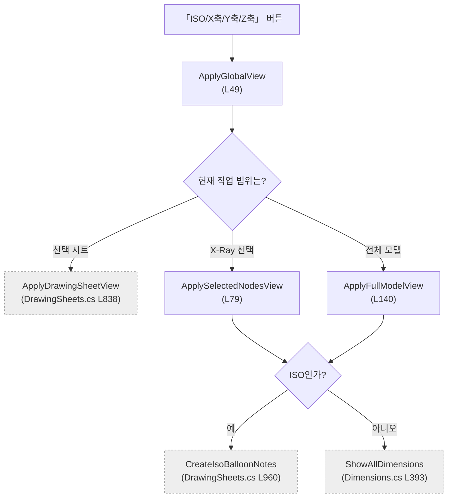
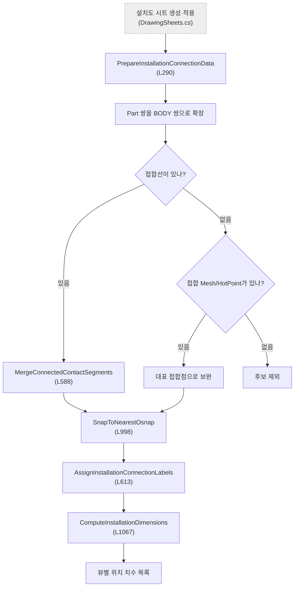

# Form1.GlobalViews.cs — 공통 카메라 전환과 설치 위치 치수

**한 줄**: 화면의 ISO·X축·Y축·Z축 버튼을 현재 작업 범위에 맞게 라우팅하고, 설치도에서는 간섭 후보를 BODY 접합선까지 좁혀 **기준 부재 끝단에서 접합 모서리까지의 위치 치수**로 바꾼다.

---

## 1. 진입점 — 언제 도는가

### 화면에서 직접 시작

| 화면 동작 | 핸들러 | 위치 | 결과 |
|---|---|---:|---|
| **ISO** 클릭 | `btnGlobalISO_Click` | L17 | 현재 범위를 ISO로 보고 풍선을 표시 |
| **X축** 클릭 | `btnGlobalAxisX_Click` | L25 | 카메라를 +X에 두고 X축 직교 뷰 표시 |
| **Y축** 클릭 | `btnGlobalAxisY_Click` | L33 | 카메라를 −Y에 두고 Y축 직교 뷰 표시 |
| **Z축** 클릭 | `btnGlobalAxisZ_Click` | L41 | 카메라를 +Z에 두고 Z축 직교 뷰 표시 |

네 버튼은 방향 문자열만 다르고 모두 `ApplyGlobalView`(L49)로 모인다.

### 다른 파일에서 시작

| 호출되는 메서드 | 언제 |
|---|---|
| `PrepareInstallationConnectionData` (L290) | 설치도 시트를 만들 때 간섭 결과를 실제 접합 BODY·접합점·표시할 상대 STRU로 변환 |
| `ExtractInstallationDimensions` (L246) | 설치도 시트를 3D 화면에 적용하면서 기존 치수를 지우고 설치 위치 치수를 다시 구성 |
| `ComputeInstallationDimensions` (L1067) | 2D 설치도 출력용으로 UI를 건드리지 않고 같은 위치 치수 목록만 계산 |

목록 선택이나 더블클릭에 직접 연결된 핸들러는 없다.

---

## 2. 실행 흐름 — 무엇이 어떤 순서로





### 2-1. ISO·축 버튼

1. **`ApplyGlobalView(viewDirection)`** (L49) — 현재 범위를 우선순위로 고른다.
   1. 도면정보 탭에서 시트가 선택돼 있으면 그 시트 (`ApplyGlobalView`, L56~62)
   2. 아니면 X-Ray 선택 부재가 있으면 그 부재 (`ApplyGlobalView`, L64~67)
   3. 둘 다 아니면 전체 모델 (`ApplyGlobalView`, L69~72)
2. **`ApplyDrawingSheetView(viewDirection)`** (`Form1.DrawingSheets.cs` L838) — 첫 번째 경우를 도면 시트 전용 경로에 맡긴다. 이 파일은 내부로 들어가지 않는다.
3. **`ApplySelectedNodesView(viewDirection)`** (L79) — 두 번째 경우 선택 색을 지우고 X-Ray를 다시 구성한 뒤, 선택 부재에 카메라와 화면을 맞춘다.
4. **`ApplyFullModelView(viewDirection)`** (L140) — 세 번째 경우 X-Ray를 끄고 모든 부재를 보인 뒤, 전체 모델에 카메라와 화면을 맞춘다.
5. ISO면 **`CreateIsoBalloonNotes`** (`Form1.DrawingSheets.cs` L960), X/Y/Z면 **`ShowAllDimensions`** (`Form1.Dimensions.cs` L393)를 호출한다.

**그래서 화면에는** 현재 시트·선택 부재·전체 모델 중 하나가 지정 방향으로 보이고, ISO에는 부재번호 풍선, 직교 뷰에는 그 방향의 치수가 나타난다.

### 2-2. 설치도 연결 데이터 준비

1. **`PrepareInstallationConnectionData(sheet)`** (L290) — 이전 연결·표시 목록을 비우고, 현재 시트 BODY 목록과 직전에 간섭 검사한 BODY 목록이 같은지 확인한다.
2. 일반 간섭 결과가 아니라 제작도 근접 검사 결과인 `fabricationNeighborClashList`에서 **대상 Part 하나와 외부 Part 하나**로 이루어진 쌍만 남긴다 (L308~318).
3. **`GetBodyIndicesForPart`** (L484) — 캐시를 우선 쓰고, 없으면 Part의 모든 하위 BODY를 SDK에서 찾는다.
4. BODY 조합마다 경계상자가 0.5mm 안에서도 겹치지 않으면 버린 뒤, **`GetBodyContactAreas`** (L528)로 접합선을 구한다.
5. **`MergeConnectedContactSegments`** (L588) — 끝점 사이가 1mm 이내인 선분을 같은 접합영역으로 합친다.
6. 접합선이 없으면 SDK 접합 Mesh를 쓰고, 그것도 없지만 간섭 HotPoint가 있으면 가장 가까운 양쪽 BODY의 대표점으로 남긴다 (L554~570, L374~394).
7. 접합점은 **`SnapToNearestOsnap`** (L998)으로 3mm 안의 LINE/POINT Osnap에 붙인다.
8. **`AssignInstallationConnectionLabels`** (L613) — 상대 Assembly·Part 이름과 인덱스로 정렬해 A, B, …, Z, AA 순 라벨을 붙인다.
9. **`ExpandInstallationContextToStru`** (L433) — 접합한 외부 Part의 STRU 조상 아래 BODY 전체로 점선 배경 표시 범위를 넓힌다.

**그래서 설치도 시트에는** 실제 접합 BODY·접합점·상대 부재 라벨과, 점선으로 함께 보여줄 상대 STRU BODY 목록이 준비된다.

### 2-3. 설치 위치 치수 계산

1. **`ExtractInstallationDimensions(sheet)`** (L246) — 3D 치수·선·풍선과 화면 목록을 지운다.
2. **`ComputeInstallationDimensions(sheet)`** (L1067) — 접합 BODY 쌍별로 위치 치수 후보를 만든다.
3. **`BuildInstallationPlacementAnchor`** (L862) — 대상 BODY의 길이축, 접합 중심, 축별 가까운 끝단과 접합 모서리를 정한다.
4. 접합이 대상 BODY 폭의 절반 이상을 덮는 축은 “가로지르는 접합”으로 보고 제외하고, 국소 접합인 축만 남긴다 (L938~975).
5. 각 축의 두 끝점을 그 축 성분만 다른 순수 축정렬 좌표로 투영한다 (L1078~1094).
6. **`AddInstallationDimension`** (L1122) — 길이 3mm 이하를 버리고, 해당 축이 화면에 보이는 직교 뷰 두 곳에 치수를 추가한다.
7. 뷰·축·양 끝 좌표·설명 이름이 같은 결과를 합치고 번호를 다시 매긴다 (L1112~1119).
8. `ExtractInstallationDimensions` 경로라면 `chainDimensionList`와 `lvDimension`을 채우고, 이후 보조선 기준이 선택 STRU에 고정되도록 `xraySelectedNodeIndices`를 시트 부재로 바꾼다 (L258~283).

**그래서 화면과 2D 출력에는** 상대 부재 전체 크기가 아니라, 기준 부재 끝단에서 실제 접합이 시작되는 모서리까지의 축별 위치가 표시된다.

---

## 3. 상태 — 무엇을 읽고 무엇을 쓰나

### Form1.cs에서 공유하는 상태

| 필드 | 읽기/쓰기 | 역할 |
|---|---|---|
| ⚠ `vizcore3d` | 읽기·쓰기 | 카메라, 선택/X-Ray, 표시 초기화, 노드·접합 형상·Osnap·BBox 조회 |
| ⚠ `xraySelectedNodeIndices` | 읽기·쓰기 | 글로벌 뷰의 대상 범위. 설치도 치수 후에는 시트 BODY 목록으로 교체 |
| ⚠ `bomList` | 읽기 | 전체 모델 ISO 풍선 대상 |
| ⚠ `chainDimensionList` | 쓰기 | 설치 위치 치수 결과 |
| ⚠ `fabricationNeighborClashList` | 읽기 | 설치 연결 후보가 되는 근접 간섭 결과 |
| ⚠ `fabricationTargetBodyIndices` | 읽기 | 간섭 검사가 어느 시트 BODY를 대상으로 했는지 검증 |
| ⚠ `fabricationTargetPartIndices` | 읽기 | 간섭 쌍에서 기준 Part와 외부 Part 구분 |
| ⚠ `fabricationNeighborPartIndices` | 읽기 | 설치도 점선 배경 후보 확장 |
| ⚠ `fabricationBodyBoundsCache` | 읽기 | BODY 조합의 광역 겹침 필터와 HotPoint 최근접 BODY 판정 |
| ⚠ `fabricationBodyToPartIndexCache` | 읽기 | Part → BODY 역조회 |

### 화면 상태

`tabControlLeft`·`tabPageDrawing`·`lvDrawingSheet`로 범위를 고르고, `lvDimension`에 계산된 축·뷰·거리·양 끝 좌표를 표시한다. 이 컨트롤들은 Designer에 선언된다.

### 이 파일이 선언하는 상태

| 상수/타입 | 값·역할 |
|---|---|
| `InstallationContactClusterTolerance` | **1.0mm** — 접합선분을 같은 영역으로 묶는 거리 |
| `InstallationContactSnapTolerance` | **3.0mm** — 접합점을 Osnap으로 붙일 최대 거리 |
| `InstallationPlacementTieTolerance` | **0.5mm** — 끝단면 후보 동률 허용오차 |
| `InstallationMinComponent` | **3.0mm** — 사실상 끝단에 붙은 미소 위치 치수 제거 |
| `InstallationContactCrossCoverage` | **0.5** — 접합이 축 길이의 절반 이상을 덮으면 위치 없는 관통 접합으로 판정 |
| `InstallationAxisComponent` | 채택 축, 그 축의 기준 끝단, 접합측 모서리 좌표 |
| `InstallationPlacementAnchor` | 한 BODY 접합에서 계산한 축별 치수 기준과 진단값 |

메서드 내부의 `struBodyCache`는 한 번의 STRU 확장 동안만 재사용되고 호출이 끝나면 사라진다. 지속 캐시는 Clash 파일에서 만들고 이 파일은 읽기만 한다.

`DrawingSheetData.InstallationConnections`와 `InstallationContextIndices`도 이 파일이 비우고 다시 채운다.

---

## 4. 의존 — 무엇과 묶여 있나

### VIZCore3D SDK API

`VIZCore3D.NET.xml`에서 아래 멤버와 시그니처를 확인했다.

| API | 이 파일에서 쓰는 이유 |
|---|---|
| `View.MoveCamera(CameraDirection)` | ISO/+X/−Y/+Z 카메라 위치로 전환 |
| `View.FlyToObject3d(List<int>, float)` | X-Ray 선택 부재에 화면을 맞춤. 코드의 배율은 `1.0f` |
| `View.FitToView()` | 전체 모델을 화면에 맞춤 |
| `View.XRay.Enable/Clear/Select` | 선택 부재는 불투명, 나머지는 X-Ray로 유지 |
| `Object3D.Select(Object3dSelectionModes)` | 이전 빨간 선택 표시 전체 해제 |
| `Object3D.FromIndex` | Part/STRU 이름·계층 확인 |
| `Object3D.GetChildObject3d(..., ALL_CHILDREN, true)` | Part·STRU 아래 BODY 전체 조회 |
| `Object3D.GetBoundBox(..., false)` | Osnap이 없을 때 BODY 8개 모서리와 최장 월드축 계산 |
| `Object3D.GetOsnapPoint` | LINE 시작/끝과 POINT 중심을 접합·끝단 기준점으로 사용 |
| `GeometryUtility.GetObjectCollisionLine(int, int)` | 두 BODY 사이의 실제 접합선 조회 |
| `GeometryUtility.GetJunctionMesh(int, int, bool)` | 접합선이 없을 때 접합 Mesh로 보완 |
| `Review.Note.Clear` / `Review.Measure.Clear` / `ShapeDrawing.Clear` | 이전 뷰의 풍선·치수·보조선 제거 |
| `View.SetRenderMode(SMOOTH)` | 글로벌 3D 뷰를 은선이 아닌 실선 형상으로 표시 |

XML은 `CameraDirection`의 항목명을 `X_PLUS` 등으로만 설명한다. 이 프로젝트에서 부호가 **카메라가 서는 축 방향**이라는 화면 매핑은 실기 확정 사양인 `docs/기술 노트/데이터 매핑 기준.md`를 따른다.

### 다른 Form1 파일

| 메서드 | 위치 | 맡기는 일 |
|---|---|---|
| `ApplyDrawingSheetView` | `Form1.DrawingSheets.cs` L838 | 선택 도면 시트 전용 카메라·표시 적용 |
| `CreateIsoBalloonNotes` | `Form1.DrawingSheets.cs` L960 | ISO 부재번호 풍선 생성 |
| `FindNearestParentAssembly` | `Form1.DrawingSheets.cs` L3367 | STRU를 못 찾았을 때 가장 가까운 Assembly 확인 |
| `FindParentStru` | `Form1.DrawingSheets.cs` L3394 | Part의 STRU 조상 확인 |
| `RestoreAllPartsVisibility` | `Form1.MfgDrawing.cs` L23 | 전체 모델 뷰에서 숨긴 부재 복원 |
| `GetMfgAxisDetection` | `Form1.MfgDrawing.cs` L3672 | LINE Osnap 방향을 5도 군집화해 BODY 주 길이축 판정 |
| `ShowAllDimensions` | `Form1.Dimensions.cs` L393 | 선택 범위의 X/Y/Z 치수 표시 |
| `BoundsOverlapWithinClearance` | `Form1.Clash.cs` L763 | 두 BODY AABB가 여유값 안에서 겹치는지 판정 |
| `DiagLog` | `Form1.cs` L266 | 접합·축·fallback 진단 기록 |

---

## 5. 알고리즘 — 자명하지 않은 계산

### 5-1. 글로벌 버튼은 “방향”보다 먼저 “범위”를 고른다

라우팅 우선순위는 **선택 도면 시트 > X-Ray 선택 부재 > 전체 모델**이다. 같은 X축 버튼이라도 어느 상태에서 눌렀는지에 따라 시트 전용 처리, 선택 부재 처리, 전체 처리로 갈린다. 이 분기가 화면 곳곳의 별도 축 버튼을 하나로 합친 핵심이다.

현재 살아 있는 버튼의 직교 뷰는 다음과 같다.

| 버튼 | 카메라 위치 | 시선 | 화면 right / up | SDK 인자 |
|---|---|---|---|---|
| X축 | +X | −X | +Y / +Z | `X_PLUS` |
| Y축 | −Y | +Y | +X / +Z | `Y_MINUS` |
| Z축 | +Z | −Z | +X / +Y | `Z_PLUS` |
| ISO | 등각 | — | — | `ISO_PLUS` |

선택 범위에서는 `FlyToObject3d(..., 1.0f)`, 전체 범위에서는 `FitToView()`를 써서 화면 맞춤 방식도 다르다.

### 5-2. Part 간섭 결과를 BODY 접합 위치로 내린다

간섭 검사는 Part 쌍을 알려주지만 설치 치수에는 **어느 BODY의 어느 모서리가 닿았는지**가 필요하다. 그래서 다음 다단계 보완이 들어간다.

```
Part 간섭 쌍
→ 양쪽 하위 BODY 전수 조합
→ AABB 0.5mm 광역 필터
→ 공식 접합선
→ 없으면 접합 Mesh
→ 그래도 없으면 간섭 HotPoint
→ 3mm 안의 LINE/POINT Osnap으로 스냅
```

SDK의 한 API만으로 최종 위치를 얻지 못해 접합선·Mesh·HotPoint를 단계적으로 결합한다. 이 계층이 **SDK 호출 자체보다 우리 코드가 필요한 대표 구간**이다.

접합선분 병합은 기존 영역의 어느 점과 새 선분의 어느 점 사이 거리가 `≤ 1.0mm`이면 같은 연결 성분으로 본다. 새 선분이 여러 영역을 잇는 경우 그 영역들을 하나로 합친다.

HotPoint fallback에서 BODY 선택 점수는 점에서 AABB까지의 축별 바깥 거리 제곱합이다.

```
dx = X가 [MinX, MaxX] 안이면 0, 아니면 가까운 경계까지 거리
score = dx² + dy² + dz²
```

점수가 가장 작은 BODY가 대표 BODY가 된다.

### 5-3. 위치 기준은 연결 부재 Osnap이 아니라 접합영역이다

접합점 평균을 `contactCentroid`로 만든다. 이 점은 두 부재의 실제 교선 위라 대상 부재 범위를 벗어나지 않는다. 연결 부재 자체의 먼 Osnap을 쓰던 방식에서 생긴 과도한 147mm·950mm 치수를 막기 위한 재설계라는 코드 주석이 있다.

각 월드축에서 대상 BODY의 Min/Max 끝단 중 접합 중심과 가까운 쪽 끝단면을 고르고, 그 면의 여러 Osnap 가운데 접합 중심과 **축 직교 평면 거리**가 가장 짧은 점을 택한다. 끝단면 판정에는 0.5mm 동률 허용오차가 들어간다.

### 5-4. “국소 접합”인 축에만 치수를 만든다

축별 판정식은 다음이다.

```
coverage(axis) = 접합점의 축방향 extent / 대상 BODY의 축방향 extent
```

- `coverage ≥ 0.5` — 연결부재가 그 축을 절반 이상 가로지름. 특정 설치 위치가 없다고 보고 생략
- `coverage < 0.5` — 한 지점에 국소적으로 붙음. 위치 치수 생성

연결측 좌표는 접합 중심이 아니다. 접합 구간의 Min/Max 중 대상 끝단에 가까운 **접합 모서리**를 쓴다. 그래서 “끝단에서 접합이 시작되는 곳까지”의 치수가 된다.

두 3D 점은 다른 축에서도 벌어질 수 있으므로, 치수를 만들 때 시작점의 나머지 두 좌표는 그대로 두고 현재 축 좌표만 접합 모서리로 바꾼다. 결과는 순수 X·Y·Z 축정렬 선분이다.

### 5-5. 보이는 뷰에만 배정하고 미소값을 제거한다

| 치수 축 | 배정되는 뷰 | 제외되는 뷰와 이유 |
|---|---|---|
| X | Y, Z | X뷰에서는 깊이축이라 두 끝점이 화면상 겹침 |
| Y | X, Z | Y뷰에서는 깊이축 |
| Z | X, Y | Z뷰에서는 깊이축 |

거리 계산은 `|end[axis] - start[axis]|`이며 **3mm 이하**는 끝단 잔여나 Assembly 틈으로 보고 버린다. 최종 중복 키는 뷰·축·축방향 양 끝 좌표(F2, 0.01mm 표기)·설명 이름이다.

### 5-6. 표시 범위와 치수 기준 범위를 일부러 분리한다

점선 배경은 상대 Part가 속한 STRU의 하위 BODY 전체까지 넓히지만, 치수 기준과 화면 Crop/Fit은 선택 STRU에 고정한다. 상대 서포트 전체 BBox가 보조선을 밀거나 배율을 축소하지 않게 하려는 분리다.

---

## 6. 책임과 결합 — 다시 짠다면

### ① 이 파일이 지는 책임

- ISO·X·Y·Z 명령을 받아 **선택 시트 → X-Ray 선택 → 전체 모델** 우선순위로 표시 범위를 고른다.
- SDK 카메라·가시성·X-Ray를 바꾸고, 방향에 맞는 풍선 또는 치수 표시를 다른 파일에 요청한다.
- 제작도 근접 결과를 BODY 접합선·Mesh·HotPoint까지 내려 설치도 연결 데이터와 상대 STRU 표시 범위로 바꾼다.
- 접합영역과 기준 부재 끝단 사이 거리를 계산해 직교 뷰별 설치 위치 치수를 만든다.

글로벌 뷰 UI와 설치도 기하 계산이라는 서로 다른 책임이 한 파일에 함께 있다.

### ② 떼어낼 수 있는 것

| 무엇을 | 어디로 | 근거 |
|---|---|---|
| `MergeConnectedContactSegments`, 축별 extent·끝단·거리 계산 | `InstallationGeometryCalculator` 같은 순수 계산 모듈 | SDK 조회가 끝난 뒤에는 좌표·선분·BBox만으로 계산하므로 WinForms와 무관하다. 현재 1mm 병합, 0.5 비율, 3mm 최소 길이 규칙을 그대로 자산으로 옮길 수 있다. |
| 접합선 → Mesh → HotPoint fallback과 Osnap 스냅 | `InstallationContactExtractor` | 입력을 BODY별 기하 DTO와 Osnap 목록으로 만들면 화면 상태 없이 시험할 수 있다. |
| A, B, …, AA 라벨 정렬·부여 | `InstallationLabelAssigner` | Assembly·Part 이름과 인덱스만 받는 결정적 정렬 규칙이다. |
| 문자열 방향과 범위 우선순위 | `ViewCommand`/`ViewScope` 값 객체와 라우터 | 카메라 실행 전에 결정되는 정책이므로 SDK 호출과 분리할 수 있다. 문자열 오타도 enum으로 없앨 수 있다. |

### ③ 못 떼는 것과 이유

- 네 버튼 핸들러와 현재 탭·선택 행 판독은 WinForms 컨트롤에 묶여 있어 UI 어댑터에 남아야 한다.
- `MoveCamera`, `XRay`, `Show`, `BeginUpdate` 같은 실행은 상태를 가진 `vizcore3d` 인스턴스와 SDK Node 인덱스에 묶인다. SDK 전용 `ViewPort` 어댑터 경계가 필요하다.
- 풍선·일반 치수·시트 전용 뷰는 `DrawingSheets`와 `Dimensions`의 ⚠ 공유 목록을 곧바로 바꾸므로, 현재 형태 그대로는 `Form1` 밖으로 옮길 수 없다.
- `BuildInstallationPlacementAnchor`의 `connectedPoints` 선행 조건은 실제 계산에 직접 쓰이지 않는다. 제거 가능 여부는 연결 BODY의 기하 조회 실패를 어떻게 처리할지 정한 뒤 확인해야 한다 `(미확인)`.

### ④ 지울 것

- 호출자가 없는 `ProjectInstallationPoint`(L796)와 `GetInstallationPerpendicularDistance`(L802)는 삭제 대상이다.
- `InstallationPlacementAnchor.ConnectedCornerPoint`처럼 실제로는 접합 중심을 담는 잘못된 이름은 새 DTO로 옮길 때 없애고 `ContactCenter`로 통일한다.
- `Dimensions`와 `DrawingSheets`에 남은 미배선 축/ISO 핸들러 8개는 이 파일의 살아 있는 라우터와 기능이 겹치므로 통합 때 삭제 대상이다. 시트 선택 시 같은 `ApplyDrawingSheetView`로 가는 것은 확인했지만, 외부에서 리플렉션 호출하는지는 `(미확인)`이다.
- 문자열 `viewDirection` 분기와 빈 `catch { }`는 enum 명령과 실패 결과형으로 대체한 뒤 제거한다.

---

## 부록 — 지나가며 눈에 띈 것

| | 내용 |
|---|---|
| ⚠ | `BuildInstallationPlacementAnchor`는 `connectedPoints`가 비면 중단하지만 실제 끝점 계산에는 그 목록을 쓰지 않는다. 유효한 접합점이 있어도 상대 BODY 기하 조회 실패로 치수가 사라질 수 있다. |
| ⚠ | 주석의 “유의미하게 긴 축”과 달리 실제 게이트는 `접합 extent / 부재 extent < 0.5`와 최종 거리 `> 3mm`다. 얇은 축에서 의도치 않은 치수가 생기는지는 `(미확인)`이다. |
| · | `ApplySelectedNodesView`의 `BeginUpdate`~`EndUpdate`가 `try/finally`가 아니어서 중간 SDK 예외 시 갱신 상태가 남을 수 있다. |
| · | `InstallationPlacementAnchor.ConnectedCornerPoint`에는 접합 모서리가 아니라 접합 중심이 들어간다. |
