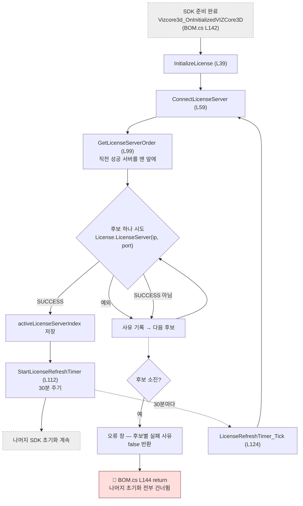

# Form1.License.cs — 라이선스 서버 연결

**한 줄**: 프로그램을 켤 때 **VIZCore3D 라이선스 서버에 인증**하고, 이후 **30분마다 다시 인증**한다. 서버 후보가 둘이라 하나가 죽으면 다른 쪽으로 넘어간다.

전체에서 가장 작은 파일이고 가장 독립적이다. 다른 기능과 얽히지 않는다.

---

## 1. 언제 도는가

버튼이 없다. **사용자가 부르는 게 아니라 프로그램이 알아서 돈다.**

| 시점 | 무엇 |
|---|---|
| **앱 시작** | SDK 준비가 끝나면 `Vizcore3d_OnInitializedVIZCore3D` (BOM.cs L142) 안에서 `InitializeLicense()` 호출 |
| **30분마다** | `licenseRefreshTimer`가 `LicenseRefreshTimer_Tick` 실행 |

> 🔴 **인증에 실패하면 SDK 초기 설정 전체가 중단된다.**
> ```csharp
> if (!InitializeLicense()) return;     // BOM.cs L144
> ```
> 이 `return` 뒤에 툴바 표시·모델트리 표시 등 나머지 초기화가 전부 있다.
> **창은 뜨는데 아무것도 동작하지 않는 상태**가 된다. 오류 창은 한 번 뜨고 사라진다.

---

## 2. 실행 흐름



### 앱 시작 — `InitializeLicense()` L39

1. **`ConnectLicenseServer(out failures)`** (L59) — 후보 서버를 순서대로 시도
2. 성공하면 → **`StartLicenseRefreshTimer()`** (L112) — 30분 타이머 시작 → `true`
3. 전부 실패하면 → **오류 창**에 후보별 실패 사유를 줄바꿈으로 나열 → `false`

### 후보 시도 — `ConnectLicenseServer()` L59

```
GetLicenseServerOrder() 가 정한 순서대로 반복
   ↓
vizcore3d.License.LicenseServer(ip, port) 호출
   ├─ 예외 발생   → 사유 기록하고 다음 후보로 계속 (죽지 않는다)
   ├─ SUCCESS     → activeLicenseServerIndex 저장 + 로그 → 즉시 true
   └─ 그 외 결과   → 사유 기록하고 다음 후보로
   ↓
전부 실패 → activeLicenseServerIndex = -1 → false
```

### 30분마다 — `LicenseRefreshTimer_Tick()` L124

`ConnectLicenseServer()`를 다시 부른다. **성공하든 실패하든 앱은 계속 돈다.** 실패하면 로그만 남기고 다음 주기에 재시도한다. 전체가 `try/catch`로 감싸여 있어 타이머 안에서 난 예외가 앱을 죽이지 않는다.

---

## 3. 상태

이 파일이 소유한 필드는 셋뿐이고, **전부 이 파일 안에서만 쓰인다.** 공유 상태가 없다.

| 필드 | 무엇 |
|---|---|
| `LicenseServers` (static readonly) L18 | 후보 서버 배열 — `(IP, 포트)` 튜플 2개 |
| `activeLicenseServerIndex` L28 | 마지막으로 성공한 후보의 인덱스. 미인증이면 `-1` |
| `licenseRefreshTimer` L33 | 30분 주기 타이머 (`System.Windows.Forms.Timer`) |

### 후보 서버 (L18~22)

| 순서 | 주소 | 용도 |
|---|---|---|
| 1 | `127.0.0.1:8901` | 로컬 (기본) |
| 2 | `60.100.164.177:8901` | 사내 라이선스 서버 (폴백) |

**코드에 박힌 상수다.** 설정 파일로 빼지 않았다 — 당시 판단은 *"현장마다 바뀔 값이면 App.config로 빼는 게 맞는데, 지금은 지시받은 1개뿐이라 상수로 두었다"* (이슈 #61 코멘트).

---

## 4. 외부 호출

### VIZCore3D SDK

| API | 무엇 |
|---|---|
| `vizcore3d.License.LicenseServer(ip, port)` | 라이선스 서버에 인증 요청. `VIZCore3D.NET.Data.LicenseResults` 반환 (`SUCCESS`면 성공) |

### 다른 파일

| | |
|---|---|
| `DiagLog(msg)` (Form1.cs L266) | 진단 로그. 이 파일의 모든 로그가 `[License]` 접두어를 쓴다 |

**이 파일이 남을 부르는 건 `DiagLog` 하나뿐이고, 남이 이 파일을 부르는 건 `InitializeLicense` 하나뿐이다.** 결합이 거의 없다.

---

## 5. 알고리즘

계산이랄 게 거의 없는 파일이다. 규칙은 셋이다.

### ① 시도 순서 — 성공한 서버를 기억한다 (`GetLicenseServerOrder` L99)

```
직전에 성공한 서버가 있으면  →  그 서버를 맨 앞에
그 다음                    →  나머지를 정의된 순서대로
```

`yield return`으로 순서만 만들어 낸다. **30분 갱신 때마다 로컬부터 다시 시도하지 않는다** — 사내 서버로 폴백된 상태라면 계속 사내 서버부터 간다. 그 서버가 죽으면 그때 다시 나머지 후보로 폴백한다.

### ② 예외도 "다음 후보"로 취급한다 (L72~78)

`LicenseServer()` 호출 자체가 예외를 던져도 `continue` 한다. **연결 실패와 인증 거부를 구분하지 않고 똑같이 "이 후보는 안 됨"으로 처리**하는 설계다. 사내망 밖이라 로컬 서버가 아예 없는 상황에서도 폴백이 동작해야 하기 때문.

### ③ 실패 사유를 모아서 한 번에 보여준다

후보마다 실패 이유를 `failures` 리스트에 쌓고, **전부 실패했을 때만** 오류 창에 전체를 나열한다.

```
127.0.0.1:8901 → 예외 (연결 거부)
60.100.164.177:8901 → LICENSE_EXPIRED
```

어느 단계에서 막혔는지 사용자가 바로 알 수 있게 한 것이다.

---

## 6. 책임과 결합 — 다시 짠다면

### ① 이 파일이 지는 책임

**하나뿐이다.** "라이선스 서버에 인증하고 유지한다."

전체 13개 파일 중 **책임이 하나인 유일한 파일**이다. 그래서 리팩토링 난이도가 가장 낮다.

### ② 떼어낼 수 있는 것 — 파일 전체

| | |
|---|---|
| **무엇을** | 파일 전체 (145줄) |
| **어디로** | `LicenseManager` 독립 클래스 |
| **근거** | 자기 소유 필드 3개는 밖에서 아무도 안 본다. 공유 상태 중 `vizcore3d`·`DiagLog`는 쓰지만 ③처럼 주입으로 풀린다. UI 컨트롤은 안 건드리나 `System.Windows.Forms.Timer`(L33)가 **UI 메시지 루프에 묶이므로** 타이머 소유·해제 경계를 같이 정해야 한다 (교차검증 #1) |

인터페이스는 이 정도면 된다.

```
LicenseManager(vizcore3d, DiagLog)
  .Initialize()  →  bool + 실패 사유 목록
  .Dispose()     →  타이머 정지
```

**오류 창을 이 클래스가 띄우지 않게** 하는 게 핵심이다. 지금은 `InitializeLicense()` 안에서 `MessageBox.Show`를 직접 부른다 — 그래서 UI에 묶여 있다. **실패 사유만 반환하고 표시는 호출자가** 하면 완전히 분리된다.

### ③ 못 떼는 것과 이유

| 무엇 | 무엇에 묶였나 |
|---|---|
| `vizcore3d.License.LicenseServer()` | **SDK.** 생성자로 주입받으면 해결 |
| `DiagLog` | `Form1.cs`의 static 메서드. 로거를 주입받는 형태로 바꾸면 해결 |
| `MessageBox.Show` (L48) | **UI.** 위처럼 반환값으로 바꾸면 해결 |
| `licenseRefreshTimer` (L33) | **WinForms Timer = UI 메시지 루프 의존.** 호출자가 타이머를 소유하거나 스레드 타이머 + 마샬링으로 교체 (교차검증 #1) |

**넷 다 주입·소유 이전으로 풀린다.** 구조적으로 막힌 게 없다.

### ④ 지울 것

없다. 죽은 코드도 중복도 없다.

### 🔑 리팩토링 순번 후보 1위

- 책임 1개 · 145줄 · 공유 상태 0 · 되돌리기 쉬움
- **다른 파일을 건드리지 않는다** (호출부는 `BOM.cs` 한 줄뿐)
- "공유 상태에 묶이지 않은 기능은 뺄 수 있다"는 것을 **가장 싸게 증명**할 수 있는 파일

---

## 부록 — 지나가며 눈에 띈 것

> 리팩토링 판단과 별개로 기록만 해둔다.

| | 내용 |
|---|---|
| 🔒 | **사내 라이선스 서버 IP·포트가 공개 저장소에 있다.** `Form1.License.cs:21` · `STATUS.md` · `issues.json` 3곳 = **5곳**. 저장소가 PUBLIC이라 커밋 이력에도 남는다 |
| ⚠ | **인증 실패 시 "켜졌지만 안 되는" 상태가 된다.** `BOM.cs L144`의 `return`이 나머지 초기화를 전부 건너뛴다. 오류 창은 한 번 뜨고 사라지고 재시도 수단이 없다 |
| ⚠ | **후보 서버가 코드 상수다.** 현장마다 다르면 재빌드해야 한다 (이슈 #61에서 이미 인지하고 보류) |
| · | 갱신 주기 30분의 근거가 없다 (L115). SDK 라이선스 임차 시간과 맞는지 **(미확인)** |
| · | 갱신 실패가 로그에만 남는다. 사용자는 다른 기능이 실패할 때에야 안다 |

---

## 관련 문서

- [`Form1.md`](./Form1.md) — `DiagLog` · 앱 시작 순서
- `docs/setup/build-environment.md` — SDK DLL 배치
