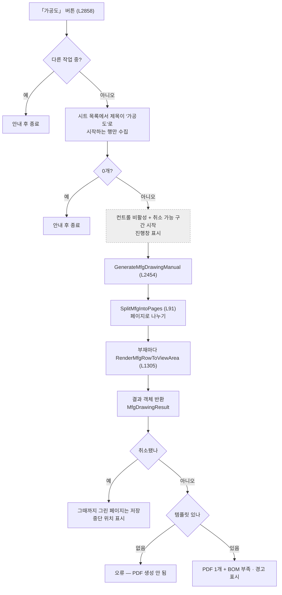
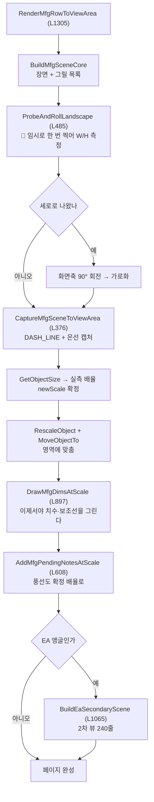

# Form1.MfgDrawing.cs — 부재 하나를 제조용 도면으로

**한 줄**: 부재 **하나만 화면에 남기고**, 제일 긴 축이 가로가 되게 **돌려서 세우고**, 2D로 **찍은 다음**, 그제서야 확정된 배율로 **치수와 풍선을 그린다.**

> 📊 **버튼 하나가 3,883줄을 끌고 간다.** 프로젝트에서 버튼 대비 코드가 가장 무거운 파일이다.
> 메서드 60개, 그중 `BuildMfgSceneCore` 485줄 · `GenerateMfgDrawingManual` 372줄 · `BuildEaSecondaryScene` 240줄.

---

## 1. 진입점

### 버튼 1개

| 화면 버튼 | 핸들러 | 줄 | 크기 |
|---|---|---|---|
| **가공도** | `btnMfgDrawingSheet_Click` | L2858 | 121줄 |

### 버튼 말고 도는 경로가 둘 더 있다

| 경로 | 무엇 |
|---|---|
| **도면 시트 목록에서 가공도 행 선택** | `LvDrawingSheet_SelectedIndexChanged`(DrawingSheets.cs) → `ExecuteMfgDrawing` L2326 → **3D 미리보기** |
| **도면 일괄 출력** | `Form1.Stru.cs` → `GenerateMfgDrawingManual` L2454 → **PDF** |

**미리보기와 PDF가 같은 코어를 쓰고 어댑터만 다르다.**

```
                BuildMfgSceneCore (L1873, 485줄)
                  부재 격리 · 카메라 · 축 · Osnap · EA · 치수·풍선 목록
                        │
        ┌───────────────┴───────────────┐
ExecuteMfgDrawing (L2326)      RenderMfgRowToViewArea (L1305)
  3D 미리보기 어댑터              PDF 어댑터
  SMOOTH · 실루엣 · FitToView     DASH_LINE · 캡처 · 배율 확정 · 그리기
```

### 다른 파일이 부르는 것

| 메서드 | 부르는 곳 |
|---|---|
| `ExecuteMfgDrawing` | DrawingSheets ×9 |
| `RestoreAllPartsVisibility` L23 | Drawing2D · GlobalViews |
| `GenerateMfgDrawingManual` | Stru |
| `GetSprefValue` · `IsPadOrPlateFromSpref` · `IsAngleFromSpref` | Dimensions · DrawingSheets |
| `GetMfgAxisDetection` · `GetMfgHolesFromApi` | GlobalViews · BOM |

---

## 2. 실행 흐름

### 2-1. 「가공도」 버튼 → PDF



### 2-2. `BuildMfgSceneCore` — 장면 만들기 485줄

```mermaid
flowchart TD
    A["BuildMfgSceneCore (L1873)"] --> B["ClearMfgViewAnnotations<br/>참조축이 Measure.Clear 로 지워지므로 먼저"]
    B --> C["1. 부재 격리<br/>전체 숨김 → 이 부재만 Show"]
    C --> D["2. BBox 로 최장축 판별"]
    D --> E{"IsPadOrPlateFromSpref"}
    E -- "판형 PAD/PLATE" --> F["최단축에서 본다<br/>= 평판을 정면으로"]
    E -- 일반 --> G["최장축이 가로로 보이는 방향<br/>Y최장 → X뷰 · 그 외 → Y뷰"]
    F --> H["View.MoveCamera"]
    G --> H
    H --> I{"ORIENTATION UDA 로<br/>로컬 참조축을 만들 수 있나"}
    I -- 예 --> J["ActivateMfgReferenceAxis<br/>시선 자체를 로컬축에 정렬"]
    I -- 아니오 --> K["ApplyOrientationRotation<br/>기존 카메라 유지"]
    J --> L["Z 최장축이면 ApplyZ90 = true<br/>(적용은 어댑터가)"]
    K --> L
    L --> M{"Osnap 캐시 hit?"}
    M -- 예 --> N["캐시 재사용<br/>GetOsnapPoint 생략"]
    M -- 아니오 --> O["GetOsnapPoint<br/>LINE 양끝 + POINT · CIRCLE 제외"]
    N --> P{"IsAngleFromSpref — EA 앵글?"}
    O --> P
    P -- 예 --> Q["열린 방향 판정<br/>centroid vs BBox 중심"]
    Q --> R["±카메라 선택 · 180° 회전 여부"]
    R --> S["코너 판정<br/>깊이축으로 두꺼운 쪽이 접힘 모서리"]
    S --> T["상하 스왑 결정"]
    P -- 아니오 --> U
    T --> U["FilterHiddenLineOsnap<br/>뒷면 점 제거"]
    U --> V["극점 선별<br/>축당 최대 4점 × 2축 = 최대 8점 (#15)"]
    V --> W["MergeCoordinates + AddChainDimensionByAxis<br/>(Dimensions.cs)"]:::other
    W --> X["FilterMfgDimensions<br/>축당 8개"]
    X --> Y["🔑 PendingDims 에 쌓기만<br/>offset 미적용 · 그리지 않음"]
    Y --> Z2["GetMfgHolesFromApi + BuildMfgPendingNotes<br/>풍선도 목록에만"]
    Z2 --> Z3["MfgViewPose 반환"]
    classDef other fill:#eee,stroke:#999,stroke-dasharray:3
```



### 2-3. PDF 어댑터 — 찍고 나서 그린다



---

## 3. 상태

### `Form1.cs` 공유 상태

| 필드 | 읽기/쓰기 | 무엇에 |
|---|---|---|
| ⚠ `vizcore3d` | 읽기·쓰기 | 전부 |
| ⚠ `bomList` | 읽기 | 부재 BBox·이름 |
| ⚠ `_lastMfgViewPose` | **쓰기** | 미리보기 결과. 시트 선택 후처리 회전이 참조 |
| ⚠ `_mfgPreviewNetRoll` | 읽기·**쓰기** | 🔑 누적 회전 상쇄용 |
| ⚠ `_mfgActiveReferenceAxisId` | 읽기·쓰기 | 활성 참조축 리뷰 ID |
| ⚠ `_udaValueCache` | 읽기·**쓰기** | SPREF·ORIENTATION 조회 캐시 |
| ⚠ `_lastCollectedNodeOsnapMap` | 읽기 | Osnap 캐시 |
| ⚠ `_cancelRequested` · `_cancelableOperationInProgress` | 읽기 | 취소 |

### 이 파일의 상수 — 전부 종이 절대 mm

| 상수 | 값 | 무엇 |
|---|---|---|
| `MfgCanvasBaseOff` L1478 | **9.0** | 보조선 1단 (제작도는 7.5) |
| `MfgCanvasLvlSp` L1479 | **9.0** | 단 간격 → 전체 18mm |
| `MfgCanvasExtGap` L1480 | **2.0** | 보조선 시작 간격 |
| `MfgLvl2TextSlideCanvas` L1481 | **2.5** | 2단 텍스트 밀기 |
| `MfgCanvasBalloonGap` L1482 | **6.0** | 치수 외곽 → 첫 풍선 |
| `MfgCanvasBalloonRowSpacing` L1483 | **8.0** | 풍선 행 간격 (6mm 글자 + 2mm) |
| `MfgCanvasBalloonTextHeight` | **6.0** | 풍선 글자 높이 |
| `MfgCanvasMeasureTextHeight` | **10.0** | 치수 글자 높이 |
| `MfgMinModelAreaHeightRatio` | **0.35** | 🔑 **주석이 많아도 모델 영역은 35% 보존** |
| `MfgMaxDimensionsPerAxis` · `MfgMinTextSpace` | **8** · **25.0** | 치수 선별 (제작도와 같은 값이지만 별도 상수) |
| 🔴 `MfgCameraSignProbeEnabled` L1493 | **false** | 검증 프로브 — **꺼져 있다** |

---

## 4. 의존

### VIZCore3D SDK — 이 파일이 가장 많이 쓴다

| API | 무엇에 |
|---|---|
| `Object3D.Show(ALL, false)` → `Show(대상, true)` | 🔑 **부재 격리** |
| `View.MoveCamera(CameraDirection)` | 시선 |
| `View.RotateCameraByScreenAxis(0,0,각도)` | ⚠ **누적(상대) 회전** |
| `View.ScreenAxisRotation.LockZAxis` | 회전 잠금 해제 |
| `View.SetRenderMode(DASH_LINE / SMOOTH)` | 은선 / 실선 |
| `View.FitToView` · `GetCameraData` · `ZoomRatio` | 프레이밍 |
| `Drawing2D.Object2D.Create2DViewObjectWithModelHiddenLineAtCanvasOrigin` | 🔑 **2D 캡처** |
| `Drawing2D.Object2D.GetObjectSize` | 🔑 **실측 배율의 근거** |
| `Drawing2D.Object2D.RescaleObject` · `MoveObjectTo` | 배치 |
| `Drawing2D.Object2D.ModelLineThickness` · `Set2DViewCreateObjectItemLineWidth` | 선 굵기 |
| `Drawing2D.Object2D.Add2DMeasureFrom3DMeasure` · `Add2DNoteFrom3DNote` · `Add2DObjectFromShapeDrawing` | 3D → 2D 이관 |
| `Object3D.GetOsnapPoint` | 특징점 (⚠ **클릭당 약 0.8초**) |
| `Object3D.UDA.Keys` | SPREF·ORIENTATION |
| `Object3D.GetNodeHoleInfo` | 홀·슬롯홀 |
| `Review.Measure.AddCustomDistanceUserAxis` · `AddCustomAxisDistance` | 치수 |
| `Review.ReferenceAxis` 계열 | 로컬 참조축 |

### 다른 `Form1.*.cs`

| 메서드 | 어디 | 맡기는 일 |
|---|---|---|
| `MergeCoordinates` · `AddChainDimensionByAxis` · `ApplySmartFiltering` · `ComputeCanvasAbsoluteOffsets` · `DrawDimension` | `Form1.Dimensions.cs` | **치수 계산 전부** |
| `FilterOsnapForDimAxis` | `Form1.DrawingSheets.cs` | 축당 극점 최대 4점 선별 (2축이라 합계 최대 8점) |
| `PrepareDrawingCanvas` · `SaveCurrentDrawingToPdf` · `EndPdfPageAccumulation` | `Form1.Drawing2D.cs` | PDF 페이지 |
| `FillRevisionTable` · `KeepBorder` | `Form1.ExcelTemplate.cs` | 표제부 |
| `ShowBusyOverlay` · `BeginCancelableOperation` · `DiagLog` | `Form1.cs` | 진행·취소·로그 |

---

## 5. 알고리즘

### ① 부재를 어느 방향에서 볼 것인가 (L1897~1930)

```
최장축을 구한다  (BBox 세 변 중 제일 긴 것)

판형(PAD/PLATE)이면   →  최단축 방향에서 본다      = 평판을 정면으로
그 외                →  최장축이 가로로 보이는 방향
                          Y가 최장 → X뷰
                          그 외    → Y뷰
Z가 최장이면          →  ApplyZ90 = true          = 화면에서 90° 눕힌다
```

**판형이냐 아니냐로 규칙이 정반대다.** 판은 넓은 면을 봐야 하고, 형강은 길이를 봐야 한다. 판정은 `SPREF` UDA 문자열로 한다.

### ② 🔑 방향을 추측하지 않고 **찍어서 잰다** (`ProbeAndRollLandscape` L485)

```
임시로 한 번 캡처  →  GetObjectSize 로 W·H 측정  →  즉시 삭제
   높이 > 폭 이면  →  화면축 90° 회전해서 가로로
```

주석에 이유가 있다 — **"실제 투영 방향을 임시 캡처로 측정 (ground truth — 축 규약 추측 제거)"**.

카메라 방향·부재 회전·ORIENTATION이 겹치면 "화면에서 어느 쪽이 가로인지"를 계산으로 맞히기 어렵다. **한 번 찍어보는 게 확실하다.**

### ③ 🔑 배율이 확정된 뒤에야 그린다

**이 파일 전체를 관통하는 구조다.**

```
BuildMfgSceneCore   →  PendingDims · PendingNotes 에 "그릴 것"만 쌓는다
        ↓
CaptureMfgSceneToViewArea  →  캡처 → GetObjectSize → 실측 newScale 확정
        ↓
DrawMfgDimsAtScale · AddMfgPendingNotesAtScale  →  그제서야 그린다
```

왜 이렇게 하나 — 주석에 답이 있다.

> 추정 스케일(`EstimateFitScaleForViewArea`, BBox 기반)은 2D 은선 투영 실측과 달라 **보조선 길이가 부재·뷰마다 어긋났음** (설계 §4.4 v2-c, 2026-07-01)

**미리 계산한 배율과 실제 그려진 배율이 다르다.** BBox는 3D 상자인데 은선 투영은 실루엣이라 값이 안 맞는다.

### ④ EA 앵글 — L자 부재의 열린 쪽 찾기 (L2035~2110)

앵글(ㄱ자 단면)은 **어느 쪽이 열렸는지**에 따라 도면이 뒤집힌다.

```
Osnap 점들의 무게중심(centroid)과 BBox 중심을 비교한다
   openH = BBox중심H − centroidH
   openV = BBox중심V − centroidV

openV > 0        →  180° 회전 (use180)
openH 의 부호    →  ±카메라 선택   (뷰 방향마다 규칙이 다르다)
```

**무게중심이 BBox 중심에서 어느 쪽으로 쏠렸는지가 곧 "빈 쪽"** 이다. L자는 한쪽이 비어 있으니 점이 반대편에 몰린다.

### ⑤ EA 접힘 모서리 찾기 — 두께로 구분한다 (L2110~2145)

두 뷰를 만들 때 **어느 쪽이 접힌 코너이고 어느 쪽이 자유단인지** 알아야 상하를 맞출 수 있다.

```
높이축의 min/max 양쪽 끝 30% 띠를 본다
각 띠에서 깊이축 방향 퍼짐(extent)을 잰다
   퍼짐이 큰 쪽  =  반대 플랜지가 있는 쪽  =  접힘 코너
   퍼짐이 작은 쪽 =  판 두께(~8mm)뿐       =  자유단
차이가 1.0mm 넘어야 판정을 신뢰한다
```

> **"자유단 쪽은 깊이 방향으로 판 두께뿐이라 극명하게 갈린다"** — 코드 주석. 8mm와 플랜지 전체 폭의 차이라 오판할 여지가 적다.

2차 뷰용으로 **같은 판정을 축만 바꿔 한 번 더** 한다.

### ⑥ Osnap을 극점만 남긴다 — 최대 8점 (L2200~2220)

```
보이는 축(2개)마다 FilterOsnapForDimAxis 호출  →  축당 극점 최대 4점 강제 포함
두 결과를 AddRange — 축 사이 중복 제거 없음     →  최종 최대 8점 (같은 극점 중복 가능)
```

2026-06-23 사용자 사양. **EA 중간 station이 폭주해 치수가 겹치던 문제를 원천 제거**한 것. 제작도의 `FilterOsnapForDimAxis`를 그대로 쓴다.
(첫 작성은 "4점만 남긴다"로 축약했는데 축당 4점 × 2축이라 최대 8점이 맞다 — 교차검증 #15)

### ⑦ 미리보기 회전 누적 차단

`RotateCameraByScreenAxis`는 **상대(누적) 회전**이다. PDF 경로는 매번 새로 시작하지만 미리보기는 그렇지 않아서, **Z최장축(90°)·EA(180°) 부재를 연속으로 클릭할수록 카메라가 점점 틀어졌다** (2026-07-22 수정).

```
적용한 총량을 _mfgPreviewNetRoll 에 기록
   → 다음 진입 때 음수로 되돌린다 (ResetMfgPreviewViewState)
   → MoveCamera 앞에서 되돌리므로, MoveCamera 가 자체 리셋해도 안전
```

### ⑧ 카메라 프레이밍은 `EndUpdate` **뒤에** (L2440~2470)

```
BeginUpdate 안에서 MoveCamera 직후 FlyToObject3d 를 부르면
   → 회전 피벗만 부재로 옮겨지고 camZoom = 0 (퇴화 프레임)
   → 줌·거리를 못 잡아 부재 일부만 극단 확대
```

그래서 **커밋 후 `FitToView`** 로 바꿨다 (2026-07-22). 회전도 커밋 후 적용한다 — `ScreenAxisRotation`이 `BeginUpdate` 안에서는 commit 전 상태일 수 있어 **클릭 순서에 따라 결과가 달라지는 버그**가 있었다.

### ⑨ Osnap 캐시 — 클릭당 0.8초를 없앤다

`GetOsnapPoint`가 **미리보기 클릭당 약 0.8초**를 먹는 병목이다. 도면 리스트를 뽑을 때 채운 부재별 맵이 있으면 재사용한다.

- 맵도 `CollectAllOsnap`에서 **LINE 양끝 + POINT만 담고 CIRCLE 제외**라 결과가 같다
- 점은 **복사**해서 캐시 원본 오염을 막는다
- miss면 `GetOsnapPoint` 직행 (안전 폴백)

### ⑩ 주석이 많아도 모델은 35% (`MfgMinModelAreaHeightRatio`)

치수와 풍선이 많으면 모델이 눌린다. **영역 높이의 35%는 모델 몫으로 보장**한다.

---

## 6. 책임과 결합 — 다시 짠다면

### ① 이 파일이 지는 책임

**여섯 개다.**

| | 책임 | 대략 |
|---|---|---|
| 1 | **장면 만들기** — 격리·축·카메라·회전 | `BuildMfgSceneCore` 485 |
| 2 | **EA 앵글 특수 처리** — 열린 방향·코너·스왑·2차 뷰 | 약 400 |
| 3 | **캡처와 배율** — 프로브·캡처·리스케일·배치 | 약 400 |
| 4 | **지연 그리기** — 치수·풍선을 확정 배율로 | 약 400 |
| 5 | **PDF 페이지 조립** — 템플릿·BOM표·저장 | `GenerateMfgDrawingManual` 372 |
| 6 | **UDA 조회** — SPREF·ORIENTATION·판정 | 약 250 |

### ② 떼어낼 수 있는 것

| 무엇을 | 어디로 | 근거 |
|---|---|---|
| 🔑 **UDA 조회 6종** — `GetSprefValue` · `GetSprefValueUncached` · `GetUdaValue` · `GetUdaValueUncached` · `IsPadOrPlateFromSpref` · `IsAngleFromSpref` (L2979~3066, L3138~3196) | `UdaReader` | 가공도와 무관하고 `Dimensions`·`DrawingSheets`도 부른다. 의존은 `UDA` API + 캐시 + **부모 walk-up용 노드 트리 조회**(`FromIndex`·`ParentIndex`, 교차검증 #16) — 분리하려면 UDA 어댑터에 **노드 트리 어댑터도 같이** 필요하다 |
| **ORIENTATION 파싱** — `TryParseMfgOrientationDirection` · `TryGetMfgCardinalDirection` (L3466~3528) | `OrientationParser` | 문자열 → 축·각도. 순수 파싱 |
| **ORIENTATION 조회** — `ParseOrientation` · `GetOrientationLabel` (L3197~3245, L3261~) | `UdaReader` 쪽 | ⚠ 순수 파서가 아니다 (교차검증 #17) — `nodeIndex`를 받아 `GetUdaValue`로 **SDK-backed UDA를 조회**한 뒤 파싱한다. 조회와 파싱을 먼저 갈라야 위 파서가 분리된다 |
| **벡터 헬퍼** — `DotMfgVector` · `MfgAxisVector` · `FormatMfgVector` | 기하 유틸 | 순수 함수 |
| `MfgAxisUpPositive` (L947) | ⚠ 기하 유틸 아님 | `vizcore3d.View.GetCameraAxis()`로 **현재 카메라 상태를 읽는다** (교차검증 #18). 축 벡터를 인자로 받게 바꾼 뒤에야 분리 가능 |
| **`FilterHiddenLineOsnap`** (L3067, 71줄) | 기하 유틸 | 좌표와 BBox만 받는다 |
| **종이 절대 상수 10개** (L1474~1493) | 도면 사양 클래스 | 제작도 상수(`Dimensions.cs`)와 **한 곳에 모아야 비교가 된다** |
| **`MfgDrawingResult` · `MfgPage`** (L44~70) | `Models.cs` | 데이터 그릇 → [`Models.md`](./Models.md) |

**②만 해도 약 600줄이 나가고, 그중 UDA 조회는 다른 두 파일도 쓰는 공용 기능이다.**

### ③ 못 떼는 것과 이유

| 무엇 | 무엇에 묶였나 |
|---|---|
| `BuildMfgSceneCore` 485줄 | 🔴 **SDK 상태 조작과 계산이 완전히 섞여 있다.** `Show`로 부재를 숨기고 → BBox 계산 → `MoveCamera` → Osnap 조회 → EA 판정 → 치수 계산이 **한 흐름**이다. 중간 상태(카메라가 어디 있나, 무엇이 보이나)에 다음 계산이 의존한다 |
| 캡처·배율 | **"찍어봐야 안다"가 설계 전제다.** SDK 없이는 배율을 못 구하므로 분리 불가 |
| `BuildEaSecondaryScene` 240줄 | 코어를 다시 부르고 결과를 변형한다. 코어와 한 몸 |
| 어댑터 2개 | UI(미리보기) / PDF 파이프라인 |

**여기가 이 프로젝트에서 가장 안 풀리는 곳이다.** `Dimensions`는 계산과 그리기를 가를 수 있지만, 여기는 **"SDK에 물어봐야 다음 계산이 되는" 구조**라 순수 계산으로 뽑을 덩어리가 작다.

현실적인 방향은 분리가 아니라 **단계 이름 붙이기**다.

```
지금   BuildMfgSceneCore 485줄이 8단계를 한 메서드에

제안   MfgScene.Isolate(bom)          부재 격리
       MfgScene.DecideView(bom)       축·카메라 방향        ← 순수 계산 가능
       MfgScene.ApplyOrientation()    참조축
       MfgScene.CollectOsnap(bom)     캐시 포함
       MfgScene.AnalyzeAngle(osnap)   EA 판정              ← 순수 계산 가능
       MfgScene.BuildDimensions()     치수 목록
       MfgScene.BuildNotes()          풍선 목록
```

**2번과 5번은 좌표만 받으므로 순수 계산으로 뺄 수 있다.** 나머지는 SDK 상태에 묶여 남는다.

### ④ 지울 것

| | 내용 |
|---|---|
| 🔴 **`RunMfgCameraSignProbe` 80줄** (L296) | `MfgCameraSignProbeEnabled = false` (L1493) 뒤에 있다. **`const bool false`라 절대 실행되지 않는다.** 주석에 *"검증 후 프로브째 제거"* 라 적혀 있고, 2026-07-20에 AccessViolation 격리를 위해 껐다 |
| 🟠 **`MfgMaxDimensionsPerAxis`·`MfgMinTextSpace`** | 값이 제작도와 **똑같다** (8 / 25.0). 주석은 *"제작도와 별도 값"* 이라 하지만 실제로는 같다. 갈라둔 의도는 남기되 지금은 중복 |
| 🟠 **`FilterMfgDimensions`** (L1503, 12줄) | 본문이 `return ApplySmartFiltering(dims, 8, 25.0f);` 한 줄. 확장 지점으로 남긴 껍데기 |

### 🔑 정리하면

```
지금  Form1.MfgDrawing.cs 3,883줄

바로 줄일 수 있는 것
        죽은 프로브            -80
        껍데기·중복 상수       -20
                              ────
                              약 -100줄

공용 기능 이관
        UdaReader             약 250줄  ← Dimensions·DrawingSheets 도 쓴다
        OrientationParser     약 200줄
        기하 유틸             약 150줄
                              ────
                              약 -600줄

남는 것  약 3,200줄 — 장면·캡처·배율·EA·PDF
```

**이 파일은 "줄이는" 것보다 "단계를 드러내는" 게 먼저다.** 485줄짜리 메서드 하나가 8단계를 품고 있으면, 어디가 틀렸는지 찾는 데만 시간이 든다.

---

## 부록 — 지나가며 눈에 띈 것

| | 내용 |
|---|---|
| 🔴 | **신 템플릿에서 캡처 API가 `AccessViolation`을 낸다.** 프로세스가 즉사해 `catch`도 못 잡는다. 2026-07-20 격리 결과 **"은선 없는 캡처"와 "HLR 모드 + 은선 캡처" 둘 다 죽었다.** 지금은 `DASH_LINE` 렌더모드로 우회 중이고, 그래서 **은선이 점선으로 보인다.** 코드 주석: *"안정화 우선, '단면만' 사양은 벤더 수정 후 복원 예정"* — **소프트힐스 문의 후보 2건으로 명시돼 있다** |
| 🔴 | 위 격리 과정에서 **캡처 직전 `FlyToObject3d`도 제거**했다 (격리 5단계, 2026-07-21). *"카메라 이동/애니메이션 중 캡처 진입 의심"* |
| ⚠ | **`SlotLength`·`Size` 의미를 SDK가 직접 안 준다.** `GetMfgHolesFromApi` 주석 — *"잠정 매핑 + 진단 로그로 실측 중"*. 슬롯홀 치수가 도면에 잘못 나갈 여지가 있다 **(미확인)** |
| ⚠ | **`[MfgCam]` 진단 로그가 아직 살아 있다.** 주석에 *"원인 확정 후 제거"* 라 적혀 있는데 남아 있다 (L2367~2385). 카메라 데이터를 매 단계 찍는다 |
| · | `ExecuteMfgDrawing`은 3D 미리보기에서 **풍선을 지운다** (`Review.Note.Clear`). PDF 경로는 유지한다. 사용자 사양 2026-07-22 |
| · | `GenerateMfgDrawingManual`은 **함수 안에 `MessageBox`가 없다.** 결과 객체(`MfgDrawingResult`)로 정보를 넘기고 표시는 호출자가 한다 — Codex 6차 권고로 정리된 구조 |
| · | 가공도 보조선이 **9/9mm**로 제작도(7.5/7.5)보다 크다. 2→4→6→9로 네 번 올렸다 |

---

## 관련 문서

- [`Form1.md`](./Form1.md) — 공유 상태 · 취소 구조
- [`Form1.Dimensions.md`](./Form1.Dimensions.md) — 치수 계산 (여기서 그대로 쓴다)
- [`Form1.Drawing2D.md`](./Form1.Drawing2D.md) — PDF 페이지 누적
- [`Models.md`](./Models.md) — `MfgViewPose` 속성 30개
- `docs/기술 노트/데이터 매핑 기준.md` — 카메라 부호와 화면축
