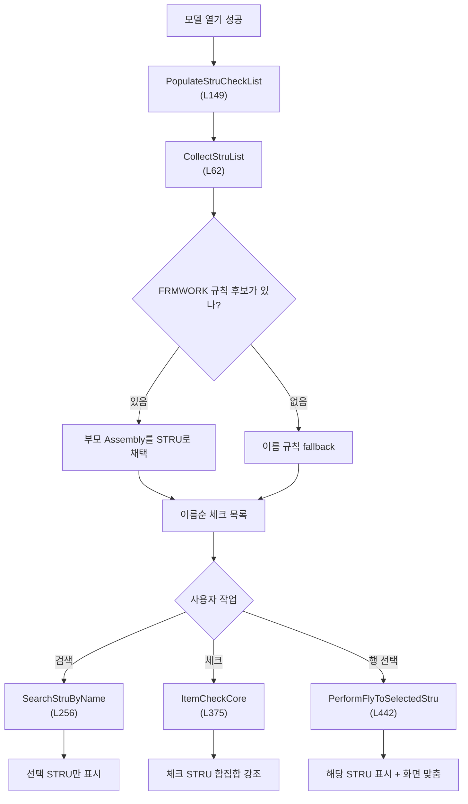
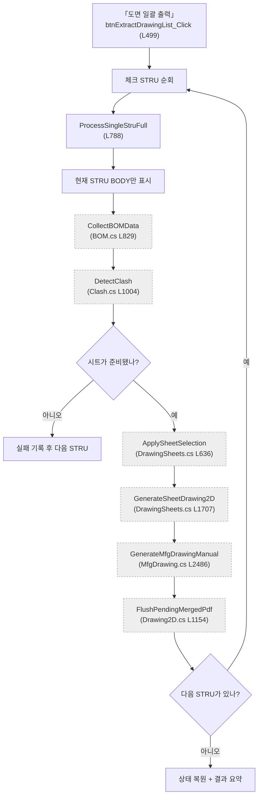

# Form1.Stru.cs — STRU 탐색·강조와 도면 일괄 출력

**한 줄**: 모델 트리 규칙으로 STRU를 찾아 선택·검색하게 하고, 체크된 STRU마다 다른 BODY를 숨긴 뒤 기존 **BOM → Clash → 치수 → 시트 → 2D → 가공도** 경로를 반복해 STRU당 PDF 하나로 묶는다.

---

## 1. 진입점 — 언제 도는가

### 앱 시작과 모델 열기

| 경로 | 메서드 | 위치 |
|---|---|---:|
| 앱 생성자 | `InitStruSearchUI` | L187 |
| 모델 열기 성공 | `PopulateStruCheckList` | L149 |

검색창과 검색 버튼은 Designer가 아니라 코드로 생성한다. 모델을 열면 STRU 후보를 다시 추출해 체크 목록과 자동완성 소스를 채운다.

### 화면에서 직접 시작

| 화면 동작 | 핸들러 | 위치 | 결과 |
|---|---|---:|---|
| **전체 선택/해제** | `btnSelectAllStru_Click` | L342 | 모두 체크돼 있으면 전부 해제, 아니면 전부 체크 |
| **도면 일괄 출력** | `btnExtractDrawingList_Click` | L499 | 체크된 STRU의 도면 4종을 순차 생성해 PDF로 저장 |
| 코드 생성 **검색** 버튼 | `BtnStruSearch_Click` | L246 | 이름으로 STRU를 찾아 그 BODY만 보이게 격리 |
| STRU 체크박스 변경 | `ClbStruList_ItemCheck` | L357 | 체크될 STRU BODY 합집합을 3D에서 선택 강조 |
| STRU 행 이름 선택 | `ClbStruList_SelectedIndexChanged` | L433 | 강조는 유지하고 그 STRU BODY를 보이게 한 뒤 화면 맞춤 |

버튼 둘과 목록 이벤트는 Designer에서, 검색 버튼은 `InitStruSearchUI`에서 직접 배선된다.

다른 파일에서는 `GetSheetKindLabel`(L1078)과 `GetSheetKindLabelWithSequence`(L1095)를 도면 목록·표제부 종류명에 사용한다.

---

## 2. 실행 흐름 — 무엇이 어떤 순서로





### 2-1. STRU 목록 구성

1. **`CollectStruList`** (L62) — SDK에서 모든 Assembly와 NodePath를 가져온다.
2. **`RuleByFrameworkChildParent`** (L128) — 이름이 `FRMWORK `로 시작하는 Assembly의 바로 위 부모 인덱스를 STRU로 채택한다.
3. 중복 부모를 제거하고 NodeName 오름차순으로 정렬한다 (L85~97).
4. 한 건도 못 찾으면 이름이 `/`로 시작하고 공백이 없는 Assembly 전체를 fallback 목록으로 쓴다 (L99~110).
5. **`PopulateStruCheckList`** (L149) — `_struNodeCache`, 체크 목록, 검색 자동완성, 개수 라벨을 함께 갱신한다.

**그래서 화면에는** 모델링 컨벤션상 STRU로 보이는 Assembly 목록이 이름순으로 나타난다.

### 2-2. 검색·체크·행 선택

1. **`SearchStruByName`** (L256) — 완전일치를 먼저 찾고, 없으면 이름순 목록의 첫 부분일치를 고른다.
2. 선택 STRU의 모든 하위 BODY를 구한 뒤 전체 BODY를 숨기고 선택 STRU BODY만 보인다 (L282~305).
3. 체크 목록의 같은 행을 선택하고 **`PerformFlyToSelectedStru`** (L442)로 화면을 맞춘다.
4. 체크박스는 **`ItemCheckCore`** (L375)에서 변경 후의 미래 체크 집합을 계산하고, 그 STRU들의 하위 BODY 합집합을 선택 강조한다.
5. 행 이름 선택은 **`PerformFlyToSelectedStru`** (L442)에서 해당 BODY를 보이게 하고 `FlyToObject3d(..., 1.2f)`를 호출한다. 다른 BODY 가시성·체크 강조색은 건드리지 않는다.

체크 클릭도 WinForms 행 선택 이벤트를 만들기 때문에 `_suppressStruSelChanged`와 `BeginInvoke`로 같은 클릭의 카메라 이동을 막는다.

### 2-3. 도면 일괄 출력 준비

1. **`btnExtractDrawingList_Click`** (L499) — 재진입, 모델, 체크 STRU를 확인한다.
2. 출력 폴더를 실행 파일 아래 `Drawings`로 고정하고 없으면 만든다. 여러 STRU면 한 번 확인을 받는다 (L527~550).
3. `_p2aInProgress`와 취소 가능 상태를 켜고 일괄 출력·치수 추출 버튼을 비활성화한다 (L553~558).
4. 전체 BODY를 다시 보이고, 기존 2D 객체·3D 풍선·치수·보조선·시트·치수·BOM 표·X-Ray·Osnap/UDA 캐시를 정리한다 (L560~604).
5. 로고 파일이 있으면 SDK 템플릿의 일반/배경반전 이미지로 같은 파일을 등록한다 (L616~631).
6. 체크 목록 순서대로 **`ProcessSingleStruFull`** (L788)을 호출한다. 한 STRU가 실패해도 다음 STRU를 계속한다.

### 2-4. STRU 하나의 BOM·Clash·시트 생성

1. **`ProcessSingleStruFull`** (L788) — STRU의 모든 하위 BODY를 수집한다.
2. 모델의 전체 BODY를 숨기고 현재 STRU BODY만 보인다. 부모 Part/Assembly는 건드리지 않는다 (L812~838).
3. X-Ray 목록을 비우고 **`CollectBOMData`** (`Form1.BOM.cs` L829)를 호출해 보이는 STRU BODY만 `bomList`에 넣는다.
4. **`DetectClash(includeOutsideNeighbors: true)`** (`Form1.Clash.cs` L1004)를 시작한다.
5. 시작하지 못하면 **`GenerateDrawingSheets`** (`Form1.DrawingSheets.cs` L20)를 직접 시도한다.
6. 시작했으면 300ms 기다린 뒤, `Clash.IsBusy == false`이고 `drawingSheetList.Count > 0`이 될 때까지 50ms 간격으로 최대 60초 폴링한다. 완료 후 다시 300ms 기다린다 (L877~920).
7. 시트가 하나도 없으면 해당 STRU를 실패 처리한다 (L924~926).

**그래서 이 시점에는** 현재 STRU 전용 BOM·간섭·치수·도면 시트 목록이 준비된다.

### 2-5. 시트별 2D 생성과 PDF 누적

1. STRU 이름을 파일명에 안전한 문자열로 바꾸고 `Drawings/<STRU>/` 폴더와 `<STRU>_생산제작도.pdf` 경로를 만든다 (L930~949).
2. **`BeginPdfPageAccumulation`** (`Form1.Drawing2D.cs` L990)으로 여러 캔버스를 한 PDF로 모으는 상태를 시작한다.
3. 일반 시트(제작·조립·설치)는 목록 행을 선택하고 **`ApplySheetSelection`** (`Form1.DrawingSheets.cs` L636)으로 3D 범위·카메라·치수·BOM을 적용한다.
4. **`GenerateSheetDrawing2D`** (`Form1.DrawingSheets.cs` L1707)로 2D 캔버스를 만들고 선택 표시를 해제한다. 성공 캔버스는 저장하지 않고 누적한다.
5. 한 시트가 실패하면 **`DiscardCurrentPdfPage`** (`Form1.Drawing2D.cs` L1081)로 반쪽 페이지를 버리고 다음 시트로 간다.
6. 가공도 시트는 모아서 **`GenerateMfgDrawingManual`** (`Form1.MfgDrawing.cs` L2486)에 한 번 맡기고, 생성된 페이지를 같은 누적에 더한다.
7. 호출부가 STRU 처리를 마친 직후 **`FlushPendingMergedPdf`** (`Form1.Drawing2D.cs` L1154)로 그때까지 성공한 페이지를 PDF 하나로 저장한다. 취소·실패가 중간에 발생해도 완성된 앞 페이지는 남긴다.

### 2-6. STRU 사이와 전체 종료

1. STRU마다 2D 객체를 지우고 `GC.Collect`·`DoEvents`·100ms 대기 후 다음 STRU로 간다 (L689~696).
2. 취소 시 부분 작업을 정리한다 (L705~711).
3. `finally`에서 모든 BODY를 보이게 하고, 늦은 Clash 이벤트가 도착할 시간을 500ms 둔 뒤 `_p2aInProgress`와 버튼·진행창을 복원한다 (L713~752).
4. 성공·실패·미처리 STRU와 생성 PDF 수를 한 번만 보여준다 (L755~771).

---

## 3. 상태 — 무엇을 읽고 무엇을 쓰나

### 이 파일이 선언하는 상태

| 필드 | 역할 | 파일 밖 사용 |
|---|---|---|
| `_struNodeCache` | 현재 모델에서 찾은 STRU Node 목록. 체크 목록 인덱스와 1:1 | 없음 |
| `txtStruSearch` | 코드로 만든 검색 입력창 | 없음 |
| `_suppressStruSelChanged` | 체크 클릭이 만든 행 선택 이벤트의 카메라 이동 차단 | 없음 |
| `_p2aInProgress` | STRU 일괄 출력 재진입·메시지박스·완료 이벤트 가드 | `Form1.BOM.cs`와 `Form1.Clash.cs`도 읽음 |

### Form1.cs에서 공유하는 상태

| 필드 | 읽기/쓰기 | 역할 |
|---|---|---|
| ⚠ `vizcore3d` | 읽기·쓰기 | STRU 계층, BODY 표시/선택, 카메라, Clash 상태, 2D 객체·템플릿 |
| ⚠ `bomList` | 쓰기 | STRU별 BOM으로 교체 |
| ⚠ `xraySelectedNodeIndices` | 쓰기 | STRU 격리는 가시성으로 하므로 매번 비움 |
| ⚠ `drawingSheetList` | 읽기·쓰기 | 비동기 완료 신호이자 출력 대상 시트 |
| ⚠ `chainDimensionList` | 쓰기 | 시작·취소 정리 |
| ⚠ `_lastCollectedNodeOsnapMap` / `_udaValueCache` | 쓰기 | STRU 전환 전 캐시 제거 |

진행·취소 필드 `_cancelRequested`와 공용 진행창도 사용한다. `Form1.Drawing2D.cs`에 선언된 PDF 누적 상태와 `Form1.DrawingSheets.cs`의 시트 선택 억제 상태는 메서드 호출을 통해 간접 사용한다.

### 화면과 파일 상태

- `clbStruList`: 표시 순서, 체크 집합, 현재 행 선택
- `lvDrawingSheet`: STRU별 생성 시트와 출력 순서
- 출력 루트: `Application.StartupPath/Drawings`
- 출력 단위: `Drawings/<STRU>/<STRU>_생산제작도.pdf`

---

## 4. 의존 — 무엇과 묶여 있나

### VIZCore3D SDK API

`VIZCore3D.NET.xml`에서 아래 멤버를 확인했다.

| API | 이 파일에서 쓰는 이유 |
|---|---|
| `Object3D.FromFilter(ASSEMBLY, true)` | Assembly 전체와 NodePath 조회 |
| `Object3D.FromFilter(ALL_INCLUDE_BODY, false)` | 현재 가시성과 무관한 전체 BODY 모수 |
| `Object3D.GetChildObject3d(index, ALL_CHILDREN, true)` | STRU 아래 모든 BODY 조회 |
| `Object3D.Show(List<int>, bool)` | STRU 가시성 격리와 종료 후 전체 복원 |
| `Object3D.Select(List<int>, true, false)` | 체크 STRU BODY 합집합 강조 |
| `Object3D.Color.RestoreColorAll()` | 기존 전체 색상 초기화 |
| `View.FlyToObject3d(List<int>, 1.2f)` | 행 선택 STRU에 화면 맞춤 |
| `Clash.IsBusy` | 비동기 간섭검사의 SDK 내부 작업 상태 확인 |
| `Drawing2D.Template.Set2DViewTemplateMark(normal, reverse)` | 일반/배경반전 템플릿 이미지 등록 |
| `Drawing2D.Object2D.DeleteAllObjectBy2DView` / `DeleteAllNonObjectBy2DView` | 시작·STRU 사이 2D 메모리 정리 |
| `UnselectAllObjectBy2DView` / `UnselectCurrentWorkObjectBy2DView` | 완성 페이지의 선택 테두리 제거 |

### 다른 Form1 파일

| 메서드 | 위치 | 맡기는 일 |
|---|---|---|
| `CollectBOMData` | `Form1.BOM.cs` L829 | 현재 보이는 STRU BODY의 기본 BOM 수집 |
| `DetectClash` | `Form1.Clash.cs` L1004 | STRU 내부 연결성과 외부 접합 검사 |
| `GenerateDrawingSheets` | `Form1.DrawingSheets.cs` L20 | Clash 결과에서 도면 시트 목록 생성 |
| `ApplySheetSelection` / `GenerateSheetDrawing2D` | `Form1.DrawingSheets.cs` L636 / L1707 | 시트 상태 적용과 2D 캔버스 생성 |
| `GenerateMfgDrawingManual` | `Form1.MfgDrawing.cs` L2486 | 가공도 페이지 묶음 생성 |
| `BuildMergedDrawingPdfPath` / `BeginPdfPageAccumulation` / `FlushPendingMergedPdf` | `Form1.Drawing2D.cs` L1190 / L990 / L1154 | STRU당 PDF 경로와 페이지 누적·최종 저장 |
| `DiscardCurrentPdfPage` / `CleanupBetweenPdfPages` | `Form1.Drawing2D.cs` L1081 / L1100 | 실패 페이지 제거와 캔버스 유지 상태 정리 |
| `ResolveDrawingAssetPath` / `SanitizeFileName` | `Form1.DrawingSheets.cs` L3790 / L1640 | 로고 경로와 안전한 폴더·파일명 |
| `ClearCanceledOperationArtifacts` | `Form1.BOM.cs` L491 | 취소 시 부분 2D/3D·목록·캐시 제거 |
| `DiagLog`·`BeginCancelableOperation`·`ThrowIfCancellationRequested` | `Form1.cs` | 진단·진행창·협력적 취소 |

---

## 5. 알고리즘 — 자명하지 않은 계산

### 5-1. STRU는 모델링 이름 규칙으로 추론한다

SDK에 이 프로젝트의 “STRU” 타입이 따로 없으므로 Assembly 이름과 부모 관계를 이용한다.

```
이름이 "FRMWORK "로 시작하는 Assembly
→ ParentIndex 한 단계
→ 그 부모를 STRU로 채택
→ 여러 FRMWORK가 같은 부모를 가리키면 HashSet으로 중복 제거
```

이 규칙이 0건이면 `/`로 시작하고 공백이 없는 Assembly를 전부 후보로 보여준다. 즉 STRU 식별은 SDK의 구조 타입이 아니라 **사용자 모델링 컨벤션을 코드로 복원한 층**이다.

### 5-2. 체크 이벤트는 “변경 전”에 오므로 미래 집합을 만든다

WinForms `ItemCheck` 시점의 `CheckedIndices`에는 아직 새 상태가 반영되지 않는다. 현재 체크 인덱스를 복사한 뒤 `e.NewValue`에 따라 클릭 행을 추가/제거해 미래 집합을 만든다. 각 STRU의 하위 BODY 합집합을 구해 전체 색을 복원한 뒤 다시 선택한다.

체크 클릭은 행 선택도 발생시킨다. `ItemCheck`에서 억제 플래그를 세우고 두 이벤트의 `BeginInvoke` 순서를 이용해 체크로 인한 카메라 이동만 막는다. 이름 클릭은 억제되지 않아 `FlyToObject3d`가 실행된다.

### 5-3. 검색은 화면 선택이 아니라 실제 가시성을 격리한다

완전일치 우선, 부분일치는 이름순 첫 항목이다. 검색 성공 시 전체 BODY를 숨기고 STRU BODY만 다시 보인다. 이 상태는 유지되므로 이후 사용자가 **치수 추출**을 누르면 공용 BOM 수집의 “보이는 BODY만” 규칙으로 같은 STRU만 처리된다.

### 5-4. 기존 수동 경로를 조립해 자동 출력한다

일괄 출력은 별도 도면 알고리즘을 다시 구현하지 않는다.

```
STRU 가시성 격리
→ CollectBOMData
→ DetectClash
→ SDK 완료 이벤트가 CompleteMainDimensionPostClash 호출
→ GenerateDrawingSheets
→ ApplySheetSelection
→ GenerateSheetDrawing2D / GenerateMfgDrawingManual
→ PDF 누적 저장
```

파일이 긴 이유는 실제 도면 계산보다 **기존 비동기·UI 중심 기능들을 STRU 순차 작업으로 안전하게 연결하고 중간 상태를 정리하는 조립 코드**가 많기 때문이다.

### 5-5. SDK 비동기를 동기 흐름처럼 기다린다

`DetectClash` 반환 직후 SDK `IsBusy`가 아직 false일 수 있고, 완료 이벤트는 `IsBusy`가 false가 된 뒤에도 시트 목록을 채우는 중일 수 있다. 그래서 다음 네 조건을 겹친다.

1. 시작 뒤 300ms 고정 대기
2. `Application.DoEvents()`로 UI 메시지와 완료 이벤트 처리
3. `!Clash.IsBusy && drawingSheetList.Count > 0`를 절대 완료 조건으로 사용
4. 완료 조건 뒤 다시 300ms 고정 대기

60초가 지나면 실패한다. SDK 작업 하나를 `await`할 Task나 완료 결과로 직접 이어주는 API가 없어 이벤트와 폴링을 접착한 우회다.

### 5-6. 가시성은 BODY만 조작한다

전체 BODY를 숨긴 뒤 STRU BODY만 보인다. Part/Assembly까지 숨기면 부모가 숨은 상태에서 자식 BODY를 보이게 해도 실제로 나타나지 않는 충돌이 있어, BODY 플래그만 조작하도록 재설계됐다는 주석이 있다.

### 5-7. PDF는 “파일”이 아니라 “페이지 누적”으로 센다

일반 시트와 가공도는 각각 2D 캔버스를 만들지만 즉시 저장하지 않는다. 성공한 캔버스를 누적하고 한 STRU가 끝날 때 한 번만 내보낸다. 시트 하나가 실패하면 현재 캔버스만 버려 앞의 정상 페이지를 보존하고, 취소도 그때까지 완성된 페이지를 저장한다.

### 5-8. 시트 종류는 음수 센티넬로 구분한다

| `BaseMemberIndex` | 종류 |
|---:|---|
| `-1` | 제작도 |
| `-2` | 설치도 |
| `-3` | 가공도 |
| `>= 0` | 조립도 |

같은 종류가 여러 장이면 도면 목록 전체에서의 순서를 `조립도 (2/5)`처럼 붙인다. 가공도는 자체 페이지 번호가 있어 여기서 제외한다.

---

## 6. 책임과 결합 — 다시 짠다면

### ① 이 파일이 지는 책임

- 모델 Assembly에서 이름 규칙으로 STRU 후보를 찾고 체크·검색 UI를 구성한다.
- 검색·체크·행 선택에 따라 BODY 가시성, 선택 강조, 카메라 이동을 제어한다.
- 체크된 STRU마다 BOM·Clash·치수·시트 생성·2D·가공도·PDF 저장을 순서대로 호출한다.
- SDK 비동기 Clash와 페이지 누적을 폴링·대기·정리하며 취소와 부분 실패를 처리한다.
- STRU별 성공·실패·PDF 수를 모아 사용자에게 보고한다.

STRU 탐색 UI와 애플리케이션 전체에 가까운 배치 출력 오케스트레이션이 한 파일에 공존한다.

### ② 떼어낼 수 있는 것

| 무엇을 | 어디로 | 근거 |
|---|---|---|
| `FRMWORK ` 부모 규칙, fallback, 정렬 | `StruCatalog` | Assembly 경로 DTO만 받으면 SDK·WinForms 없이 STRU 후보를 시험할 수 있다. fallback 정책도 명시적으로 교체 가능하다. |
| 체크 STRU → BODY 합집합 | `StruMembershipIndex` | STRU별 하위 BODY를 모델 세션 동안 한 번만 캐시하면 전체 선택의 O(N²) 반복 조회를 없앨 수 있다. |
| STRU 하나의 단계 전환과 결과 집계 | `StruDrawingJob`/`BatchDrawingCoordinator` | 각 단계를 `Succeeded/Skipped/Failed/Canceled` 결과로 연결하면 60초 폴링과 bool 해석을 없애고 실제 PDF 저장 성공만 집계할 수 있다. |
| 시작 전 가시성 저장과 종료 복원 | `VisibilityScope` | 진입 시 스냅샷, `Dispose` 시 복원이라는 독립 수명 규칙으로 만들 수 있다. |
| 파일명·폴더·페이지 누적 요청 조립 | `StruOutputPlan` | STRU 이름과 시트 목록만으로 결정되며 실제 2D/PDF SDK 호출과 분리할 수 있다. |

### ③ 못 떼는 것과 이유

- 코드로 만든 검색 컨트롤, 체크 이벤트의 “변경 전” 시점, `_suppressStruSelChanged`는 WinForms 이벤트 모델에 묶여 UI 어댑터에 남아야 한다.
- BODY 표시·선택·`FlyToObject3d`, `Clash.IsBusy`, 2D 템플릿·페이지는 VIZCore3D의 상태형 API라 각각 SDK 어댑터가 필요하다.
- 일괄 출력은 ⚠ `bomList`, `clashList`, `chainDimensionList`, `drawingSheetList`, X-Ray/UDA/Osnap 캐시를 다른 partial 파일과 공유한다. `DrawingJobContext`가 생기기 전에는 단계 호출 순서를 이 파일 밖으로 안전하게 옮길 수 없다.
- 취소가 SDK 호출 자체를 중단하지 못하고 UI 체크포인트에서만 확인되므로, SDK가 취소 토큰을 지원하지 않는 한 “즉시 취소”는 분리만으로 해결되지 않는다.
- 체크 해제 때 `RestoreColorAll`이 SDK 선택 상태까지 해제하는지는 XML만으로 확정되지 않는다 `(미확인)`.

### ④ 지울 것

- 값이 늘 0인 `pdfCount`, 호출되지 않는 `reportPdfSaved`, 사용하지 않는 `ProcessSingleStruFull` 반환 경로는 삭제한다.
- 시트 행의 `Selected = true`가 일으키는 자동 적용과 바로 뒤 직접 `ApplySheetSelection` 중 하나를 삭제한다. 배치에서는 이벤트를 억제하고 직접 호출 하나만 남기는 편이 경계가 분명하다.
- `Thread.Sleep(50~500ms)`, `Application.DoEvents`, `Clash.IsBusy` 폴링은 Clash 완료를 Task로 감싸는 어댑터가 생기면 삭제한다. SDK 이벤트 유실 시 복구 규칙은 별도 타임아웃 결과로 남긴다.
- STRU 사이의 강제 `GC.Collect`는 네이티브 2D 자원 해제 API를 확인한 뒤 삭제한다 `(미확인)`.
- 폐기된 PoC 명칭 `_p2aInProgress`와 현재 동작과 어긋난 파일 머리 주석은 `isStruBatchExportRunning`과 실제 단계 설명으로 바꾸면서 제거한다.

---

## 부록 — 지나가며 눈에 띈 것

| | 내용 |
|---|---|
| ⚠ | `lvi.Selected = true`가 선택 이벤트를 통해 시트를 적용한 직후 `ApplySheetSelection`을 직접 다시 호출해 같은 작업이 두 번 실행될 가능성이 높다. |
| ⚠ | 연결되지 않은 STRU는 시트가 생기지 않았다는 결과를 받지 못해 STRU마다 최대 60초를 기다린 뒤 실패한다. |
| ⚠ | `DetectClash` false 경로는 Osnap·체인 치수·연결성 판정을 건너뛰고 시트 생성을 직접 호출한다. |
| · | 페이지가 하나도 저장되지 않아도 내부 오류를 잡고 정상 반환하면 바깥 성공 STRU 수가 증가할 수 있다. |
| · | 시작·종료 때 전체 BODY 표시를 강제해 사용자가 만든 이전 가시성 상태를 복원하지 않는다. |
| · | **전체 선택/해제**는 항목 N개를 바꿀 때마다 전체 체크 집합을 다시 계산해 O(N²) SDK 트리 조회가 된다. |
