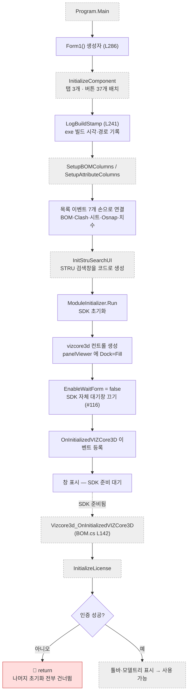

# Form1.cs — 공용 창고

**한 줄**: 화면도 버튼도 없다. **모든 파일이 함께 쓰는 상태를 보관**하고, **앱을 켤 때 한 번 도는 준비 작업**과 **누구나 부르는 공용 기능 2종**(진단 로그 · 진행/취소 창)을 담고 있다.

> 📊 이 파일은 남이 **423회** 부르고 자기는 4회만 부른다. 프로젝트에서 가장 많이 불리는 파일이다.
> 자세한 수치는 [`파일 구조.md`](../자동생성/파일%20구조.md) 참조.

---

## 1. 언제 도는가

버튼이 없다. 도는 경로가 둘뿐이다.

| 경로 | 무엇 |
|---|---|
| **앱 시작** | 생성자 `Form1()` (L286) 이 한 번 돈다 |
| **남이 부를 때** | `DiagLog` · `ShowBusyOverlay` · `BeginCancelableOperation` 등을 다른 파일이 호출 |

---

## 2. 실행 흐름 — 앱을 켜면 벌어지는 일



**생성자는 화면을 만들 뿐이고, 실제로 쓸 수 있게 되는 건 SDK 준비 이벤트가 온 다음이다.** 그 사이에 라이선스 관문이 있다.

### 생성자 `Form1()` L286 — 단계별

프로그램을 실행하면 창이 뜨기 전에 이 순서로 돈다.

1. **`InitializeComponent()`** — Designer.cs가 만든 화면(탭 3개, 버튼 37개)을 배치
2. **`LogBuildStamp()`** — 로그 맨 앞에 **exe 빌드 시각과 경로**를 남김
   > 사내·사외를 오가며 코드를 반입하다 보면 "고친 게 들어간 빌드인가"가 매번 헷갈려서 넣은 것 (코드 주석)
3. **`SetupBOMColumns()`** / **`SetupAttributeColumns()`** — 목록 컬럼 구성 (각각 BOM·Attribute 파일에 있음)
4. **목록 이벤트 7개 등록** — BOM 더블클릭, Clash 더블클릭·선택변경, 도면시트 선택, 도면BOM 선택, Osnap 선택, 치수 선택
   → **Designer.cs가 아니라 여기서 손으로 붙인다.** 버튼은 Designer, 목록은 여기
5. **`InitStruSearchUI()`** — STRU 이름 검색창을 코드로 생성 (Designer에 없음)
6. **`ModuleInitializer.Run()`** — VIZCore3D SDK 초기화
7. **`vizcore3d` 컨트롤 생성** → `panelViewer`에 붙임 (Dock=Fill)
8. **`vizcore3d.EnableWaitForm = false`** — SDK 자체 대기창을 끔
   > 우리 `ShowBusyOverlay`와 중복돼 SDK 쪽 `Please Wait / Processing...` 글자만 화면에 남았다 (2026-08-04 사내 실기, 이슈 #116)
9. **`OnInitializedVIZCore3D` 이벤트 등록** — SDK 준비가 끝난 뒤 할 일 연결

**여기서 얻는 것**: 3D 뷰어는 `panelViewer` 안에 있고, `vizcore3d` 한 개를 **모든 파일이 공유**한다. 화면 갱신·모델 조작은 전부 이 하나를 거친다.

---

## 3. 공유 상태 — 이 파일의 본체

필드 약 40개. 전부 `private`이지만 **`partial class`라 12개 파일 어디서나 직접 읽고 쓴다.**

### 3-1. 3D 컨트롤

| 필드 | 무엇 | 밖에서 쓰인 횟수 |
|---|---|---|
| `vizcore3d` | VIZCore3D 컨트롤 본체 | **826회 / 11개 파일** |

### 3-2. 데이터 목록 — 화면 목록에 그대로 보이는 것들

| 필드 | 무엇 | 밖에서 |
|---|---|---|
| `bomList` | BOM 데이터 | 96회 / 8개 파일 |
| `chainDimensionList` | 체인 치수 | 60회 / 6개 |
| `drawingSheetList` | 도면 시트 | 45회 / 4개 |
| `osnapPoints` | Osnap 좌표 | 44회 / 4개 |
| `osnapPointsWithNames` | Osnap 좌표 + 부재명 + 축 | — |
| `clashList` | 간섭 검사 결과 | 18회 / 4개 |

`osnapPointsWithNames`의 `axis`는 LINE osnap이면 시작→끝 벡터의 최대 성분(`"X"`/`"Y"`/`"Z"`), POINT·수동이면 `""`.

### 3-3. 제작도 점선용 근접 부재 검사 — 별도 계열

| 필드 / 상수 | 무엇 |
|---|---|
| `FabricationNeighborClashTestName` | `"제작도_근접후보_간섭검사"` |
| `FabricationNeighborClearance` | **3.0f** (근접 판정 여유) |
| `fabricationNeighborClashList` | 근접 검사 결과 (**일반 `clashList`와 분리**) |
| `fabricationNeighborPartIndices` / `fabricationTargetBodyIndices` / `fabricationTargetPartIndices` | 대상·후보 인덱스 집합 |
| `fabricationBodyBoundsCache` | Body별 경계상자 캐시 (광역 1차 필터용) |
| `fabricationBodyToPartIndexCache` | Body → Part 인덱스 |
| `fabricationNeighborCacheSourceBodyCount` | 캐시 유효성 판단용. 모델을 다시 열면 초기화 |

### 3-4. 속도용 캐시 — 없으면 느려서 넣은 것들

| 필드 | 왜 있나 |
|---|---|
| `_udaValueCache` | `GetSprefValue`/`GetUdaValue`가 매번 **UDA.Keys + 부모 10단계 트리 walk**를 돌아 무거웠다. 가공도 미리보기는 부재당 이 walk를 **5회** 반복 → 캐시로 1회 (2026-07-22) |
| `_lastCollectedNodeOsnapMap` | `CollectAllOsnap` 결과 재사용 → `GetOsnapPoint` 중복 호출 방지 |
| `bodyToPartNameMap` / `bodyToPartIndexMap` | Body → 부모 Part 매핑 |
| `bomInfoNodeGroupMap` | 노드 → BOM정보 탭 그룹 번호 |

### 3-5. 선택·표시 상태

`xraySelectedNodeIndices` (50회/7개) · `selectedAttributeNodeIndex` (21회/3개) · `currentBalloonMemberIndices` · `balloonOverrides` (풍선 수동 위치, 키=BOM인덱스) · `currentBalloonView` · `currentFilePath` · `txtMemberNameOverlay`

### 3-6. 가공도·제작도 카메라 상태 — 클릭 사이에 남는 것

| 필드 | 무엇 |
|---|---|
| `_lastMfgViewPose` | 가공도 공통 코어 결과. **옛 필드 3개를 통합한 것** (Z90 적용 / R180 적용 / 카메라 스냅샷) |
| `_mfgPreviewNetRoll` | 직전 미리보기가 건 화면축 회전 총량(도). `RotateCameraByScreenAxis`가 **누적** 회전이라, 다음 진입 때 음수로 되돌려 틀어짐 차단 |
| `_mfgActiveReferenceAxisId` / `_drawingActiveReferenceAxisId` | 활성 참조축 리뷰 ID. PDF는 뷰마다 Reset/Delete, 3D 미리보기는 다음 선택 때 정리 |
| `_lastModelShiftCanvasX` / `Y` | `ShowAllDimensions`가 계산한 모델 이동량(2D 캔버스 mm). 보조선이 나간 반대쪽으로 모델을 밀어 넣는 값 |

### 3-7. 진행·취소 상태

`busyOverlay` · `busyOverlayMessage` · `busyOverlayCancelButton` · `busyOverlayBaseMessage` · `_cancelableOperationInProgress` · `_cancelRequested` · `_lastCancellationCheckpoint` · `_mainDimensionInProgress`

---

## 4. 공용 기능 ① — 진단 로그

| 메서드 | 하는 일 |
|---|---|
| `DiagLog(msg)` L266 | `logs/diag-YYYY-MM-DD.log` 파일 + VS 출력창에 동시 기록 |
| `LogBuildStamp()` L241 | 시작 시 빌드 시각·exe 경로 기록 |

- 로그 경로는 **exe 폴더 기준**이라 Release 빌드에서도 동작 → 다른 기기에서 재현한 이슈 추적 가능
- **파일 쓰기 실패는 삼킨다** (`catch { }`) — 로깅 때문에 앱이 죽지 않도록

## 5. 공용 기능 ② — 진행 창과 "협력적 취소"

이 프로그램의 무거운 작업은 **UI 스레드에서 그대로 돈다.** 별도 스레드가 아니다. 그래서 취소가 특수하다.

| 메서드 | 하는 일 |
|---|---|
| `ShowBusyOverlay(msg)` L333 | 뷰어 한가운데 "처리 중..." 패널 표시. 처음 호출 때 패널을 만들고 재사용 |
| `HideBusyOverlay()` L455 | 숨김. **`finally`에서 반드시 호출해야 함** |
| `BeginCancelableOperation()` | 취소 가능 구간 시작 → 취소 버튼이 보임 |
| `EndCancelableOperation()` | 구간 종료 |
| `ProcessCancelableUiCheckpoint(msg, checkpoint)` | 진행 문구 갱신 + `DoEvents` + 취소 확인 |
| `ThrowIfCancellationRequested(checkpoint)` | 취소 요청 시 `OperationCanceledException` 발생 |
| `IsCancellationRequested(checkpoint)` | 취소 여부만 확인 (예외 없음) |
| `UpdateBusyOverlayContents()` | 취소 버튼 유무에 따라 패널 크기·문구 조정 |
| `BusyOverlayCancelButton_Click` | 취소 요청 플래그만 세움 |

### 🔑 취소가 즉시 되지 않는 이유

**SDK 호출 하나는 중간에 끊을 수 없다.** 취소 버튼을 눌러도 실제로는 이렇게 동작한다.

```
취소 클릭 → _cancelRequested = true (플래그만)
          → 현재 SDK 호출은 그대로 끝까지 감
          → 다음 ProcessCancelableUiCheckpoint 지점에서 예외 발생 → 중단
```

그래서 화면 문구도 *"현재 SDK 호출이 끝나는 즉시 안전하게 중단합니다"* 로 나간다.
**체크포인트가 드물게 박힌 구간은 취소가 느리게 먹힌다** — 체감 지연의 원인이 여기일 수 있다.

`Application.DoEvents()`로 화면을 갱신한다. UI 스레드를 점유한 채 그리는 방식이라, **DoEvents 사이에 다른 버튼이 눌릴 수 있는 구조**다.

---

## 6. 이 파일에 선언된 타입

| 타입 | 위치 | 무엇 |
|---|---|---|
| `BodyBoundsData` (struct) | L64 | Min/Max XYZ 6개. 제작도 근접 후보 광역 필터용 경계상자 |

## 7. Win32 직접 호출 — SDK 우회

| | |
|---|---|
| `SendMessage` / `SetFocus` | user32.dll |
| `WM_MOUSEWHEEL` = 0x020A · `WHEEL_DELTA` = 120 | 마우스 휠 메시지 |

**선언은 여기, 사용은 `Form1.DrawingSheets.cs:2020~2044` 한 곳뿐이다.**

하는 일: **3D 뷰어에 가짜 마우스 휠 이벤트를 보내서 줌인한다.**

```
SetFocus(뷰어 핸들)
→ SendMessage(WM_MOUSEWHEEL, WHEEL_DELTA<<16, ...) × 약 7회
→ 약 3배 확대
```

주석에 `오토핏 후 3배 줌인 (모델 선택 → WM_MOUSEWHEEL → 선택 해제)` 라고 적혀 있다.
**"배율 지정 줌" API가 없어서 사람이 휠을 굴리는 걸 흉내 낸 것**으로 보인다 (추정 — SDK에 대체 API가 있는지 확인 필요).

> 📌 이런 우회가 **"왜 코드가 이만큼 필요한가"의 실물 근거**다. 8/27 발표에 쓸 재료.

---

## 8. 책임과 결합 — 다시 짠다면

### ① 이 파일이 지는 책임

**세 개다.** 이름이 `Form1.cs`라 "본체"처럼 보이지만 실제로는 성격이 다른 셋이 얹혀 있다.

| | 책임 | 무엇 |
|---|---|---|
| 1 | **공유 상태 보관소** | 필드 약 40개 — `vizcore3d` · 데이터 목록 · 캐시 · 선택 상태 · 카메라 상태 |
| 2 | **앱 시작 준비** | 생성자 9단계 |
| 3 | **공용 서비스 2종** | 진단 로그 · 진행창과 취소 |

**남이 이 파일을 423회 부르는데, 그 상당수가 3번이다.** 1번(상태)은 필드 직접 접근이라 호출 통계에 안 잡힌다.

### ② 떼어낼 수 있는 것

| 무엇을 | 어디로 | 근거 |
|---|---|---|
| **진단 로그** (L241~280) | `DiagLogger` static 클래스 | `Form1`의 어떤 필드도 안 쓴다. 이미 전부 `static`이다. **그냥 파일만 옮기면 된다** |
| **진행창·취소** (L333~460) | `BusyOverlayController` | `panelViewer` 하나에만 묶여 있다. 생성자로 받으면 끝 |
| `BodyBoundsData` (L64) | `Models.cs` | 중첩 구조체를 밖으로 |
| Win32 P/Invoke (L19~24) | `NativeZoom` 유틸 | 쓰는 곳은 `DrawingSheets` 한 곳뿐인데 선언만 여기 있다 |

> 🔑 **진단 로그와 진행창을 빼면 `Form1.cs`의 절반(약 220줄)이 나간다.**
> 둘 다 도면 업무와 아무 관계가 없는 **인프라**다. 그리고 둘 다 위험이 낮다 —
> 로그는 실패해도 앱이 안 죽게 이미 설계돼 있고, 진행창은 UI 표시일 뿐이다.

### ③ 못 떼는 것과 이유

| 무엇 | 무엇에 묶였나 |
|---|---|
| **필드 40개** | 🔴 **`partial class Form1` 그 자체.** 12개 파일이 이 필드들을 직접 읽고 쓴다. `vizcore3d` 826회 · `bomList` 96회 · `chainDimensionList` 60회 … |
| 생성자 | WinForms 수명주기 |

**여기가 이 프로젝트 리팩토링의 진짜 벽이다.**

필드를 클래스로 묶으려면(`ModelSession`·`DimensionSet`·`SheetSet` 등) **12개 파일의 접근부를 전부 고쳐야 한다.** 한 번에 하면 되돌리기 어렵고, 나눠서 하면 중간 상태가 어중간하다.

→ 순서 제안 **(추정 — 나머지 파일 정독 후 확정)**

```
1단계  인프라 분리        진단 로그 · 진행창 · Win32     ← 위험 0, 다른 파일 안 건드림
2단계  독립 기능 분리      License · ExcelTemplate       ← 위험 낮음, 호출부 1~2곳
3단계  타입 모으기        흩어진 13개 → Models.cs        ← 위험 0, 선언 위치만 이동
4단계  상태 묶기 🔴       필드 40개 → 도메인 클래스      ← 여기가 진짜 작업
```

**1~3단계는 도면 로직을 한 줄도 안 건드린다.** 그것만으로도 `Form1.cs`가 절반 이하로 줄고, 4단계의 대상이 "필드 40개"에서 "도메인 필드 25개쯤"으로 좁아진다.

### ④ 지울 것

없다. 죽은 코드가 없다.

---

## 부록 — 지나가며 눈에 띈 것

| | 내용 |
|---|---|
| ⚠ | **줌인을 가짜 휠 이벤트로 구현했다** (7절). SDK에 배율 지정 줌 API가 있는지 확인 필요 — 없으면 소프트힐스 요청 항목 |
| ⚠ | **취소가 즉시 되지 않는다.** SDK 호출은 못 끊고 다음 체크포인트에서만 멈춘다. 체크포인트가 드문 구간은 취소가 느리게 먹힌다 |
| · | `catch { }` 로 예외를 삼키는 곳 2군데 (`DiagLog` 파일쓰기, `EnableWaitForm` 설정). 의도된 것으로 보이나 목록화 필요 |
| · | `_mainDimensionInProgress` 는 여기 선언됐지만 실제 사용은 다른 파일 (15회 / 2개 파일) |
| · | `Application.DoEvents()`로 화면을 갱신한다. **DoEvents 사이에 다른 버튼이 눌릴 수 있는 구조** |

---

## 관련 문서

- [`파일 구조.md`](../자동생성/파일%20구조.md) — 이 파일이 왜 허브인지 수치
- [`버튼별 코드 위치.md`](../자동생성/버튼별%20코드%20위치.md) — 버튼 37개가 어디로 가는지
- [`Models.md`](./Models.md) — `BOMData` · `ClashData` · `ChainDimensionData` 등 데이터 타입
