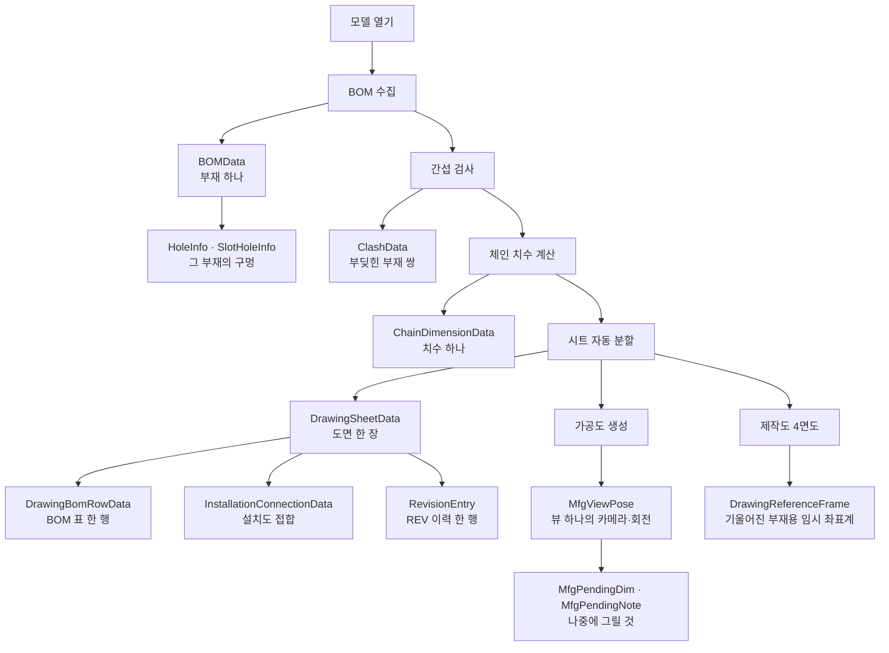

# Models — 데이터 그릇

**한 줄**: 프로그램이 들고 다니는 **데이터의 모양**을 정의한 곳. 동작 코드는 없고 속성만 있다.

두 파일로 나뉘어 있다.

| 파일 | 타입 | 무엇 |
|---|---|---|
| `A2Z/Models.cs` | 10개 | 모델·도면 전반 |
| `A2Z/Models/MfgViewPose.cs` | 3개 | 가공도 전용 |

> 🔴 **그런데 이게 전부가 아니다.** 프로젝트의 독립 타입은 **26개**인데 **13개만 여기 있다.**
> 나머지 13개는 `Form1.*.cs` 안에 흩어져 있다 → [6절](#6-책임과-결합--다시-짠다면)

---

## 1. 데이터가 생기는 순서

타입을 하나씩 보기 전에, **파이프라인의 어느 단계에서 무엇이 생기는지**부터 보면 읽기 쉽다.



**타입이 파이프라인 단계와 1:1로 붙는다.** 그래서 단계를 하나 바꾸면 그 타입이 같이 움직인다.

---

## 2. 타입별

### 2-1. 모델에서 뽑은 것

#### `BOMData` — 부재 하나 (L66)

부재 목록의 기본 단위. `bomList`에 담긴다.

| 무리 | 속성 |
|---|---|
| 식별 | `Index` · `Name` |
| 경계상자 | `MinX/Y/Z` · `MaxX/Y/Z` · `CenterX/Y/Z` |
| 형상 | `RotationAngle` · `CircleRadius` · `Purpose` |
| 구멍 | `Holes` (`HoleInfo` 목록) · `HoleSize` |
| 슬롯홀 | `SlotHoles` (`SlotHoleInfo` 목록) · `SlotHoleSize` |

생성자가 목록 4개를 미리 만들어 둔다 — **`null` 체크 없이 바로 `.Add()` 할 수 있게** 한 것.

#### `HoleInfo` (L99) · `SlotHoleInfo` (L113)

구멍 하나. 둘 다 **`ThroughAxis`(관통 방향)와 `ThroughAxisSource`(그 방향을 어디서 알아냈는지)** 를 갖는다. 방향을 추론하는 경로가 여러 개라 **근거를 같이 들고 다닌다.**

| | 차이 |
|---|---|
| `HoleInfo` | `Diameter` · `CylinderBodyIndex` (원기둥 Body에서 감지) |
| `SlotHoleInfo` | `Radius` + `SlotLength` + `Depth` (길쭉한 구멍이라 반지름만으론 부족) |

#### `ClashData` — 부딪힌 부재 쌍 (L128)

두 부재의 인덱스·이름과 접점 좌표(`XValue`/`YValue`/`ZValue`). `HasHotPoint`가 접점 유무.

### 2-2. 치수

#### `ChainDimensionData` — 치수 하나 (L9)

가장 속성이 많은 타입이고, **표시 여부를 결정하는 판단값들이 같이 들어 있다.**

| 무리 | 속성 |
|---|---|
| 기하 | `StartPoint` · `EndPoint` · `Distance` · `Axis` |
| 화면 표시 | `No`(목록 행 번호) · `StartPointStr` · `EndPointStr` · `ViewName` |
| **필터 판단** | `Priority` · `DisplayLevel` · `IsVisible` · `IsMerged` · `IsRequired` · `IsTotal` |
| 뷰 필터 | `ViewDirection` |
| 3D 연결 | `MemberIndices` |

`ViewDirection`은 **이 치수가 어느 뷰에서 보이는지**다. `"X"`/`"Y"`/`"Z"`, 병합되면 `"X,Y"`처럼 콤마로 붙는다. **`null`이나 공백이면 모든 뷰 공통**이다. 축 버튼을 누르면 이 값으로 걸러낸다.

`MemberIndices`는 치수 양 끝점이 어느 부재의 것인지다. 목록에서 치수 행을 고르면 이걸로 3D에서 해당 부재를 강조한다. **비어 있으면 핸들러가 그냥 넘어간다** — 채우는 경로가 둘인데 정확도가 다르기 때문이다.

| 채우는 곳 | 정확도 |
|---|---|
| `ExtractInstallationDimensions` | 정확히 채움 |
| `ComputeViewDimensionsForMembers` | 좌표↔노드 **사후 매핑**으로 채움 |

### 2-3. 도면

#### `DrawingSheetData` — 도면 한 장 (L169)

시트 분할 결과이자, **그 시트를 그릴 때 필요한 것을 미리 담아두는 상자**다.

| 무리 | 속성 |
|---|---|
| 식별 | `SheetNumber` · `BaseMemberName` · `BaseMemberIndex` · `MfgDrawingNo` |
| 부재 | `MemberIndices` · `MemberNames` |
| 표제부 | `PaintCode` · `PaintCode2` |
| **사전 준비분** | `PreparedDimensions` · `DimensionsPrepared` · `PreparedBomRows` · `PreparedBomNodeGroupMap` · `BomPrepared` |
| 설치도 | `InstallationContextIndices` · `InstallationConnections` |

`Prepared*` 계열은 **미리 계산해 둔 것**이고, 짝이 되는 `*Prepared` 플래그가 "계산했는가"를 표시한다. 시트를 여러 장 그릴 때 매번 다시 계산하지 않으려는 구조다.

#### `DrawingBomRowData` (L236)

시트 BOM 표의 한 행. `No`/`Item`/`Material`/`Size`/`Quantity`/`TotalWeight`/`Ma`/`Fa` 여덟 칸이 전부 문자열이다.

> 주석에 이유가 있다 — **`ListViewItem` 자체를 보관하지 않으려고** 만든 타입이다. 화면 컨트롤 객체를 들고 있으면 시트 사이에서 재사용이 위험해진다.

#### `InstallationConnectionData` (L146)

설치도에서 **선택한 STRU와 바깥 부재가 실제로 닿는 영역**. `Label`(A/B/C)로 접합부에 이름을 붙인다.

`ContactPoints`는 접합선의 시작·끝점이고, 접합선이 없는 근접 결과면 `HotPoint` 하나만 담긴다. `IsProximityFallback`이 그 구분이다.
**이 점들은 화면에 그리는 치수점이 아니라 내부 판정 자료**라고 주석이 못박고 있다.

#### `RevisionEntry` (L252)

표제부 REV 이력 한 행. 6칸. → [`Form1.ExcelTemplate.md`](./Form1.ExcelTemplate.md)

#### `DrawingReferenceFrame` (L216)

**기울어진 부재를 4면도로 그리기 위한 임시 좌표계.** `XAxis`/`YAxis`/`ZAxis`는 월드 좌표의 단위벡터고, `Min/Max`는 `Origin` 기준 **로컬** 범위다. `AlignmentAngleDegrees`가 얼마나 틀어졌는지.

이 파일에서 유일하게 `internal sealed`다 — 바깥에 안 내보내는 계산용 타입이라는 뜻.

### 2-4. 가공도 — `Models/MfgViewPose.cs`

#### `MfgViewPose` — 가공도 뷰 하나의 상태 (L46)

**속성이 30개가 넘는다.** 카메라·회전·치수·노트·EA 처리가 한 클래스에 다 들어 있다.

| 무리 | 속성 |
|---|---|
| 카메라 | `CameraData` · `CameraDirection` · `ViewDirection` · `LongestAxis` · `UsedMinusCamera` |
| 회전 | `ApplyZ90` · `ApplyR180` · `OrientationAxis` · `OrientationAngle` |
| 참조축 | `UseReferenceAxis` · `ReferenceAxisX/Y/Z` · `ReferenceAxisOrigin` |
| 지연 그리기 | `PendingDims` · `PendingNotes` · `SecondaryPendingNotes` · `ShapeDrawingIds` |
| 배치 | `PlaceNotesAbove` · `DimensionEnvelopeOffset` · `PromotedDimensionCount` · `SharedAnnotationBudgetCanvas` |
| EA 페어 | `HasCorner` · `CornerAxis` · `CornerAtMax` · `HasSecCorner` · `SecCornerAxis` · `SecCornerAtMax` · `SwapViews` · `CornerAxisUp` · `MirrorVertical` |

주석에 유래가 적혀 있다 — **옛날엔 전역 필드 3개(`_mfgDrawingZ90Applied` 등)였는데 객체로 묶은 것**이다. "카메라 회전 의도를 객체로 캡슐화"가 목적.

#### `MfgPendingDim` (L24) · `MfgPendingNote` (L36)

**"지금은 못 그리니 나중에 그릴 것"** 목록. → [5절](#5-알고리즘--타입-안에-숨은-규칙)

---

## 3. 상태

**없다.** 전부 데이터 정의뿐이고 인스턴스 필드도 로직도 없다. 생성자는 목록 초기화만 한다.

## 4. 외부 호출

**없다.** SDK도 다른 파일도 부르지 않는다. 다만 `VIZCore3D.NET.Data`의 타입을 **속성 형식으로 쓴다** — `Vector3D` · `Vertex3D` · `CameraData` · `CameraDirection`.

> 🟠 그래서 이 파일들은 **SDK에 형식으로 묶여 있다.** SDK를 바꾸면 데이터 모델부터 바뀐다.

---

## 5. 알고리즘 — 타입 안에 숨은 규칙

속성 정의뿐인데도 **규칙이 세 개 박혀 있다.** 코드가 아니라 주석과 기본값에 있어서 놓치기 쉽다.

### ① 치수 우선순위 1~10 (`ChainDimensionData.Priority` L33)

| 값 | 뜻 |
|---|---|
| **10** | 전체 길이 |
| **8** | 주요 구간 (상위 30%) |
| **5** | 중간 구간 ← **기본값** |
| **3** | 작은 구간 |
| **1** | 매우 작은 구간 |

도면에 치수가 너무 많으면 겹쳐서 못 읽는다. 그래서 **등급을 매기고 낮은 것부터 버린다.** 실제 걸러내는 코드는 `Form1.Dimensions.cs`의 `AssignDimensionPriorities` / `ApplySmartFiltering`에 있다.

단 **`IsRequired`(설치 접합 치수)는 개수 제한과 겹침 제거보다 먼저 보존**된다 — 등급과 무관하게 살아남는 예외다.

### ② `null`과 `""`가 다른 뜻이다 (`DrawingSheetData.PaintCode` L181)

| 값 | 뜻 |
|---|---|
| `null` | **아직 조회 안 함** |
| `""` | 조회했는데 값이 없음 |
| 그 외 | 실제 PAINT CODE |

**캐시 판정 기준**이다. `""`를 `null`로 바꾸면 값 없는 STRU를 매번 다시 조회하게 된다.

`PaintCode2`는 이 판정에 쓰지 않는다 — **둘은 항상 같이 채워지므로 `PaintCode` 하나만 보면 된다.**

### ③ 치수를 모아뒀다가 나중에 그린다 (`MfgPendingDim` · `PendingDims`)

가공도에서 치수를 **즉시 그리지 않는다.** 목록에 쌓아두고, 모델을 캡처해서 **실제 배율이 확정된 뒤에** 한꺼번에 그린다.

```
BuildMfgSceneCore  →  PendingDims 에 쌓기만 (offset 미적용)
        ↓
CaptureMfgSceneToViewArea  →  모델 캡처 → 실측 newScale 확정
        ↓
DrawMfgDimsAtScale  →  그제서야 그림
```

**왜 이렇게 하나** — 주석에 답이 있다.

> 추정 스케일(`EstimateFitScaleForViewArea`)은 2D 은선 투영 실측과 달라 **보조선 길이가 어긋났음** (2026-07-01)

**미리 계산한 배율과 실제 그려진 배율이 다르다.** 그래서 "그릴 것"과 "그리기"를 분리했다. `MfgPendingNote`(형상 노트)도 같은 이유다.

> 📌 SDK가 최종 배율을 미리 알려주지 않아서 생긴 구조다. **"왜 이만큼의 코드가 필요한가"에 쓸 재료.**

---

## 6. 책임과 결합 — 다시 짠다면

### ① 이 파일이 지는 책임

**데이터 모양 정의 하나뿐이다.** 문제는 책임이 아니라 **범위**다.

### ② 떼어낼 수 있는 것 — 오히려 모아야 한다

이 파일은 쪼갤 게 아니라 **흩어진 걸 모아야 하는 쪽**이다.

| 지금 어디 | 타입 | 개수 |
|---|---|---|
| ✅ `Models.cs` | ChainDimensionData · BOMData · HoleInfo · SlotHoleInfo · ClashData · InstallationConnectionData · DrawingSheetData · DrawingReferenceFrame · DrawingBomRowData · RevisionEntry | **10** |
| ✅ `Models/MfgViewPose.cs` | MfgViewPose · MfgPendingDim · MfgPendingNote | **3** |
| 🔴 `Form1.MfgDrawing.cs` | MfgAxisVector · MfgAxisDirectionBin · MfgAxisDetectionResult · MfgDrawingResult · MfgPage | **5** |
| 🔴 `Form1.Clash.cs` | DrawingBomPartData · DrawingBomPreparationContext · DrawingBomSnapshot | **3** |
| 🔴 `Form1.GlobalViews.cs` | InstallationAxisComponent · InstallationPlacementAnchor | **2** |
| 🔴 `Form1.DrawingSheets.cs` | DrawingSheetExportKind (enum) · FabricationNeighborAssemblyNote | **2** |
| 🔴 `Form1.cs` | BodyBoundsData | **1** |

**26개 중 13개만 모델 파일에 있다. 정확히 절반이다.**

데이터 모양을 찾으려면 두 군데를 봐야 하고, `Form1.*.cs` 안에 있는 것은 **파일 중간(예: `MfgAxisVector`는 MfgDrawing.cs L3279)에 끼어 있어** 눈에 안 띈다.

> 옮기는 건 **위험이 거의 없다.** 타입 선언을 파일만 바꾸는 것이고 `namespace A2Z`가 같아 참조가 안 깨진다. **가장 싸고 효과가 큰 정리 항목.**

### ③ 못 떼는 것과 이유

| 무엇 | 무엇에 묶였나 |
|---|---|
| `Vector3D` · `Vertex3D` · `CameraData` · `CameraDirection` | **SDK 형식.** 속성 타입으로 직접 쓴다 |

**데이터 모델이 SDK에 형식으로 묶여 있다.** SDK를 갈아치우면 여기부터 바뀐다. 다만 지금 그럴 계획이 없으므로 **감수할 결합**이다.

### ④ 지울 것

| | |
|---|---|
| `StartPointStr` · `EndPointStr` (`ChainDimensionData`) | `StartPoint`/`EndPoint`의 문자열 사본. 표시용으로 보이나 원본과 어긋날 여지가 있다 **(미확인 — 지우기 전 사용처 확인 필요)** |

### 🔑 리팩토링 관점에서 이 파일이 알려주는 것

**`MfgViewPose`가 속성 30개 이상을 담고 있다.** 카메라·회전·참조축·지연 그리기·배치·EA 페어가 한 클래스에 섞여 있다.

이건 그 자체로 문제라기보다 **`Form1.MfgDrawing.cs`(3,883줄)가 얼마나 많은 걸 한 번에 하는지를 보여주는 지표**다. 결과물 하나에 30개를 담아야 한다는 건, 그걸 만드는 쪽도 그만큼 복잡하다는 뜻이다.

가르면 이렇게 된다 **(추정 — MfgDrawing 정독 후 확정)**.

```
MfgViewPose        카메라 · 회전 · 참조축        (12개)
MfgDrawingPlan     지연 그리기 목록             (4개)
MfgLayout          배치 · 여백                  (4개)
MfgEaPair          EA 페어 코너·스왑·미러        (9개)
```

### ⑤ 센티넬을 이름 있는 상수로

`DrawingSheetData.BaseMemberIndex`가 음수 센티넬을 쓴다 — 제작도 `-1` · 설치도 `-2` · 가공도 `-3`.

**타입 정의에는 그 사실이 안 적혀 있다** (`DrawingSheets.cs` 주석에만 있음). 실제로 버그를 냈다 — TAG No. 조상 walk-up이 `currentIdx < 0`에서 즉시 멈춰 조립도만 값이 채워졌다 (#120).

→ 최소한 **주석을 이 타입 옆에 옮기고**, 가능하면 `enum SheetKind`로 분리한다.

---

## 부록 — 지나가며 눈에 띈 것

| | 내용 |
|---|---|
| · | **좌표를 담는 방식이 두 가지다.** `BOMData`·`HoleInfo`는 `float CenterX/Y/Z` 낱개, `ChainDimensionData`·`InstallationConnectionData`는 `Vector3D` |
| · | **접근 수준이 섞여 있다.** `DrawingReferenceFrame`·`MfgViewPose` 계열만 `internal sealed`, 나머지는 `public` |
| · | `MfgPendingDim`·`MfgPendingNote`는 속성이 아니라 **공개 필드**를 쓴다. 이 프로젝트에서 유일하다 |

---

## 관련 문서

- [`Form1.md`](./Form1.md) — 이 타입들이 담기는 공유 목록 (`bomList` · `clashList` 등)
- [`Form1.ExcelTemplate.md`](./Form1.ExcelTemplate.md) — `RevisionEntry` 사용처
- `docs/_glossary.md` — Node/Part/Body · UDA · Osnap 용어
